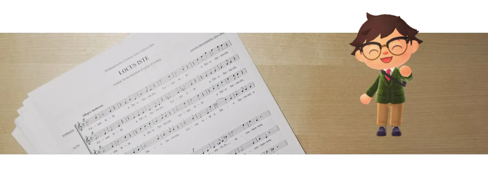

# 🤔️ 我是谁

<Profile />

你好，我是**梁子龙**，在此欢迎你的到来。

我 2015 年来到上海读大学，自那之后到现在，一直在上海居住。2022 年春末夏初，终于从学校毕业。虽说读的是数学专业，但是学得实在很一般。不论是考试、做研究，还是写论文，都没什么可取之处。专业所需的思维能力，也自知从没拿到手过。真是对不起学校、对不起导师了。

差生嘛，既然学业上有负嘱托，那总得在别的方面给自己找补找补。但谁能想到，业余时间，我竟然最爱的是学习写代码。逛 [GitHub](https://github.com)、追技术热点的时候，反倒比在教室听课自习要快乐得多，一连七年都是如此。尤其是喜欢捣鼓 Web 前端，也就是做网站的技术。能够写出漂漂亮亮的、交互丰富的界面，并通过网站传播给大家，一想到这一点，我就更做不进去那些代数题目啦……

好在，这些练习没有白费。毕业时，凭借平时的一些小小积累，我获得了一份在互联网公司做 Web 前端开发的工作，让喜欢做的事情成为了自己的第一份职业。至今一年多，虽说仍然算是个职场新人，工作内容也不能说是事事顺利，但能感受到自己技术上缓慢而扎实的成长，确实感到很开心～

另一件有意思的事情是，大学读书期间，我参加了学生合唱团。每当数学把我虐得死去活来的时候，我就躲到每周日的合唱排练里，在短暂的三个小时中进入另一个世界。依托小时候学过一点钢琴的“童子功”，我的乐感还算不错，在合唱团也能跟得上脚步，进步可观。在团里一起混熟的伙伴和老师，有不少也成为了我长久的朋友。

后来，在学业的尾声，我有幸加入了一个更厉害的合唱团体，能让我在毕业后仍然以一个合唱团员的身份活动起来。每个礼拜，经历了五天的屏幕前久坐之后，周末的晚上能够与大家聚精会神地唱一把，很爽快啊！更重要的是，这里的前辈们都强得多，我能够在他们的身边，继续进步、一起成长，的确感到很充实～

从生活节奏没有那么快的学校走出来，进入工作之后，身边不少朋友都说：每天下了班就想瘫着啊；即使今天没有很忙碌，下班后也没有力气再做别的事。的确，如今大家的工作很辛苦，年轻人的就业环境也不是完全友善，我们需要不少时间休息、放空。不过我想，如果任由这种状态发展，长久下去，恐怕除了工作时间就会放弃动脑筋，成为一个离开了工作就没有方向的人吧。

我有点害怕坠入这样的境地，所以想要尽力一试。

于是，我设立了这个网站。虽然不是第一次设立个人网站了（参见[这篇短文](/about/plan/personal-website-version-2023.html)），但我想从这个版本开始，通过书写、记录，训练自己，让脑子保持活泛，也让我的种种爱好继续生根发芽。要说有更多的目标，那么就是希望有一天，自己的输出成果能够让你也有所启发吧。

  

说起来，现在的我仍然对很多事情抱有兴趣：编程、读书、写作、音乐……往坏一点说，简直是太多了，以至于没有时间，也没能付出决心，将它们逐一精进。而且，我的兴趣方向呈现一种“周期性轮换”的状态：这一个月，可能沉浸在几本非虚构文学里；下个月，会被某款游戏吸引走全部的精力；再下个月，又想看看最近炒得火热的开源程序库是怎么写的……我真是个花心的人啊！能够花费大把大把的时间，专心地“不务正业”。

有时候会想，是不是应该专注于一件事情，把它锤炼到极致，这样更好啊？但是如今的世界，简直有太多趣味无穷的事情在吸引我们的眼睛。每当遇到一个新的、看起来很值得玩味的领域，我就知道，我这花心毛病一时半会儿还是改不掉了。况且，从我自己的遭遇来看：

当下那些恣意行动的不务正业，不知道在哪一天，就会成为自己赐给自己的恩惠啊！
