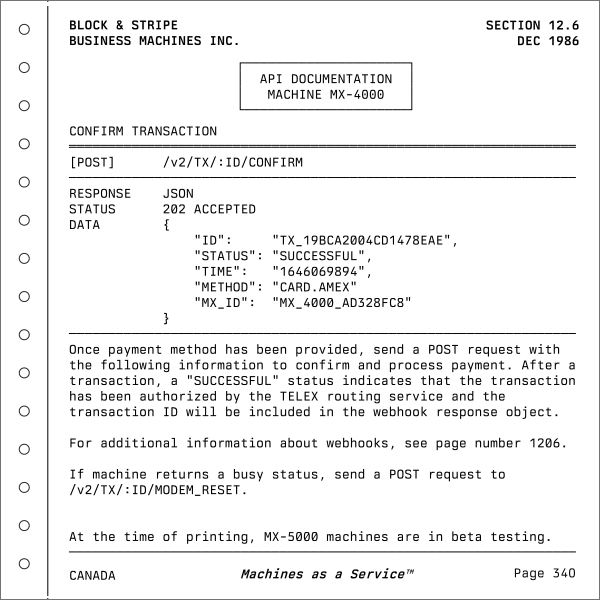

[Berkeley Mono](https://t.co/dUqr2XX9Wm) ([via](https://x.com/usgraphics/status/2001308188919161017)). Looks like major coding agents like [Claude Code](https://claude.com/product/claude-code), [Cursor](https://cursor.com), and [Amp](https://ampcode.com) (which I mainly use these days) are all using this monospaced typeface on their social media[^1] and web pages[^2]. The typeface looks great and indeed has a retro-computing charm. The type foundry, [US Graphics Company](https://usgraphics.com/), also introduces it as "a love letter to the golden era of computing":

> Berkeley Mono coalesces the objectivity of machine-readable typefaces of the 70's while simultaneously retaining the humanist sans-serif qualities. Inspired by the legendary typefaces of the past, Berkeley Mono offers exceptional straightforwardness and clarity in its form. Its purpose is to make the user productive and get out of the way.

As the introduction suggests, the typeface reminds me of man pages, telephone books, and vintage technical documentation. [The foundry's website](https://usgraphics.com/) also reflects that aesthetic.

Berkeley Mono is a commercial typeface. Curiously, however, some of those coding agents appear to be using it **without a license**, which has led the foundry to frequently tag them on X[^1].

[^1]: The type foundry's posts on X: [Claude uses Berkeley Mono](https://x.com/usgraphics/status/2001308188919161017), [Cursor uses Berkeley Mono](https://x.com/usgraphics/status/2001328611622793562)
[^2]: [One of my Amp threads](https://ampcode.com/threads/T-019b2bae-35ef-72dd-8c47-7825ecbf4cb5#message-5-block-0)
