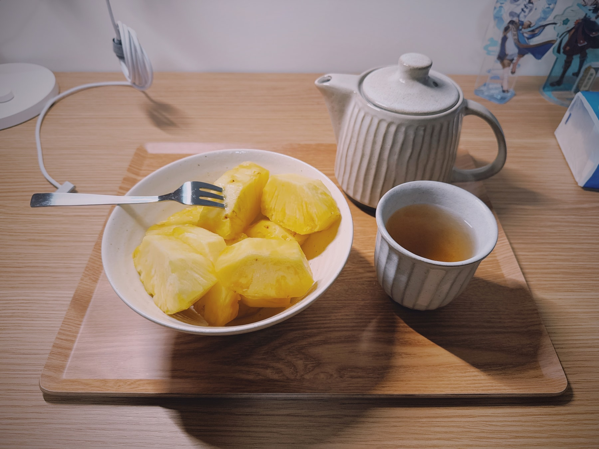
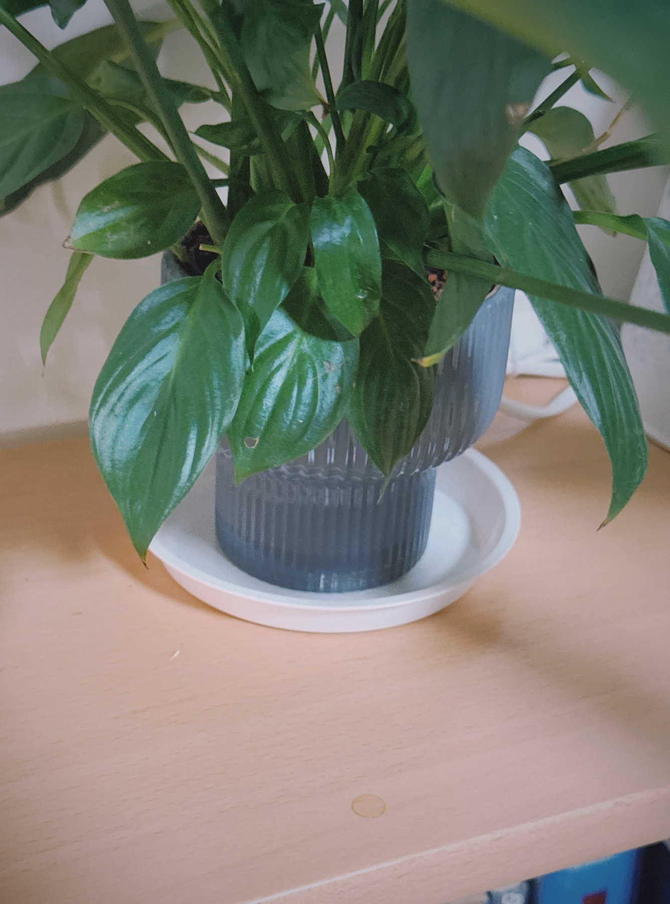
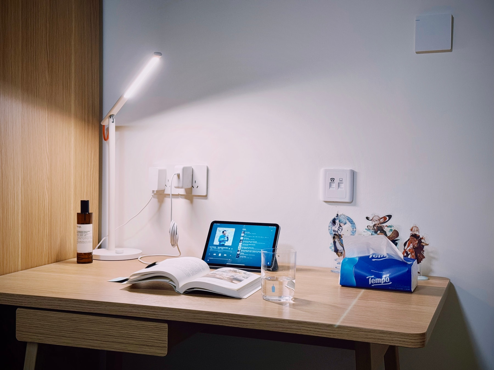
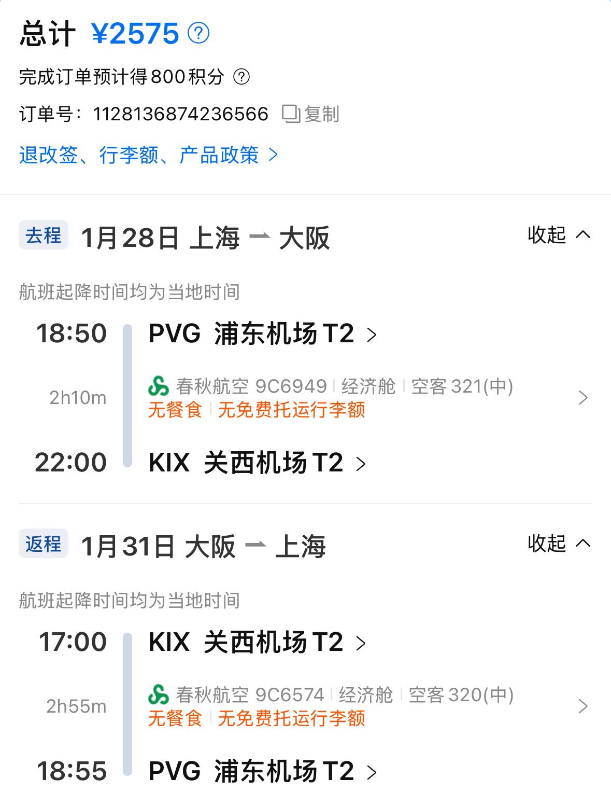

假期是一个与身边的世界产生链接的机会，是一个与自己产生连接的机会。趁此机会整理房间、整理生活、整理自己，然后有能量面对明天，即使是困难重重、无法确定的明天。

---

春节假期的最后一天，我还没醒过来，从夜里的梦开始，就感到了因为即将要上班而产生的焦虑心情。我梦到我在学校参加毕业典礼，竟然是坐在校长旁边的一个位子，我幽幽地跟他说：现在经济下行，听说卖鸡蛋比搞 IT 还挣钱，咱们学校应该快点开设专业教人卖鸡蛋啊。

我这人只要放假，肯定在家里待不住，想尽办法出门。外面天气好的时候尤其如此，上班的时候在工位上一坐坐一天，放假竟然不出去转转，实在对不起这么宝贵的时间。春节假期的前七天里，我都出门了，唯独今天，在家里宅了一天。

我坐在床尾，面对的是一墙的书。扫一遍过去，我拿起了吉井忍的《东京八平米》，躺在床上读了起来。好久没有捧着书躺在床上读了，而这本正合适。

---

这一天里，我晃晃悠悠熬过了早上，午后朋友来访，是要来拿寄放在我车里的迪士尼周边。一起寒暄了几句，喝了口茶，她们两口子就走了，还留下了两大盒水果。于是我继续晃晃悠悠到晚上。

要说这个春节，我过得还算充实。除夕当天买票去日本，然后在大阪和京都待了三天；回来之后，见同学、见朋友、逛街买餐具。这几天还看了本书，看了三四部电影。疲惫的身心算是得到了圆满的休息，但是面对新一年的工作，还是不断地在打退堂鼓。因为没有头绪，因为不知道有谁能帮我，因为不知道自己能不能做好。

小时候总觉得家里的杯子很脏，永远也擦不干净的感觉。我总在想，拿这样的杯子喝水会不会生病啊。

于是自己住以后，就爱买玻璃杯，并且每次喝完都要擦得亮亮的，一点水渍都不能有。

每当感觉生活过不去了，我就想像这样，把杯子擦亮，把雾蒙蒙的我的生活也擦亮。

眼看着，春节假期这就晃到最后一天了。心里开始不断倒计时，就要开始上班了……啊啊啊，那种事情不要啊！

从年前一周开始，公司就有了松快的氛围，每一天都会有同事消失不见，公司楼下的行李寄存点排满了大家五颜六色的行李箱。用掉年假的同事畅畅快快回家，而我们这些不请假的，就受着他们的恩惠也逐渐不需要干活了，还不用浪费年假！这一周开始，一切的工作都可以「年后再说」，到最后两天，我甚至愣在工位不知道做什么。

春节前的最后几天，大家在为 DeepSeek 感到震惊……

对了，我的网站也是在这一周重新用 Astro 开发了一遍，谢谢这段轻松的时光！

这个春节我决定不回家，一方面是去年跟家里的关系有一点僵，另一方面也是受这份工作所逼，每天感觉活得很辛苦，想要有一段时间来休息、放松。我这样的年纪回老家，的确没什么「享受」可言。

---

除夕的傍晚，我坐飞机去了大阪，待了一天后，又在京都逛了两天，这就算是我的过年。去年差不多的时候也在这边玩，去年是详细计划，而今年是出发当天的早上才买的机票。

其实看机票看了很久了，从放假前的一周，就开始每天不断地刷携程。几个月前心中萌生了去北海道过年的想法，但是工作太忙之类的缘故，拖到了十二月，发现北海道不论是机票还是酒店，价格都已经到了我承担不起的地步。但还是不甘心呀，春节前夕，我在携程上不断地开始搜，大阪、名古屋、福冈、高松……任谁往返都要四五千块。我印象里，离出发的日子越近，如果航空公司还没有把票卖光，是会降价来抛售的。于是我心想着，如果它降到两千块左右，那我就立刻出发。

除夕当天，春秋航空往返关西机场的票终于降到了两千五。恰好，前一天还得到了五千多块的一笔额外收入。我对自己说：即刻启程！

日本对我来说总有种神奇的吸引力，我看到干干净净的街道、永远擦得亮亮的汽车，就觉得心情舒畅。

---

回来后的第一天，我拜访了大学同学家，阿姨给我做了好吃的一桌子菜，还和她们家的小狗玩了一下午。

我买了一些日式餐具，看着已经快要背下来台词的电视剧，一边像模像样地吃饭。我知道过几天重新开始上班的生活后，这样的惬意就会被动地消失殆尽，所以显得特别珍贵，想留住这一刻。

这些都让我觉得，之前几个月的生活实在是被这份工作给推着走，自己的生活方式遭到了极大的挑战。我想通过这样的、每一天的仪式感，来给自己塑造边界，塑造属于我的生活节奏。

杯子里盛上冰冰凉凉的茶，偶尔能买一份凤梨果切。喝完一口后，杯子放下，触碰到桌子的声音很好听。

生活中有很多事，不是我能够掌控的。工作上的方案想不清楚、写得乱七八糟的时候，跟家里的关系怎么理都理不清的时候，自己想做的事总是会拖延很久，一不小心甚至几年时间就这样过去的时候，很多。这样的时候，我就会擦擦桌子、擦擦杯子，擦得亮亮的，再把书架、置物架什么的都整理一遍，该扔的东西扔掉。这样做一通下来，让我觉得自己还有东西能够掌控，这片干净整洁的角落，我没有在任何一个朋友家见过，这是我比他们都要厉害的地方。

新的一年，要是能多看点书就好了，多一点这样干净的、慢节奏的生活。工作很急，希望自己也能用这种长期主义来应付，能够笑着应对每一天。

我给自己的新年愿景是「保持高能量」，至少这一个月来，我觉得还是在稳定地践行。一月份，我妥善完成了阶段性的工作成果，重新整理了个人博客，给自己搭出了干净的写作空间；看了不少的影视剧，有很多享受；春节期间还去日本玩了一趟；感情方面心态会逐渐变好。好长的一个月，也是好短的一个月。

重新开始看书，接下来要把《读库 2500》、《读库 2501》给看完，最近还重新开始看《东京八平米》，让我又能感受到那种慢慢的、低欲望但一点都不枯燥的生活方式，那对于现在的我来说是一种向往。

## 东京八平米，与我亮亮的杯子

## 春节的观影记录

**[穿越时空的少女](https://movie.douban.com/subject/1937946/)**：是 06 年的老动画电影，最近在国内重新上映，而国内贺岁档的几部我都没兴趣，所以去看了。看完怀疑《天气之子》的灵感很可能来自这里，都是那种超能力快用光了才发现有遗憾的故事。

**[机器人之梦](https://movie.douban.com/subject/35426925/)**：在去大阪的飞机上看完的。没有台词，看得人心痒痒的。

**[巴黎大饭店](https://movie.douban.com/subject/36587946/)**：是电视剧《东京大饭店》时隔六年的续作，12 月底在日本上映。在大阪醒来的时候突然想到「我可以去看啊」，于是查了附近的电影院，果然还在上映，于是下午立即去看了。

---

假期的最后两天，坐在床边扫视书架，把两年前读过的《东京八平米》挑了出来，重读了一遍。读完了之后有两方面的感受。

一是羡慕作者这种低无欲、同时与身边的风景高度连接的生活方式。我在科技公司工作，平常面对同事都不敢面对面交流，最好是会议室都不去，拉一个不露脸的线上会议。一天十几个小时坐在那里，就这样过去，跟身边的事物没有任何的连接。去年九月，我搬到宝山之后，说实话小区门口的小店我一个没有去过，旁边大一点的商场也只是点过外卖的关系。一月初的时候对象来上海陪我，有一天他自己出去玩，我下班后先把车开到小区，然后去附近的地铁站等他回来。那天很开心，我第一次走在这条街道上，还在地铁站门口买了个包子吃。这样的日常是我很久没有感受到的了。

二是羡慕，吉井忍也太会使用中文了。作为一个日本人，能用如此温润、安静的笔触写下这样流畅的文章，对于现在想要捡起写作的我来说实在是很好的学习材料。面对平淡的日子，如何找到它的独特之处，让读者随着自己的脚步、自己的思绪，能够形成一个印象，这太值得学习了。

她最近在写的东西，基本上都要回到一个主旨，就是「失去」。咖喱店的关闭、家门口的钱汤越来越少……当身边的这些与自己生活息息相关、曾产生回忆的地方一一失去，就好像时代的进步抛弃了「我」，它滚滚向前，在「我」看来，不一定是件好事。

吉井忍在[《四季便当 II》](https://book.douban.com/subject/35230156/)中写道：

> 我知道，你我这些平常的日子其实一点都不平常，一碰到「意外」，他就会变得遥不可及。哪怕幸运地没遭受意外，但总有一天它们也会消逝在时间的潮流中。

所以，假期我所做的一切，都是用力握住这一点平常。其实「握住」不太贴切，那些平常我早已在这份新工作所带来的压力中失去，不如说是「寻回」。

已是深夜，于是我们都该拍拍屁股，准备明天开始上班了。只不过，不要忘记 xxx。

---

很久没有一个人度过假期了，我印象最深的还是大二结束的那个暑假。那时我痴迷自然语言处理（NLP）这门学问，买了一本厚达十厘米的英文专著，每天独自在寝室啃几页。现在看来这种学习方式简直很低效，但当时也不追求什么，就觉得这样看几页的自己很不错。那段时间，每天会出门逛逛，买一杯加了椰果的一点点奶茶。两个月里，胖了不少。

不得不承认，这次的假期我有一些无所适从。从买机票开始，我仿佛在希望有个人跟我说，去吧，你该这么做。和朋友见面，我也能很明显地感受到自己的拘谨。虽然最终还是能做生活的主人，但总是不太自信。
