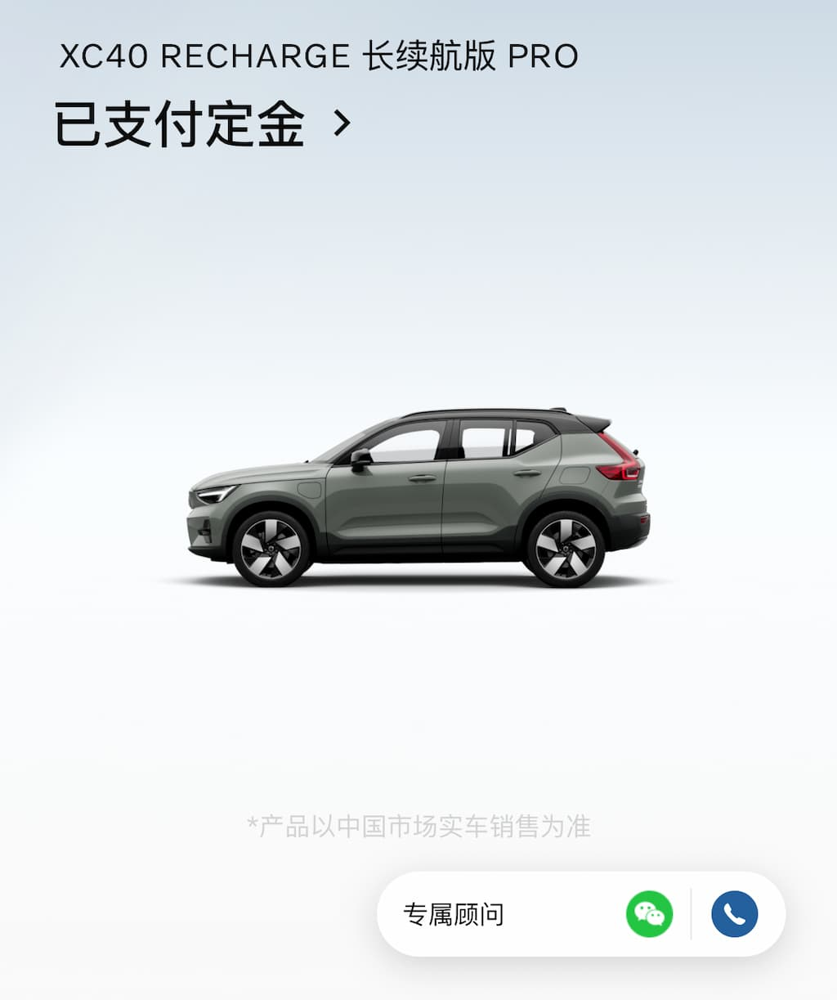
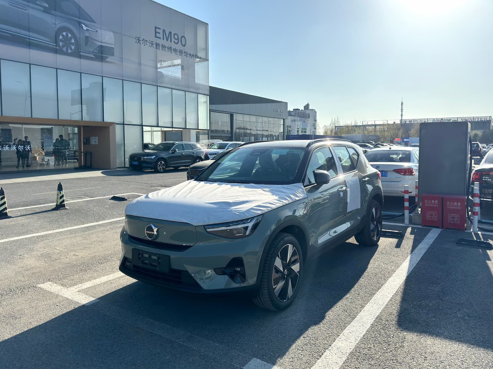
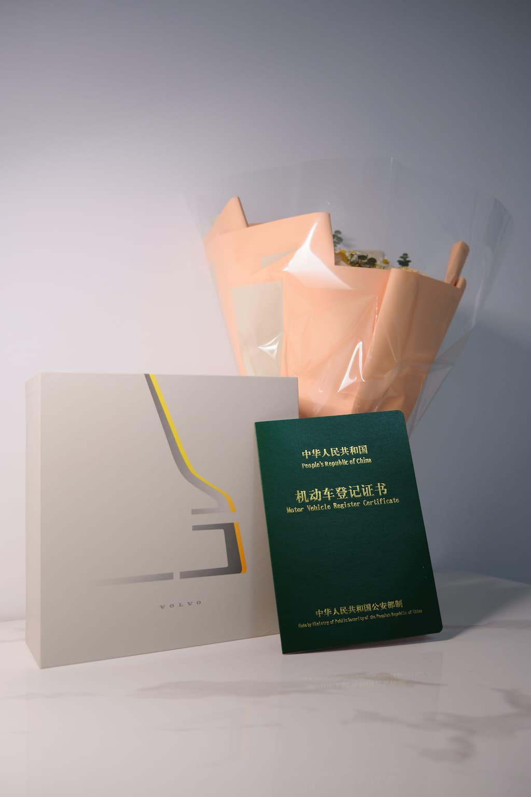

“你咋不把这玩意搁后备箱啊！”去年冬天，我带家里的小猫去体检，打车回来的路上，司机看到了装在包里的猫，生气地说了这句话。现在想想，那应该就是我决定买辆车的瞬间。

买车是我上学的时候从来不敢去想的事情，就连朋友开车接送我，我坐在那里都畏畏缩缩的。时间来到现在，我这个新手司机已经无事故驾驶 3000 公里。

我这个新手司机，驾龄突破三个月，里程突破 3000 公里。

买车的想法，在毕业之初是完全没有进过我的脑袋里的。我从 2023 年开始做起这个梦，并终于攒到了一点钱。我可真是沉不住气，攒了一点钱就想花掉！于是买车这个欲望在 2023 年底到 2024 年初逐渐成型，如今我将付诸实践。这是我人生中的第一笔大宗消费！

说起品牌和车型，虽然我之前没有买车的想法，但是一直对沃尔沃这个品牌抱有好感，并以此为方向一直暗示自己：有钱了要买一台沃尔沃！现在想来，最初的缘分应该是 2019 年我参加了彩虹合唱团之后，第一次作为团员登台演出，就是沃尔沃在上海推出新款 S60 的发布会上，我们团的商演节目。虽然彼时完全不懂车，但是看着耀眼灯光下闪闪发光的一排小轿车，内心可能还是有所触动。并且沃尔沃这个名字，也自然地在我心里刻下一道，留住了。

后来，我被沃尔沃硬朗踏实的外观、帅气的前灯尾灯，还有无人不提的安全驾驶理念所吸引，逐渐开始了解、钟爱。虽然本人什么车都没开过，但就是对沃尔沃充满了好感。这可能就是踏入了所谓身份认同的消费主义陷阱里吧！不管怎样，2023 年以来，我逐渐瞄准了一款车型：沃尔沃 XC40 Recharge。

从预算上来说，这是沃尔沃最便宜的车。我其实潜意识里更喜欢油车，不喜欢电车一冲一冲，加减速都过于猛的感觉，平时坐新能源出租车时体会尤深。但是看过诸多评测后，大家都说沃尔沃这种传统品牌做电车，驾驶质感、乘坐质感仍然保留着油车那种平顺的加减速体验，这才稍稍安慰。再加上上海目前油车要 10 万块钱换一块蓝牌铁皮，实在不值。

2023 年，我正对这款车型痴迷的时候，没想到同事毕磊先买了这一款，我真是嫉妒万分！我跟他说喜欢沃尔沃的时候，他还得了便宜卖乖似的，叫我多看看现在的国产新势力，或者特斯拉，说沃尔沃买来都给老婆开了云云。哼！

话说回来，国产新势力我是真的接受不了。比着屏幕大、比着取消实体车手柄，还一个比一个丑，花里胡哨的设计让车完全成为了一个玩具而不是驾驶工具。你说，那些会发光的天窗、能按摩的座椅、无处不在的语音助手，我要了干啥！

特斯拉嘛……Model 3 的屏幕换挡，以及反人类的按键转向灯……新能源车可能没有什么可创新的了，明明已经很自然、人们习以为常的人机交互，他们就是要想着法的改变。

沃尔沃呢，仍然是传统车型的味道，我很喜欢。

## 令人激动的三月

<TimeLine>

<TimeLineItem date="2024-02-26">
前期逛了一些店、咨询了朋友和一些销售，了解了些必要信息后，决定开始推进买车这件事。首先，在随申办上办理了“新能源牌照申领一件事”。
</TimeLineItem>

<TimeLineItem date="2024-03-01">
去沃尔沃环球港店试驾，跟销售商议购车方案。最终，在沃尔沃 App 上，下了 5000 元定金，就决定是他啦！🫨

</TimeLineItem>

<TimeLineItem date="2024-03-04">
“一件事”的第一步——牌照额度审批通过，销售发来了电子合同。
</TimeLineItem>

<TimeLineItem date="2024-03-10">
办好了银行贷款，下午去沃尔沃康桥 4S 店验车。

</TimeLineItem>

<TimeLineItem date="2024-03-11">
支付尾款 269400 元。人生中第一次支付这么多的钱……😵
</TimeLineItem>

<TimeLineItem date="2024-03-10">
厂商通过随申办上传了车辆信息，进入“一件事”第二步——车辆信息确认，需要等待 5 个工作日。
</TimeLineItem>

<TimeLineItem date="2024-03-20">
车辆信息确认通过，进入“一件事”第三步——专用牌照申请事项。下午，销售帮忙开好了发票，这标志着正式成交～
</TimeLineItem>

<TimeLineItem date="2024-03-21">
销售代办了平安车险，经过一番商议，这辆车第一年的保费为 7790.77 元。
</TimeLineItem>

<TimeLineItem date="2024-03-24">
在交管网站上选了车牌号：<strong>沪A·EA1689</strong>。很喜欢这个号码！🥰
</TimeLineItem>

<TimeLineItem date="2024-03-26">
车辆上牌完成，“一件事”完全通过，车辆在交管网站上正确备案～
</TimeLineItem>

<TimeLineItem date="2024-03-31">
提车啦，一个月的购车旅程终于完成！🥳

</TimeLineItem>

</TimeLine>

不知不觉，提车已经一周了。3 月的最后一天，我把属于自己的新车开出来的时候，朋友在副驾坐着，看着战战兢兢的我，不无滑稽。本来想着能够一口气开回家，结果一看导航说出“前方路口掉头”就完全乱了阵脚，只能在附近的道路上先慢慢熟悉，找一个附近的商场即刻停下。

好在，这种紧张的情绪在几小时内就逐渐消散了，我也慢慢接受：这是属于我的车，是我要带他去往城市的每一个角落。于是，我送朋友回了家，又再折返到环球港去接吉效廷回家。停到小区对面的停车场时，一种安心感油然而生。

巧合的是，第二天我就接到了公司停车管理员的通知，说腾云大厦停车场空出了月租车位，可以开始月租了。此前，我已在系统中排队一个多月了，看来真的是“天助我也”吗？午后，我就喊上同事，把车从漕河泾印象城开出来，停到了专属于自己的车位上。

自从年初开始计划买车以来，我的脑海中出现过非常多的美好画面：听着舒缓的音乐开车上下班、伴着好闻的味道和天窗透进来的和风在空旷的道路上缓慢行驶、拉着朋友们去吃饭聚会逛超市……这些画面，竟然在这一周内都一一实现了。

这一周，中环、内环高架走了好多次，也意识到了上海的主干道来来去去就这么几条。市区内，不论从哪里去哪里，都是半小时加减十五分钟的路程，也让我多了不少出行的安定感。昨天，在淮海路附近的小巷里左右穿梭，更是从新的视角看到了匆匆又清凉的上海城市景象。以前，那些蓝色绿色的路牌，我这种只懂得坐地铁的人自然是视而不见的；而如今开车了，终于知道那些路牌都是为驾驶者所设计，这些柏油马路才是城市交通最重要的组成部分，那么自己对城市生活的掌控感和参与感也在不知不觉间提升了。

还有一个小插曲：我在提车当天，第一次停到长宁来福士的时候，不由得想要四下观察一下我的新车，猛然看到左后轮毂上有一个清晰可见的划痕。于是我赶紧告知销售，并联系维修。接下来的周一到周三，车子被开去 4S 店维修，销售也帮我支付的维修的费用。周三晚上，正是清明节假期的开始，我拿到已经修好一新的车，暗自在想：这件从年初就开始计划的事，终于在此刻落定尘埃。于是，我挑选好音乐，开去与朋友聚会的路上。这辆车就是我的新朋友，今后，还要仰仗他带我四处游荡了！
