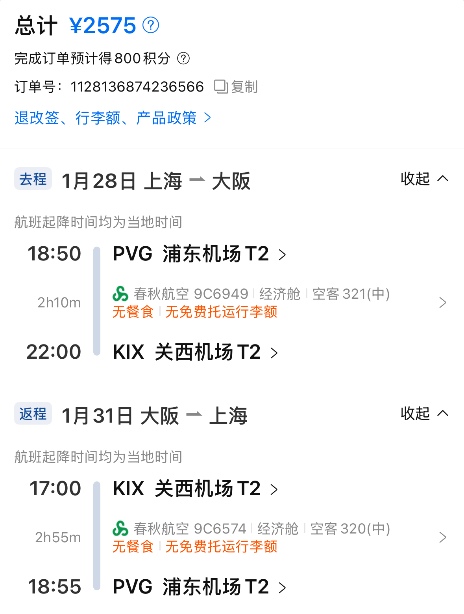

小时候总觉得家里的杯子很脏，永远也擦不干净的感觉。我总在想，拿这样的杯子喝水会不会生病啊。

于是自己住以后，就爱买玻璃杯，并且每次喝完都要擦得亮亮的，一点水渍都不能有。

每当感觉生活过不去了，我就想像这样，把杯子擦亮，把雾蒙蒙的我的生活也擦亮。

眼看着，春节假期这就晃到最后一天了。心里开始不断倒计时，就要开始上班了……啊啊啊，那种事情不要啊！

从年前一周开始，公司就有了松快的氛围，每一天都会有同事消失不见，公司楼下的行李寄存点排满了大家五颜六色的行李箱。用掉年假的同事畅畅快快回家，而我们这些不请假的，就受着他们的恩惠也逐渐不需要干活了，还不用浪费年假！这一周开始，一切的工作都可以「年后再说」，到最后两天，我甚至愣在工位不知道做什么。

春节前的最后几天，大家在为 DeepSeek 感到震惊……

对了，我的网站也是在这一周重新用 Astro 开发了一遍，谢谢这段轻松的时光！

这个春节我决定不回家，一方面是去年跟家里的关系有一点僵，另一方面也是受这份工作所逼，每天感觉活得很辛苦，想要有一段时间来休息、放松。我这样的年纪回老家，的确没什么「享受」可言。

## 去京都过年

除夕的傍晚，我坐飞机去了大阪，待了一天后，又在京都逛了两天，这就算是我的过年。去年差不多的时候也在这边玩，去年是详细计划，而今年是出发当天的早上才买的机票。

其实看机票看了很久了，从放假前的一周，就开始每天不断地刷携程。几个月前心中萌生了去北海道过年的想法，但是工作太忙之类的缘故，拖到了十二月，发现北海道不论是机票还是酒店，价格都已经到了我承担不起的地步。但还是不甘心呀，春节前夕，我在携程上不断地开始搜，大阪、名古屋、福冈、高松……任谁往返都要四五千块。我印象里，离出发的日子越近，如果航空公司还没有把票卖光，是会降价来抛售的。于是我心想着，如果它降到两千块左右，那我就立刻出发。

除夕当天，春秋航空往返关西机场的票终于降到了两千五。恰好，前一天还得到了五千多块的一笔额外收入。我对自己说：即刻启程！

日本对我来说总有种神奇的吸引力，我看到干干净净的街道、永远擦得亮亮的汽车，就觉得心情舒畅。

## 空空的马路，干干净净的家

回来后的第一天，我拜访了大学同学家，阿姨给我做了好吃的一桌子菜，还和她们家的小狗玩了一下午。

我买了一些日式餐具，看着已经快要背下来台词的电视剧，一边像模像样地吃饭。我知道过几天重新开始上班的生活后，这样的惬意就会被动地消失殆尽，所以显得特别珍贵，想留住这一刻。

这些都让我觉得，之前几个月的生活实在是被这份工作给推着走，自己的生活方式遭到了极大的挑战。我想通过这样的、每一天的仪式感，来给自己塑造边界，塑造属于我的生活节奏。

杯子里盛上冰冰凉凉的茶，偶尔能买一份凤梨果切。喝完一口后，杯子放下，触碰到桌子的声音很好听。

生活中有很多事，不是我能够掌控的。工作上的方案想不清楚、写得乱七八糟的时候，跟家里的关系怎么理都理不清的时候，自己想做的事总是会拖延很久，一不小心甚至几年时间就这样过去的时候，很多。这样的时候，我就会擦擦桌子、擦擦杯子，擦得亮亮的，再把书架、置物架什么的都整理一遍，该扔的东西扔掉。这样做一通下来，让我觉得自己还有东西能够掌控，这片干净整洁的角落，我没有在任何一个朋友家见过，这是我比他们都要厉害的地方。

新的一年，要是能多看点书就好了，多一点这样干净的、慢节奏的生活。工作很急，希望自己也能用这种长期主义来应付，能够笑着应对每一天。

我给自己的新年愿景是「保持高能量」，至少这一个月来，我觉得还是在稳定地践行。一月份，我妥善完成了阶段性的工作成果，重新整理了个人博客，给自己搭出了干净的写作空间；看了不少的影视剧，有很多享受；春节期间还去日本玩了一趟；感情方面心态会逐渐变好。好长的一个月，也是好短的一个月。

重新开始看书，接下来要把《读库 2500》、《读库 2501》给看完，最近还重新开始看《东京八平米》，让我又能感受到那种慢慢的、低欲望但一点都不枯燥的生活方式，那对于现在的我来说是一种向往。

## 春节的观影记录

**[穿越时空的少女](https://movie.douban.com/subject/1937946/)**：是 06 年的老动画电影，最近在国内重新上映，而国内贺岁档的几部我都没兴趣，所以去看了。看完怀疑《天气之子》的灵感很可能来自这里，都是那种超能力快用光了才发现有遗憾的故事。

**[机器人之梦](https://movie.douban.com/subject/35426925/)**：在去大阪的飞机上看完的。没有台词，看得人心痒痒的。

**[巴黎大饭店](https://movie.douban.com/subject/36587946/)**：是电视剧《东京大饭店》时隔六年的续作，12 月底在日本上映。在大阪醒来的时候突然想到「我可以去看啊」，于是查了附近的电影院，果然还在上映，于是下午立即去看了。
