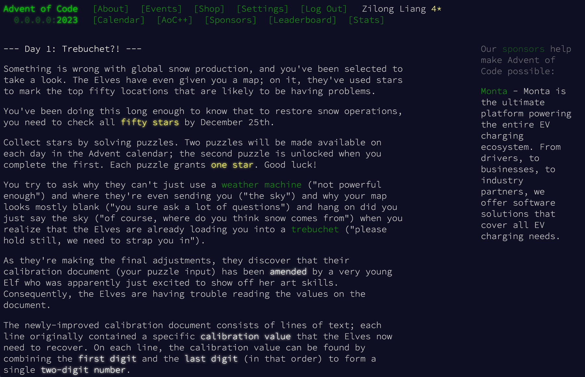
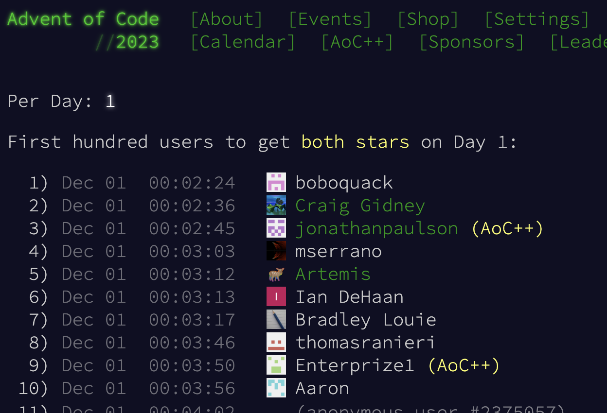

2015 年开始，一个名为 Advent of Code（AoC）的编程游戏逐渐在程序员圈子中火热起来。每年的 12 月 1 日 到 25 日，活动网站会每天放出两道题目，参与者会用最快的时间编写程序解决。游戏不限编程语言、不限解决方法，甚至不一定要使用编程，只要能够对给定的输入得到结果，并输入到网站里，就能获得当天的星星。

25 天的时间，每天有两颗星星，于是一共有 50 颗星星。程序员在这 25 天里，御宅属性发作，会兴奋地讨论、分享心得，在 Twitter 、Reddit 或者是 GitHub 上晒出自己的解法，或者是卡关了来求助解法。但最让人向往的还是登上活动的排行榜：每一题前一百名提交结果的游戏参与者，就可以登上当天的排行榜，并且根据排名获得额外的星星。其实每天放出的题目并不算难，也不会用到太过高深的编程技巧，主要锻炼的还是简单的问题解决能力。尤其是最开始的几天，资质平平、经验尚浅的开发者也能在半小时内解决两道题。但是打眼一看，排行榜的第一名，往往是在一分多钟就解决了两道题目的高手，这时候才会感叹人外有人，天外有天了。

我在 2020 年知道这个活动，21 年、22 年好像都想要参与却好像都忘记了时间，只是后来零散地做了几道尝鲜。今年，我准备沉浸式地玩一把～不过，通过这两天的体验，在我刚刚看完题目的时候，排行榜基本就已经满了。看来，赶上这些高人简直是绝无可能了……

AoC 背后的组织者是美国纽约的程序员 Eric Wastl，平日也在公司上班。到了 12 月却摇身一变，在 AoC 网站上化身圣诞老人，每天的礼物就是这两道题。其实这个活动本身就借用了西方民俗的降临节日历（advent calendar）概念：每到 12 月，人们都会为了倒数耶稣圣诞来领的日子，准备一个包含 24 个小格子的日历，从 1 号开始每天可以开启一个格子，获取当天的礼物；到了礼物全部取完，也就到了圣诞节，到了新的一年。

于是，程序员们的降临节礼物，便是每天在美国东部时间 00:00（UTC-5，即北京时间中午 13:00）准时放出的题目。如今，活动有超过一百万的注册参与者，每天嗷嗷待哺。程序员们看着网站上的倒计时，宛如中国大城市的打工人定了闹钟准备抢高铁票，一到点便兴奋起来。网站使用等款字体、暗黑主题，在这种极具科技感的极客风格上，又用霓虹灯一般的字色和圣诞主题图案，共同拼凑出一幅景象：就像每个程序员小时候梦想的一样，计算机是魔法一般有求必应的，在这温馨的节日中与计算机相对而坐，抓耳挠腮，不也是一种幸福浪漫吗。

不过，即便每年圣诞已经过去，AoC 活动的余温还不会那么快消褪。大家会在社交媒体上炫耀自己使用了多么离奇的解法，也会对别人独出心裁的解法高呼 f-word；不过最耐看的，是大家通过活动本身，对编程技巧、工程能力、问题解决能力的深层思考。AoC 就像一个“全世界程序员联合起来”的契机：此刻社区变得活跃，是为了争排行榜上的名次，是为了和全世界的“自己人”过一个属于程序员的圣诞“春晚”，也是为了一起探讨、分享程序设计的哲学。

人家过圣诞都全家团聚，其乐融融；你们这帮写代码的，怎么过节还自己找罪受啊！

::: info 参考

- [Advent of Code 官网](https://adventofcode.com/)
- [维基百科：Advent of Code](https://en.wikipedia.org/wiki/Advent_of_Code)
- [麻省理工科技评论对 AoC 的报道](https://www.technologyreview.com/2021/12/17/1042483/puzzle-challenge-coding-christmas/)
- [Hacker News 上 AoC 2023 热火朝天的讨论](https://news.ycombinator.com/item?id=38483271)

:::
