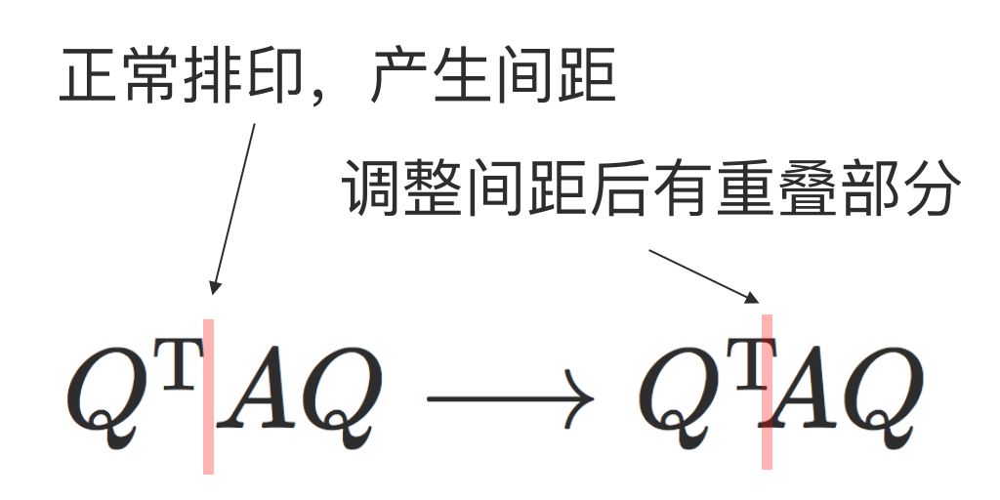

在 LaTeX 排版中，有很多需要注意的地方。这篇文章定期总结其中的小撇步。

<!-- more -->

## EP01 调整矩阵乘法的间距

遇到矩阵相乘，最直接的做法是将两个大写字母原样打出，如 `$AB$` 将会输出 $AB$。但由于数学模式中，字母符号默认为斜体，有的时候会出现一些看起来很奇怪的间距，比如：
$$ U^{\trans}AV, \quad VD, \quad VM, \quad NA \quad \dots$$
在这些例子中，大部分是由于 V、A 等字母变为斜体时所占宽度较大导致的，下面这个图显示了这个过程：
<div align="center">
    
</div>
解决的办法也很容易，数学模式中 `\mskip{[distance]mu}` 提供了微调间距的功能，其中 `[distance]` 代表所需调整的距离，而一个单位的 `mu` 基本上是 1/18 的 `em` 宽度。大量的经验表明，`-2mu` 和 `-5mu` 是在这种情形下常用的。比如：

```latex
Q^{\mathrm{T}}AQ  % From
Q^{\mathrm{T}}\mskip{-5mu}AQ  % To
```

效果： $Q^{\trans}AQ \longrightarrow Q^{\trans}\mskip{-5mu}AQ$

```latex
VD  % From
V\mskip{-2mu}D  % To
```

效果：$VD \longrightarrow V\mskip{-2mu}D$

这样就可以让矩阵相乘的式子看起来更美观了。我们把最开始的几个例子都做这种处理，看一下效果：

$$ U^{\trans}\mskip{-5mu}AV, \quad V\mskip{-2mu}D, \quad V\mskip{-2mu}M, \quad N\mskip{-2mu}A.$$

【参考】 Higham, N. J. (1998). **_Handbook of Writing for the Mathematical Sciences (Vol. 63)_**. SIAM.
