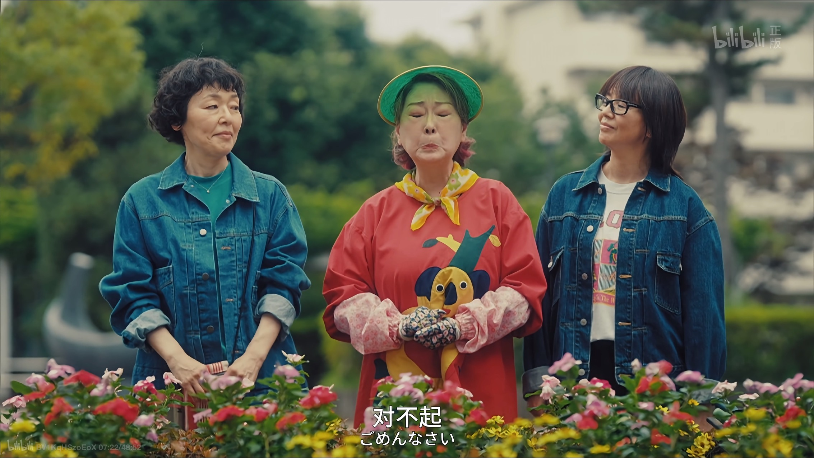
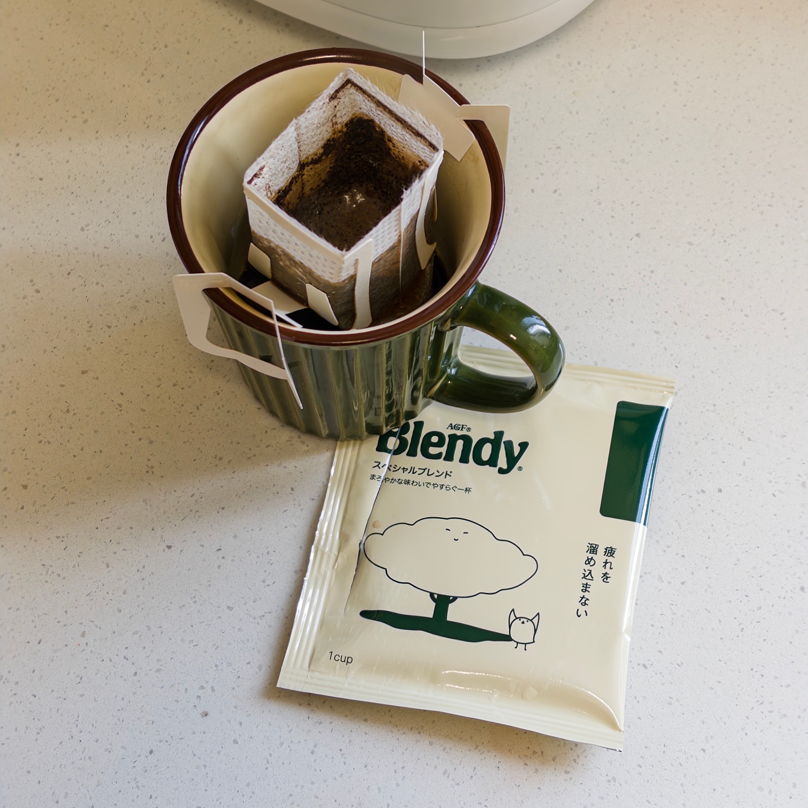

用什么来开启这第一则手记呢？不如就从这个简单的，周一的午后说起。

今天居家办公，开完早会，我把沙发上堆了一周的衣服整理好，十一点出头就点了午饭。伴着午饭，我看完了日剧《[住宅区的两人](https://movie.douban.com/subject/36902276/)》的第二集。

下个月初，我和诗胤准备去东京旅行。规划之余，我又拿起了一些旧书、旧杂志，比如《[东京八平米](https://book.douban.com/subject/36096287/)》和 2025 年的一期《[&Premium](https://andpremium.jp/)》，体会那种味道和氛围。

我喜欢钻研技术。另一方面，我也乐于把家里打理得干干净净，感受平静美好的生活。最近看了几集 [Life in Atami](https://www.youtube.com/@lifeinatami) 的 vlog，加上这些日剧、书和杂志，都让我想要重拾这种平静、治愈的力量。周末我花时间，重新整理了自己的[个人网站](https://zlliang.me)，与英语技术笔记并行，开辟了这个生活手记站点，也是因为被最近的这些事情给触动，想要通过简单的写作，重拾生活的感受力。

看完这一集，阳光还不错。现在是下午一点出头，我又冲了一杯咖啡，准备开始下午的工作。

