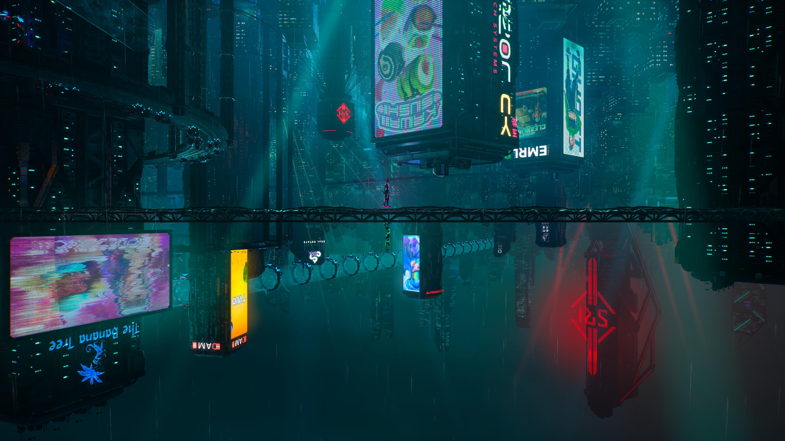
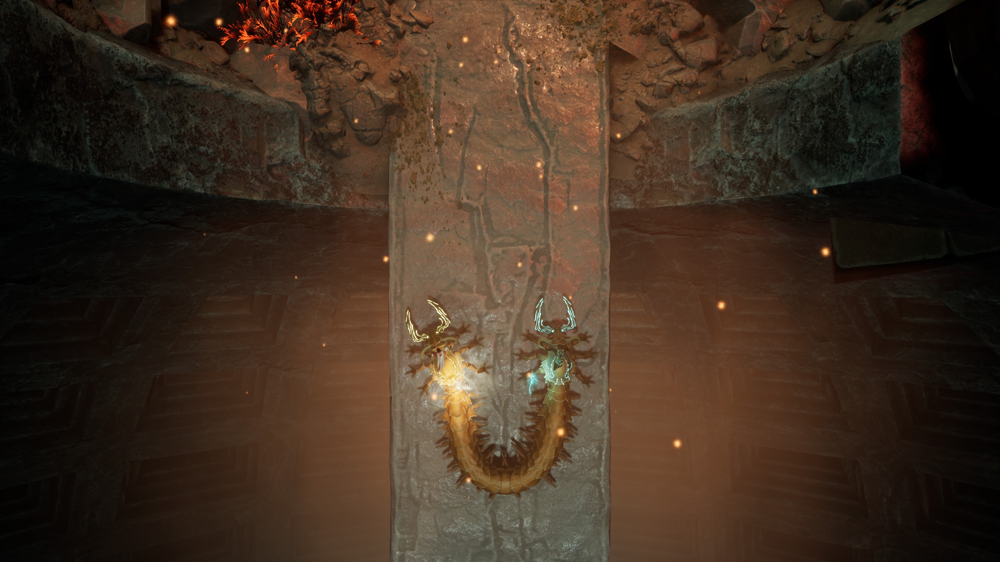

昨天晚上，和诗胤通关了《[双影奇境](https://www.ea.com/games/split-fiction/split-fiction)》！在小小的沙发上，我们断断续续打了几个月才通关，最后的关卡让我们都很震撼。诗胤也从一个 3D 游戏新手（连转视角都还不会的那种）开始成长，算是入了门。鼓掌鼓掌！我准备下一步就给他推荐《塞尔达传说：旷野之息》。

今天，看完了《住宅区的两人》第三、第四集。越来越好看了，朋友、邻居之间形成的温馨社区，还有童话一般的人际相处，看得人心暖暖。

关于从上周做到现在，终于搭建完毕的中英文博客系统，今天也花时间写了一篇心得，放在技术笔记中：[Splitting My Websites and Finalizing My Writing Framework](https://tech.zlliang.me/posts/2026/01/13/splitting-my-websites-and-finalizing-my-writing-framework)。
