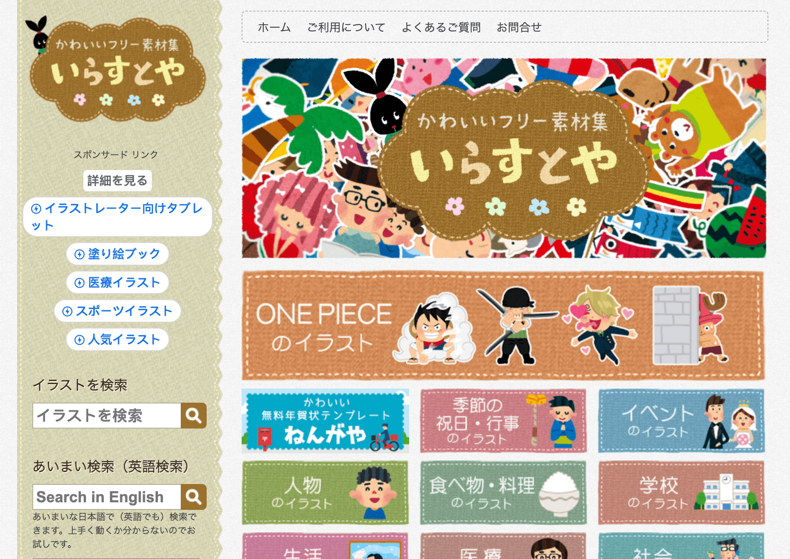
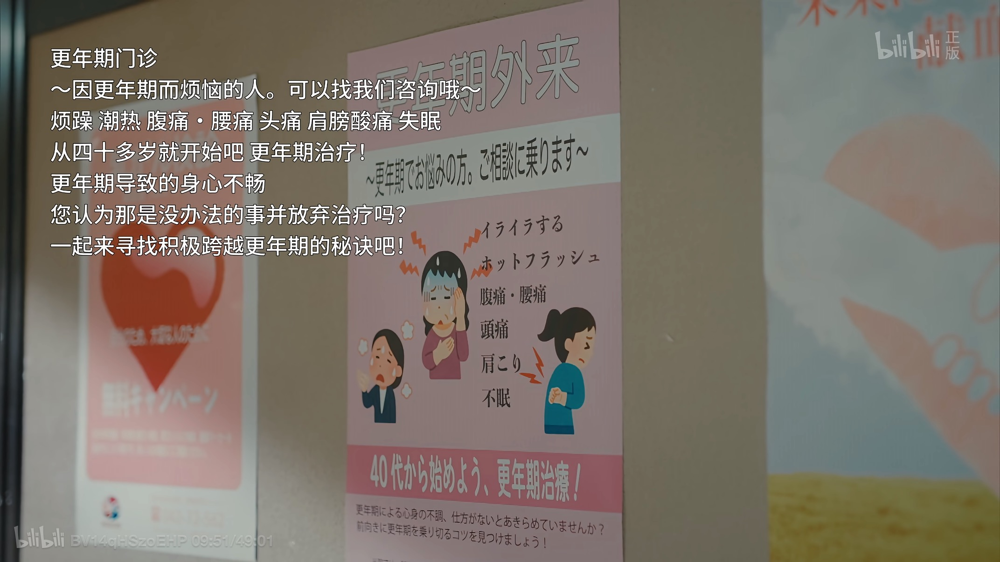

在网上是不是经常可以看到这种风格的插画小人呢：

  

原来，这些插画都来自于一个叫做 [**irasutoya**](https://www.irasutoya.com/)（いらすとや，直译是「插画屋」）的素材库！

irasutoya 是由日本插画师 Takashi Mifune（みふねたかし，汉字可以写作「三船隆」）创办的。从 2012 年创办以来，网站上已经收录了成千上万张插画，全部都由作者一人完成。直到今天，他还在源源不断地更新作品。

人物、事件、生活、社会、建筑、动物，irasutoya 的插画覆盖了方方面面的话题，一共有上百种分类。每一个插图，网站都提供了透明背景的 PNG 版本。根据网站条款，所有素材都可以免费使用，包括 20 张以内的免费商用。

详尽的分类，简单易获取的素材，慷慨的免费授权，以及持续不断的更新，都让 irasutoya 融入了日本乃至世界的每个角落。

