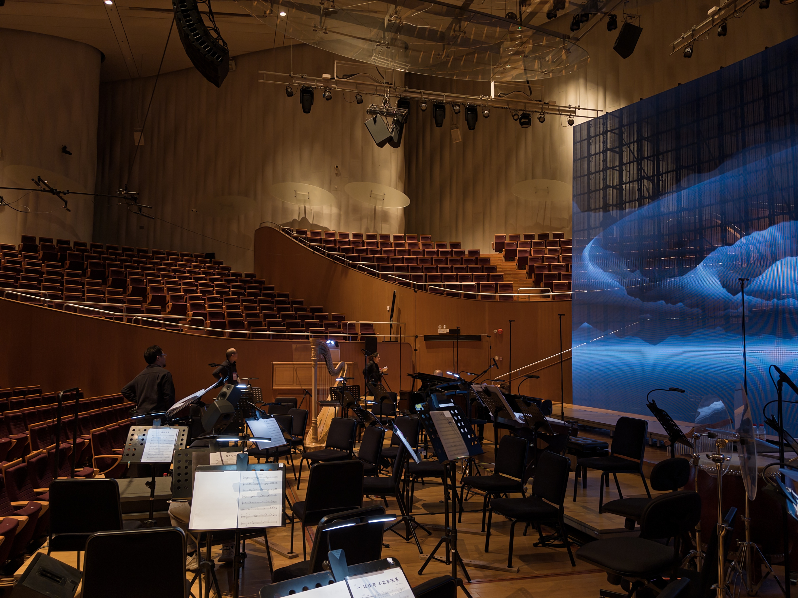

《罗刹国纪·海之篇》第二次演出的排练，从一周前开始。仅有两周左右的时间，要完成二十多首曲目的重排。合唱团员和乐手，相比去年七月的首演都有一部分更换，需要重新磨合；更别说还有三四首曲目的新增或是完全重写。排练压力非常大。

那天在排练厅，我作为有念白台词的演员，站在侧面，和指挥平齐，面向合唱团和乐队。以往感觉很宽敞的排练厅一下子挤了一百多人，加上各类乐器，要找出一条路出门都很难。指挥坐在台上，要用一己之力调动这一百多人，按照统一的节奏和情绪流动，同时发出数十种声音，可真是需要很大的能量。我一下子就体会到了他的厉害。让我在一百多人面前讲两句话，我都会发抖，他还要连着排三个小时呢。

临近演出的这周，进驻音乐厅进行现场排练。包含所有合唱团员和乐手的联排是在周三、周四。对于我来说，恰好这周在工作中遇到了些烦恼，晚上的排练算是换换心情，唱得很爽。不过，对于制作团队来说，忙前忙后没停过，工作强度和压力一看便知。

这两天的联排，都到十点半左右才收工。按照日程排完了曲目，留下几个合唱声部开开小灶；开完小灶，又留下有念白台词的演员对对戏。音乐厅渐渐变得很空旷，我们也慢慢在这种清爽的空气中找到了一些台词的节奏。观众可能不会感觉到（其实也不应该感觉到），我们站立的角度、台词中每一个字的声调和语气，都经过了细致的打磨。做演员可真难，因为脑子里装着这些表演细节的同时，还要忧虑着一个最基本的问题：词能不能好好背得下来，不要念错。

