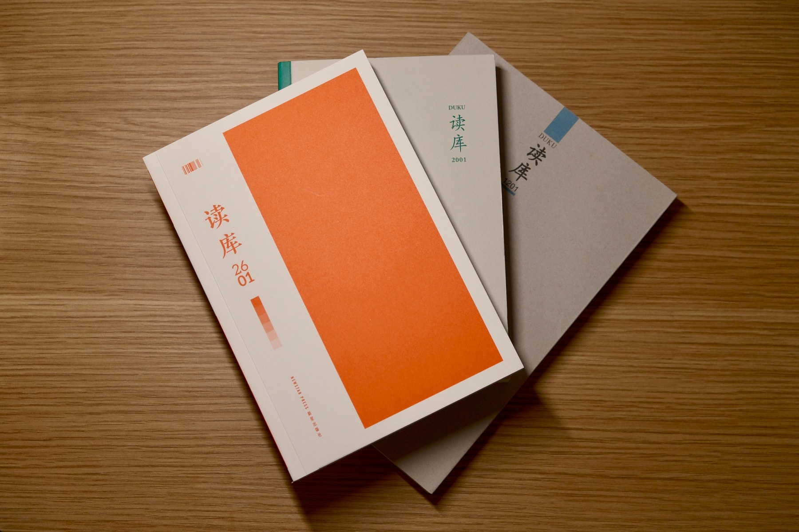

新一年的《读库》到了。这套每年六本的杂志书（MOOK），走进了它的第三个十年，也迎来了第二次装帧改版。十年前，《读库》改为轻型纸小开本，读者群体中不乏有反对的声音；经过打磨后，《读库》重新考虑字号、用纸，但也努力播种小开本的出版理念，终于形成稳定的品质，与读者又共同经历十年。这次改版，开本稍稍变大，设计更现代，不知道是不是又会有一番讨论呢？对我来说，新的十年，《读库》又会在我的书架上形成一道新的风景，我很期待。

前面几年，我的阅读习惯有下滑，有几期《读库》甚至没有拆封。今年，当然要从认真读开始。在信息过载的时代，读库[^1]的坚持尤为珍贵，而习惯成自然地随手捧起来阅读，就是对这种珍贵的最好回应。我决定好好读完每一篇文章，以及每期随附的读库新书，也多关注一下读者群。

[^1]: 带书名号的《读库》表示每年六本的 MOOK，而不带书名号的读库则表示其出版方
