## 写作与阅读，日拱一卒

去年十二月，我重新搭建个人网站，开始用英文撰写技术笔记。进入 2026 年，我认为实践地还不错，可以继续扩展，于是又搭建起了这个用中文撰写的生活手记站点。一月中旬，我写下了[第一篇手记](/notes/2026/01/12/starting-from-this-monday-afternoon)，一个新的、令我满意的写作框架宣告完成。关于其中的思考，我用英文记录在了这篇文章中：[_Splitting My Websites and Finalizing My Writing Framework_](https://tech.zlliang.me/posts/2026/01/13/splitting-my-websites-and-finalizing-my-writing-framework)。

新的一年我有个目标，就是通过写作，来锻炼思考的深度，还有对生活的感受力。搭建个人网站和写作框架，就是为这个目标服务的。一月的阅读，也和这个目标相关。我用一周多的时间读完了《[当我谈跑步时，我谈些什么](https://book.douban.com/subject/37021151/)》，村上春树的一本回忆录。关于跑步和写作。从去年读《[没有色彩的多崎作和他的巡礼之年](https://book.douban.com/subject/25733470/)》开始，才头一次感受村上春树的写作，很喜欢。很早之前读过台版《挪威的森林》，但没什么印象了。今后可以多读一点。

重看[吉井忍](https://www.douban.com/people/48894112/)的部分作品。关于她的作品，我列了一份[收藏清单](/notes/2026/01/22/shinobu-yoshiis-works)。她是用中文写作的日本作家，写作简洁凝练但有温度。或许正因为是外国人，反而能用一种审视的态度使用中文，保持真实、不矫饰的风格。

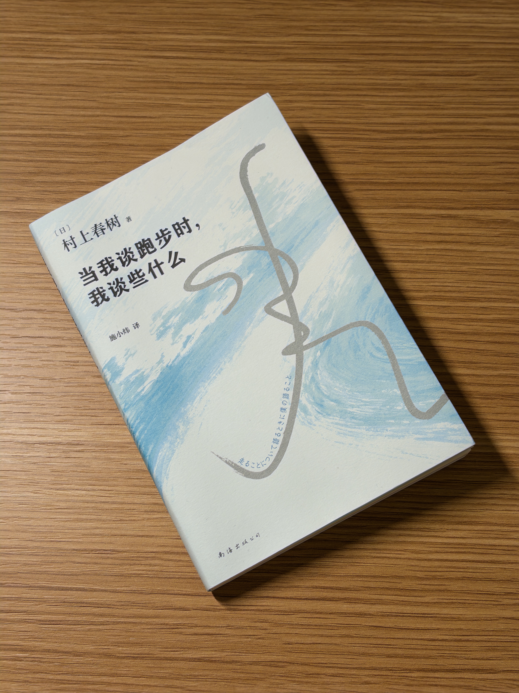

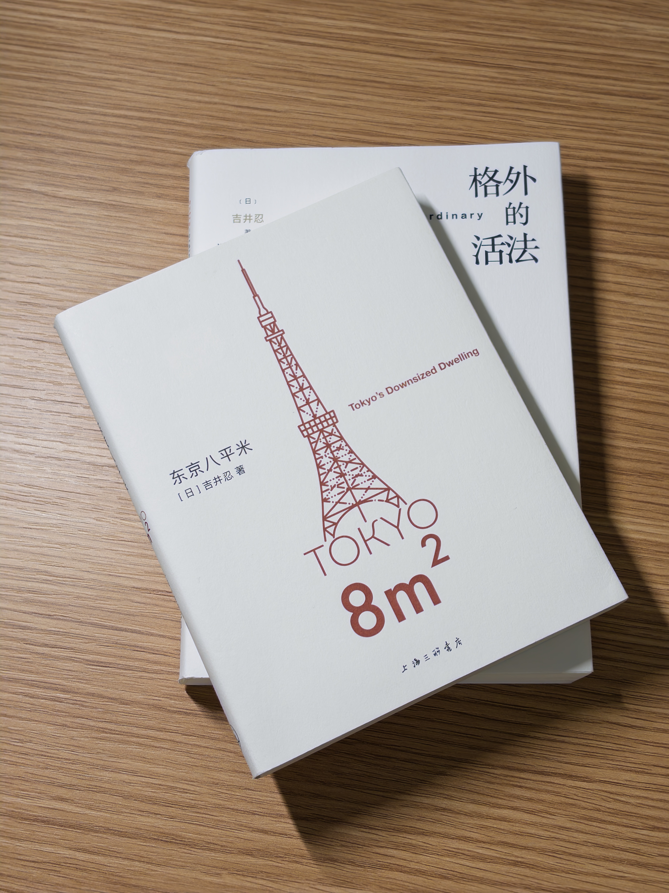

## 屏幕前，沙发上

《[机智医生生活](https://movie.douban.com/subject/33464863/)》从去年秋天就开始看。韩剧实在每一集都很长，12 集堪比国剧的三四十集。这个月看了两三集左右，看到第 11 集。

《[住宅区的两人](https://movie.douban.com/subject/36902276/)》只花了一个礼拜左右，从头看到尾。那一周每天中午吃饭都要看一集，非常喜欢，看到一个人在家里大笑出声。我把它放进了我的豆瓣 top 10。第一集和诗胤一起看的，但看得出他对这部不太感冒，于是后面的我自己看完。可能因为剧里都是老头老太太吧。

诗胤有天突然想开始看《[神探狄仁杰](https://movie.douban.com/series/ECVUNAKVI)》，恰好是我也非常喜欢的剧，看过很多次。他吓得不行，但也一起吐槽当时的特效有多塑料；他还一个劲儿问我后面发生了什么，谁是好的谁是坏的，猜得还特别准。他一问我就想说，于是早在狄仁杰破案前我俩就已经破完案了。我们一起看完了第一部，还有第二部的前两个案子。

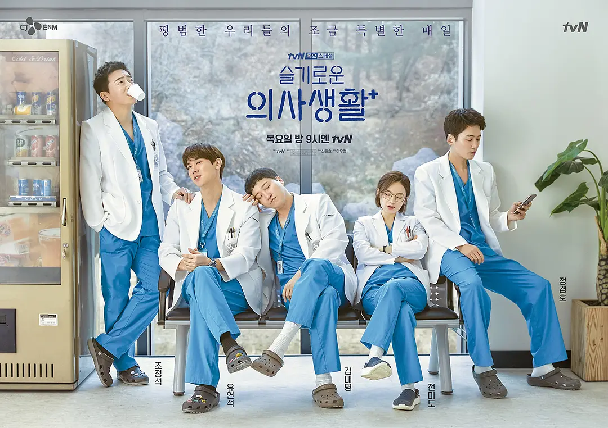

《[双影奇境](https://www.douban.com/game/37083957/)》通关了。去年夏末我们就开始玩，每周会有几个小时，晚上窝在沙发上玩。诗胤从 3D 游戏零基础开始入门，最终爱上了这款游戏，并在后来尝试玩前作《双人成行》时吐槽没有续作惊艳。《双影奇境》玩到最后，我们都被这款游戏的绝妙创意给震撼到了。断断续续的几十个小时，收获的是一起在沙发上欢笑打闹的回忆。

## 翻过我们的山

从一月中旬开始，我和诗胤都进入了一段忙碌，也都在月末迎来了转机。

诗胤在百度实习三个月之后，拿到了校招 offer。于是他向公司提出，休假一段时间，回到学校把毕业的事情处理完。为了毕业，他需要发表一篇 SCI 论文，并完成他的学位论文。发表论文是我没完成过的事，但难度是一看便知的。其实他在实习期间也没有把论文落下。他和导师经常会在夜里开会沟通，然后整宿地跑代码，第二天对着不尽人意的运行结果，一声轻叹。从去年八月就开始的期刊投递、审核过程也是一波三折，在此期间，诗胤甚至几乎完成了另一篇论文用作备选。

诗胤和我有点像，遇到事情心情就会很沉重，每天都叫着「完蛋了，干不完了」。然后带着这种沉重的包袱，又总会点点滴滴做完每件事情的人。进入一月中下旬，好消息到来：经过一番修改，论文被研究领域内很不错的期刊接收。[Elsevier](https://www.elsevier.com/) 的论文页面上，看到他的英文名列在首位，很为他激动。此刻，他又埋头开始写毕业论文了，身影出现在家里的书桌前、咖啡馆、学校的教室和图书馆。接下来的这座山，他也会勇敢翻过。

说回我自己。从十二月末到一月中旬，生活给了我一个舒服的空档。按照外企通常的工作节奏，十二月末同事们陆续开始休假，我手上的事也不必着急了，恰逢半年的试用期刚刚通过，于是非常轻松地度过了这段时光。工作日历上堆满了大家的 OoO（out of office）日程，这个缩写是多么地俏皮可爱。另一边呢，彩虹合唱在月初有一场《活在爱里面》。虽有难度不小的新曲目，但有几年的应对经验，也算是驾轻就熟。

进入到中旬，我遇到了工作上的新挑战。面对一项我自认为很简单的工作，花了两周时间，却仍然在与相关的同事沟通、讨论，至今仍然进展平平。我在这项任务中需要直面自己的很多弱点：沟通时尚不能简单直接地切中要点、要用英语开会时还是会发怵、不会控制局面，等等。但良好的职场沟通能力的确是我今年想要构筑的技能，因此我乐于见到这种挑战。即便这次做得磕磕绊绊，也是为将来的平坦而铺路。

与此同时，合唱团也要开始为期两周的紧张排练，准备月末上演的《[罗刹国纪·海之篇](https://www.douban.com/location/drama/37436340/)》。上一轮的首演是去年七月份，半年的时间过去，乐谱多少有些生疏，加上大部分曲目演唱难度都不低，排练日程比平时多了几倍。除此之外，承蒙指挥信任，我还要扮演一个台词不少的特殊角色，需要花时间琢磨、参加更多的排练才行。月末，《海之篇》两场演出顺利完成。谢天谢地，我的台词说的还不错。庆功宴上，大家都喝疯了，你追我赶，互道辛苦。过去半年排演的劳累，在炸耳的欢呼声中得到释放。

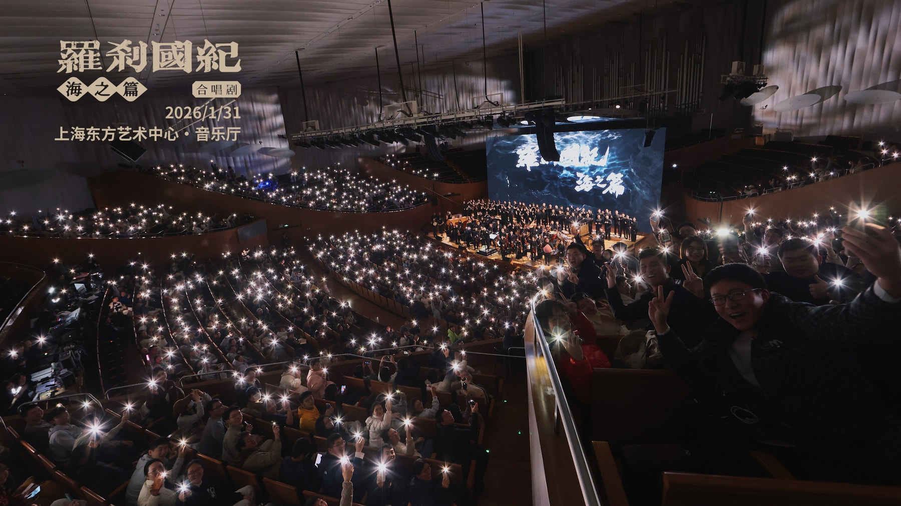

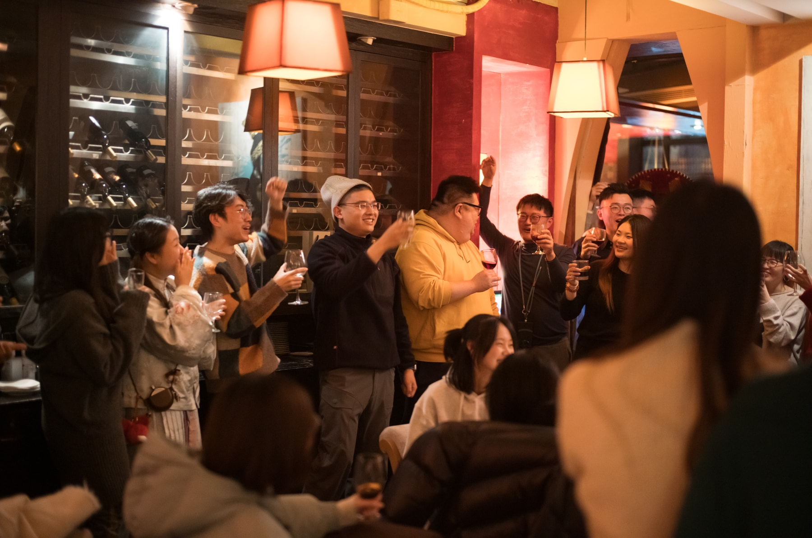

## 生活瞬间

跨年夜在诗胤的家乡重庆度过。行前，诗胤就翻遍了抖音和大众点评，精挑细选要带我吃哪几家美食。刚到重庆的傍晚，我们太过兴奋，也太过饥饿，暴食了一顿火锅。真好吃，也是真吃得太快太多。第二天，我们的肚子就都发作了。

我们逛了好多步行街，加重了「重庆没有一条路是平的」这种刻板印象。我也确信了网上所说，在这里开车、走路，真的如入迷宫。但这座城市的魅力也在于此。两江交汇的岸边夜景，我觉得比上海的外滩、香港的维多利亚港都还要好看。

这个月吵架两次。即便已经一起生活了将近半年，作为两个高敏感的人，还是需要时间和契机，交流平时相处中遇到的问题。人会不断改变、进化，我们要体会到变化，及时沟通出新的共识才行，即便是通过争吵的方式。

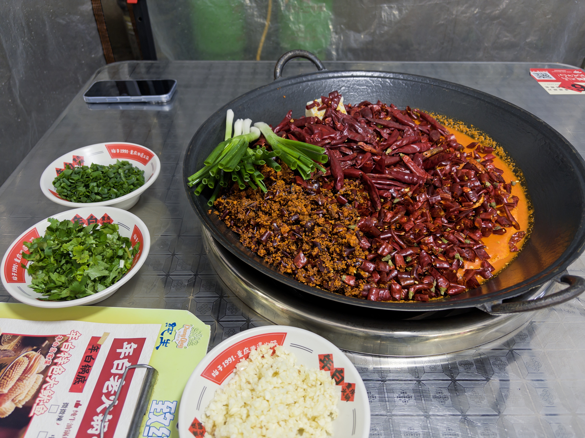

诗胤开始了种牙疗程，要持续到年中。十二月去看诊时，我们都惦记着元旦假期要去重庆吃辣，于是约到了一月初再种牙。种完后他痛了几天，但没到一周就又馋辣了。那天我们在上生新所散步，这个我很喜欢的街区，终于带诗胤来逛了一次。我指着中庭那些树说，到时候去东京代官山，你看看这两个地方是不是长得很像。当晚，就去吃鸿姐火锅了。

本月还去了两次和平公园。一次是我自己在家待得烦闷，出门散心，另一次是和诗胤一起来这里的茶室学习、办公。湖边有露天的社区剧场，一组大爷大妈们在看另一组大爷大妈表演，唱歌跳舞。不远处是有名的鸽子房，上百只鸽子聚在一处，咕咕叫。诗胤拉着我，不敢过去跟鸽子亲近。我还觉得好可爱，想摸摸。

有个宝贵的周日，我们去共青森林公园散步。天气阴冷，人很少，气氛萧瑟；但也能想象，到了春天这里的草地一定会很热闹。即便是在深冬，也有好多人放风筝。我们在湖边坐着看了好一会儿，有个大风筝，一直没能飞起来。转头走到了湖的另一边，有一对情侣在长椅上拥吻，姿势不雅。

这个冬天，似乎每个超市、烘焙店都在渲染「草莓季」的气氛，满眼红色，贩卖盒装草莓和草莓制品。以往几年会有吗？我从没注意过。和诗胤一起生活后，我比以往爱吃水果了。这个月买了好多次草莓，回家切来吃。

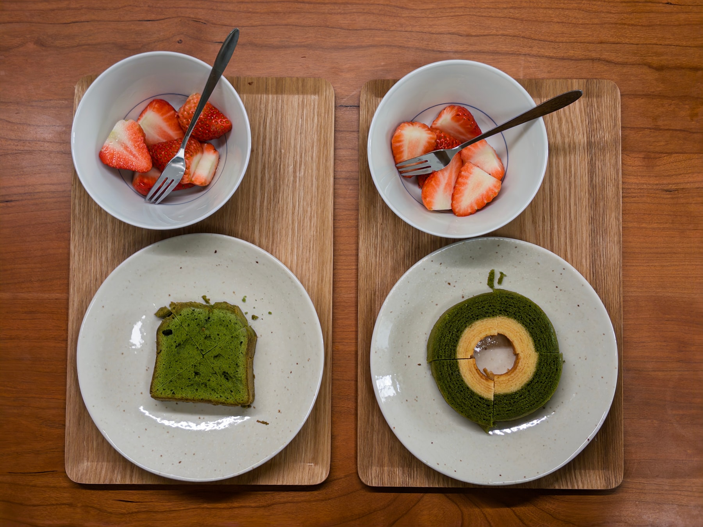

元旦到新年的这段时间，适合老朋友相见，也适合整理家里的一切。我跟腾讯的前同事聚餐，他们曾是我进入职场的第一波伙伴；在美国工作的大学室友回国，途径上海，也约着一起吃了顿饭，在江边走走、聊天。

准备认真对待一下多病的植物。原来，在家里待了一年左右的那盆叫做「白掌」。我拍下它现在的惨状，拿给 ChatGPT 看。然后根据它的指示，剪掉枯叶、换了更大的新盆。它能不能好好活下来呢？

整理和收纳。垃圾每天都很多。给厨房添置了一个置物推车，台面整洁了不少。对我来说，整理房间不是烦恼，而是整理心情的一种方式。但是要检讨一点：自从入住这间自如的出租房后，因为有每月一次的免费保洁，自己擦扫桌子、地面、卫生间的频率降低了。还是要多做家务，保持清洁才行。

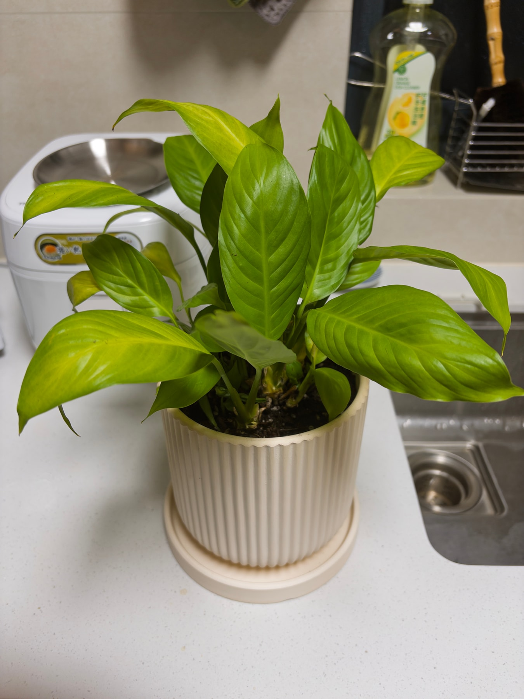

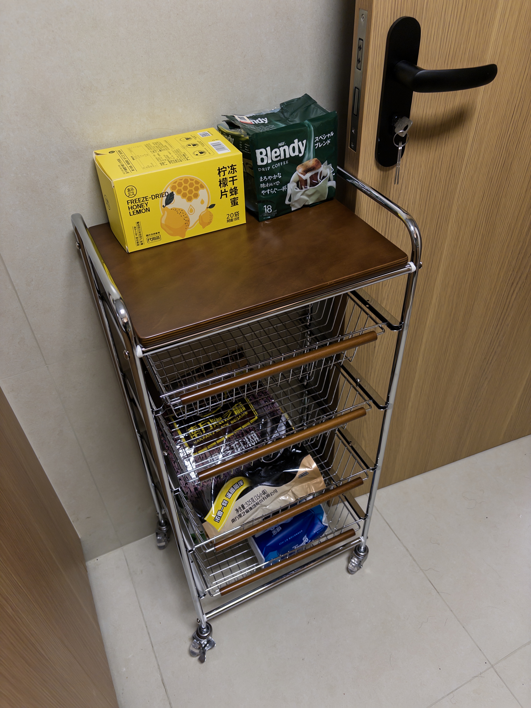

## 即将到来的二月

近在眼前的是和诗胤一起的东京旅行。本来打算去福冈，但考虑到最近中日关系紧张的形势下，航班有取消的风险，还是选择去大城市。这将是我第四次去东京，不过不论几次，还都是想去。这个城市有种魅力，在街道上走走，或者是周边的小城市逛逛，都能梦幻般度过。这次和诗胤一起去，想着是带他同步进度，体会我眼中的东京，也让我们有新的体验。以后，可以一起去探索日本的更多小角落。

为了这次旅行，我在二月初请了几天年假。我供职的公司 Booking.com 实行混合办公政策，每两周仅需来办公室四天。具体是哪四天，按惯例，一般是其中一周的周一到周四。于是同事们一起算了算，二月的第一周结束之后，是居家办公周，接着是春节假期，接着又是居家办公周。那么下次来公司现场办公，就要到三月了。

公司在一月末就布置上了各类春节装饰，还派发了春节小礼物，氛围慢慢变浓。进入二月，工作的积极性也大打折扣，不由自主地进入「年后再说」模式。感谢国家的政策，今年比以往多了两天假期，从除夕前一天开始。我订好了回山西老家的机票，和家人一起过年之后，还会一起去潮汕玩几天。诗胤决定在老家待久一点，陪陪长辈，应该会到三月才回来。

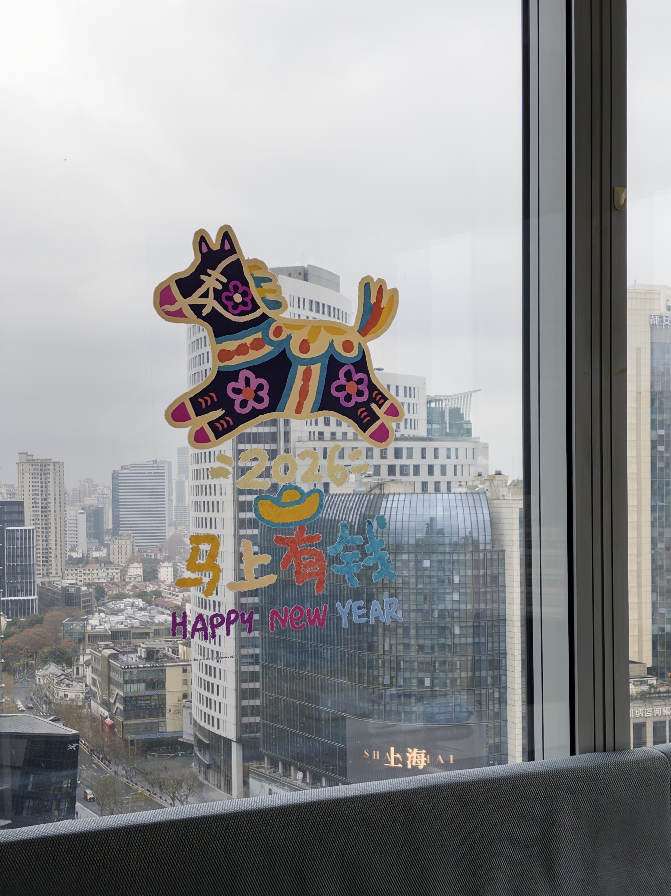

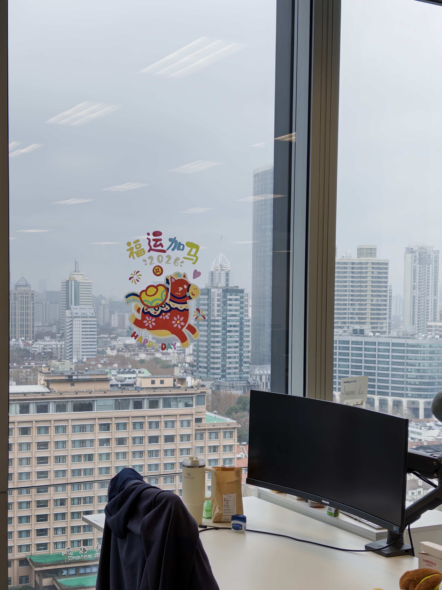

