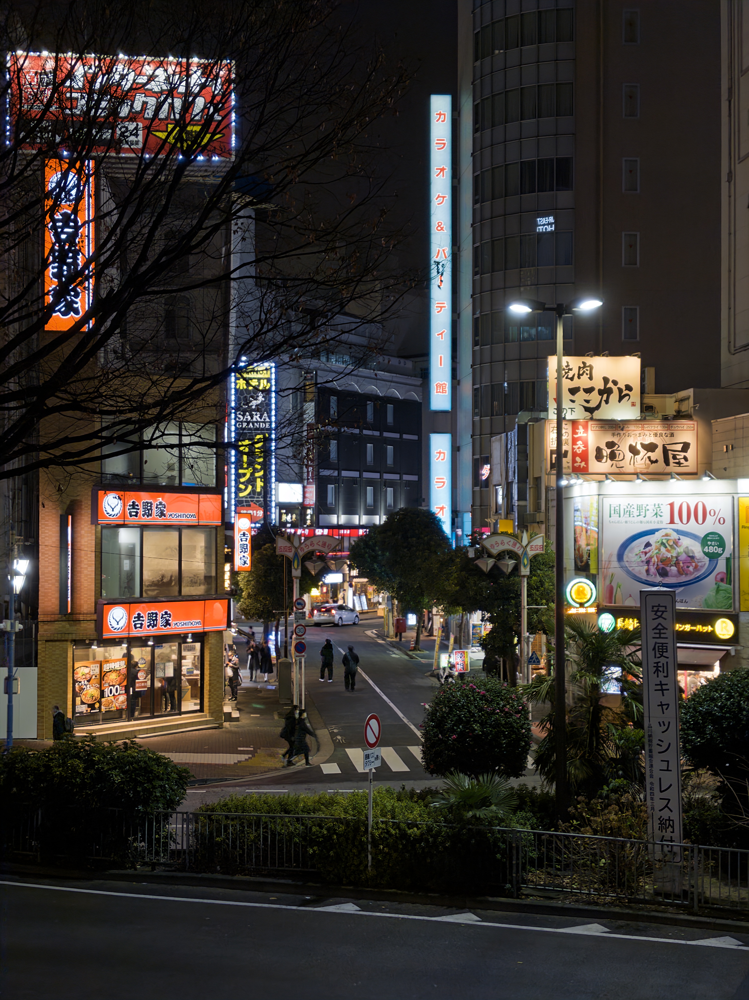
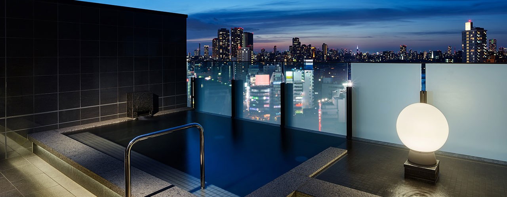
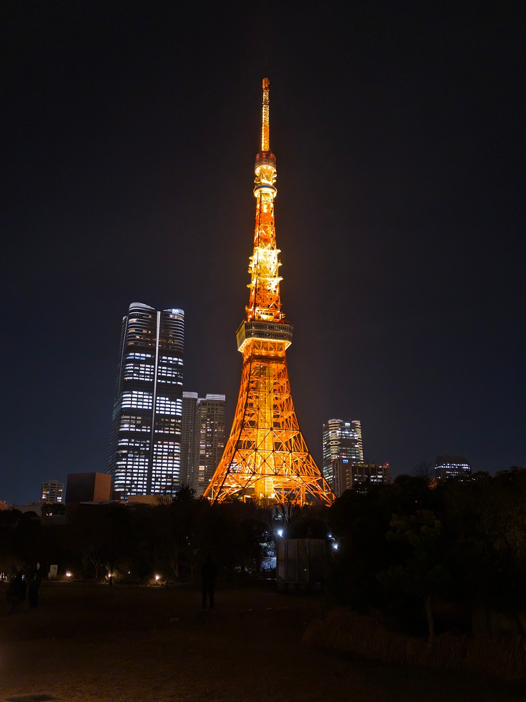
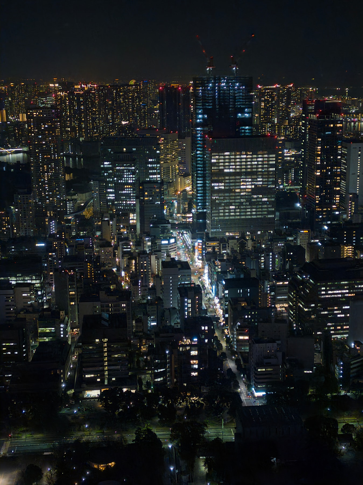
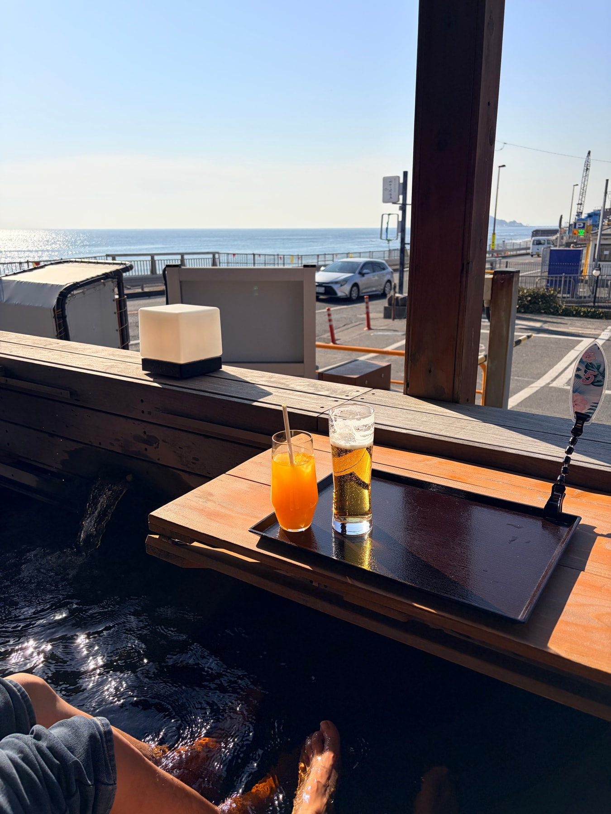
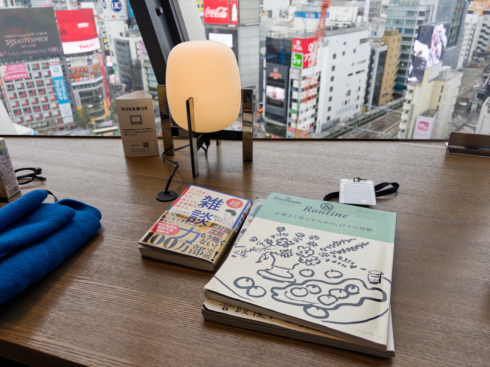
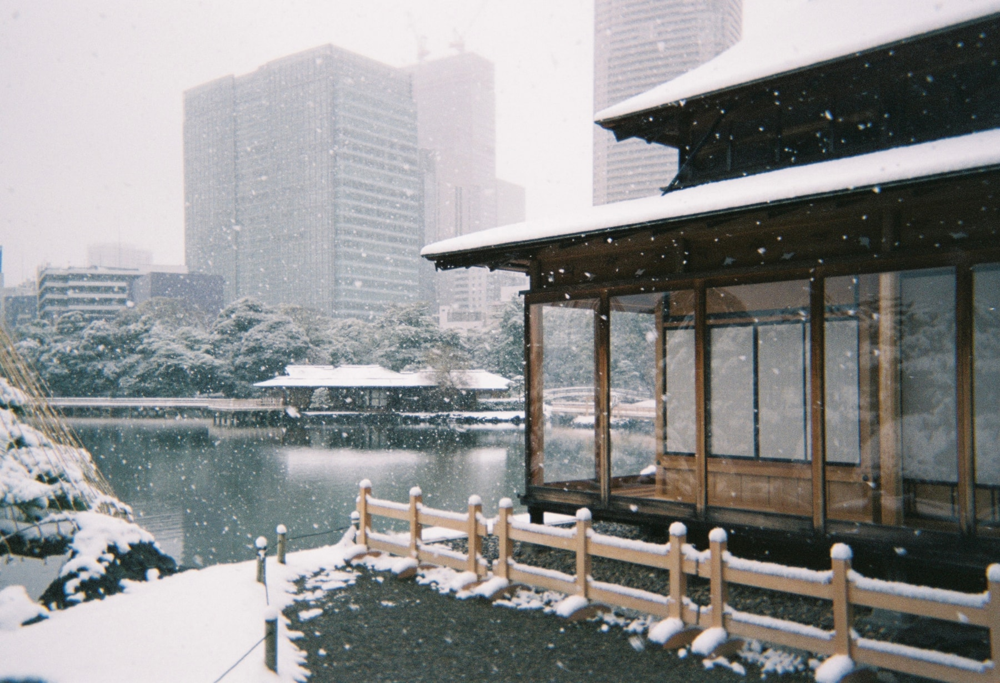
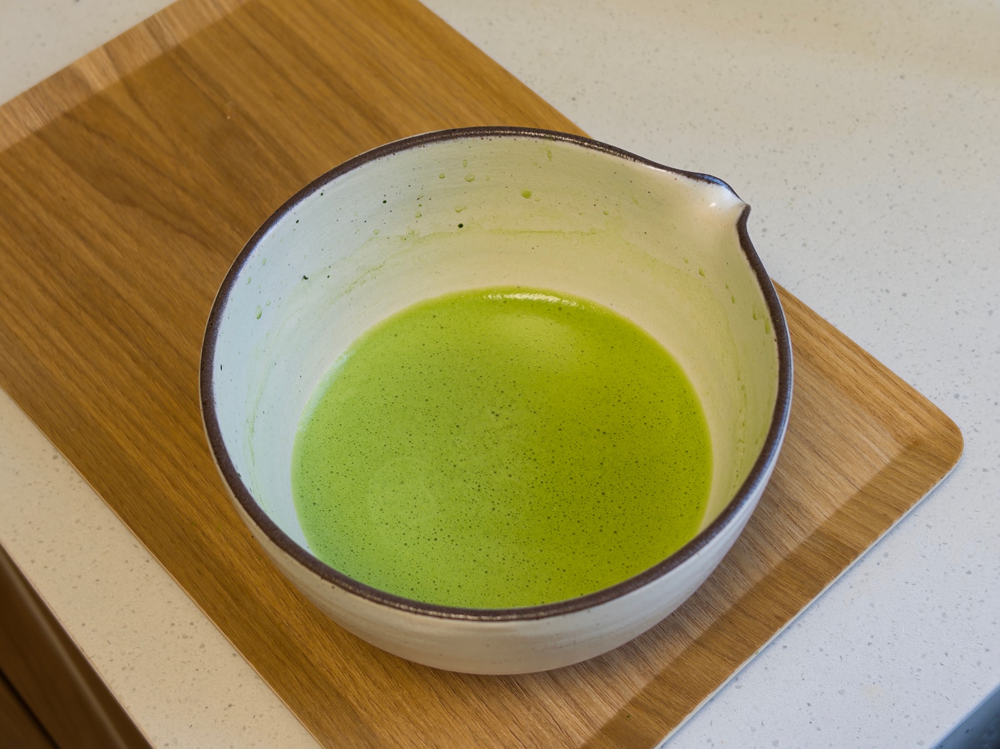
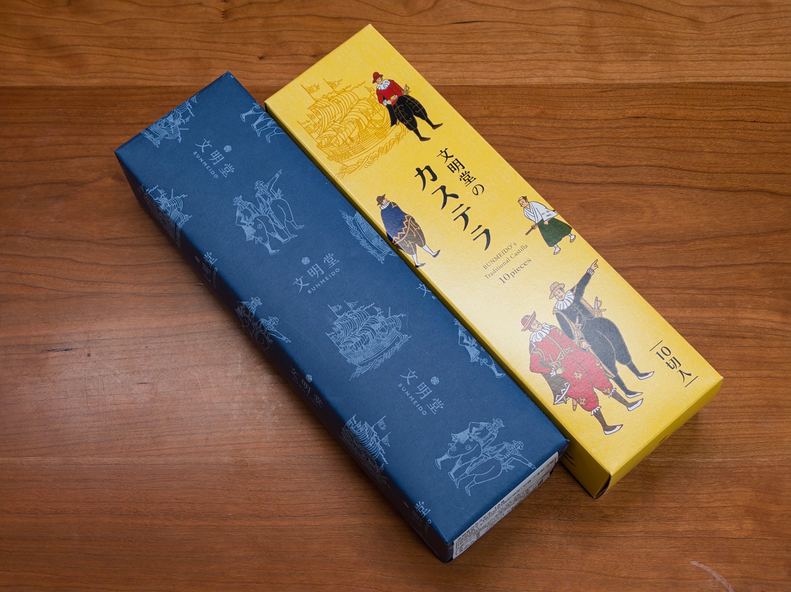

二月初，请了两天年假，连带着周末一共四天，和诗胤一起去了东京。原本的计划是去年十一月底去福冈，但那时中日关系骤然变得紧张，我们决定不冒风险。到了今年年初，眼看着诗胤费心办下来的签证快要过期，还是利用一下比较好。决定再一次去东京，是怕在这样的政治局势下，往返小城市的航班很可能被取消。

这是我第四次在东京旅行。诗胤是第一次，不过他之前曾去过大阪。行前，我跟他说，也跟自己说，这次要悠闲一点、轻松一点。没想到几天之后，我们还是带着每天 15,000+ 的步数回家。

## 从五反田出发

在东京和周边逛，还是住在 JR 山手线沿线比较方便。之前两次我都住在高田马场附近，到了夜里站前的吸烟区小广场会热闹地聚集不少人。这次是两个人出行，想找一家设施更好、房间稍大的酒店，其实也是想换个地方体验一下，一番调查后选择了[三井花园酒店五反田](https://www.gardenhotels.co.jp/gotanda/)。事实证明，这个选择不错，是下次还会想住在这里的程度。

一下电车，拖着行李走在天桥上，诗胤就说「这就是剧里那种日本街道的感觉诶！」是什么感觉呢？道路两边的店面、竖着一层层排列的灯箱、灰白色的楼、街角的一家小型百货大厦，都是这种感觉的一部分。还有几分钟就会响一阵的轰隆隆电车声。

车站出来，就有很多餐馆。我们在这几天里吃了小巷里的一家烤肉，还有天桥下的两家拉面。酒店楼下也有一家罗森便利店，我们穿着房间里的睡衣，套个外套就来买牛奶和果冻。最舒服的还是酒店顶楼的浴场。晚上人也不会多，还有露天的浴池，可以在泡澡的时候看到城市一闪一闪的，听到街道的车流声。走路一整天的疲惫能在这里得到解放。

到达的晚上，我们就去了东京塔。我第一次来日本（也是第一次出国旅行）是跟妈妈一起，大概九年以前。那次刚到达，也是同样直奔东京塔。这次带诗胤来，我在做计划的时候不自觉地就想复刻那一次的体验。属于自己的一次「圣地巡礼」。夜晚的芝公园很安静，登塔俯瞰城市夜景，诗胤半开玩笑地说，要不来这里生活吧。

## 在镰仓成为风景

行前看了天气，周五是唯一的大晴天，于是计划去镰仓和江之岛看海。我们被湘南海岸的阳光照得眼睛睁不开，只听到海浪声哗哗。冲浪者、跑步者，还有遛狗者。小狗在这里生活都会很幸福吧。回头一看，有一个头发花白的阿姨，穿着冲浪服坐在台阶上休息聊天。他们的自行车旁都专门安装了挂冲浪板的架子。这里有一种生命力，不像我和诗胤，沿着海岸走了一遭，脚就开始痛了。

诗胤看我很想去江之岛上走一走，于是遂了我的心愿。上次也是和妈妈一起来，在这个很像鼓浪屿的岛上度过了悠闲的一天。我记得还曾在一家小餐馆吃了鸡肉盖饭。我和诗胤说，我们很快穿过这个岛，到另一头去坐轮渡回来。

结果轮渡船没开，我们只能原路返回到上岛处坐公交车。台阶又要爬一遍，坡道又要走一遍，我们都开始喊累。但是，在轮渡码头的那一边，我们看到了浮光跃金的海，一阵阵打着石头；我们在半山腰的林荫坡道上，一起大喊着、跑着冲下去，然后回头看刚才坡顶的老头有没有笑话我们。

江之电经过有名的镰仓高校前站，车窗外的丁字路口，数十人举着相机，拍电车在海岸边穿行。这里是动漫《灌篮高手》的取景地。诗胤说，坐在车里的我们简直成为了风景的一部分，感觉很像重庆李子坝的轻轨穿楼。

坐这趟电车是为了去我之前找到的一家小餐馆。它开在稻村崎温泉的旁边，有几个座位可以一边泡脚一边喝一杯饮料或者啤酒，正好可以帮我们缓解走路大半天的疲乏。才刚过中午，日头有点大，我说要是傍晚来会更舒服。邻座有一对日本情侣，拿衣服盖在头上，挑着最晒的位置，泡得比我们还久。

## 生活感与新色彩

诗胤这次带了电脑，他想着要在休息时间写写论文。我突然有个点子：以往几次去东京的[茑屋书店](https://tsutaya.tsite.jp/)逛，总能看到他家付费的共享办公空间 [SHARE LOUNGE](https://sharelounge.jp/)。既然要写论文，不如正好体验一下。于是我们在涩谷找了一家，待了一个上午。窗外是繁忙的十字路口，而我们闹中取静，他写完了一章，我拿了几本书和杂志翻翻看。

SHARE LOUNGE 按小时付费，涩谷这家一小时 1800 多日元。空间里提供网络、免费饮料、小吃，还有腰靠、可借用的大屏等实用设施。有视野开阔的窗边自习位、温暖私密的沙发位，也有供几人轻声洽谈的圆桌。这种业态很细腻，在里面待着你会感觉到适当的安静、舒服和有边界感的照料。很遗憾国内少有类似的空间，可能是缺少相似的工作文化和土壤。曾经 WeWork 一度在上海铺开，但又匆匆消逝。

<!-- 照片：早晨在涩谷窗边自习。 -->

下午，我们来到代官山。此前两次来这些街区，我都只是「逛」，也就是在路上走。路过两边的店面而不进去，拍一拍街道和小路，浅浅体会一下氛围和空气。这次有诗胤，我们在一间咖啡店小坐取暖的时候他才跟我说，为什么不进那些店铺试试衣服呢？可能是因为之前只有我自己来吧，试衣服没什么意思，也怕跟店员沟通有障碍。于是这次，我在他的引导下真正踏入了街区的每一家店。

一路上，他向我传授逛街的乐趣、试着搭配衣服的乐趣。原来我已经困在优衣库太久，去买衣服，目的性总是很强，忽略了「偶然发现」的快乐。在他的引导下，我好像豁然开朗，「逛街」这个词突然变得意义有所不同，多了些色彩。虽然这次没有下决心买到一两件衣服，但是这颗种子种下了。我还借此机会终于知道了 [nanamica](https://www.nanamica.com/) 和 [THE NORTH FACE Purple Label](https://www.nanamica.com/itemlist/4/)。

诗胤会照着电车上的导视屏，按照假名念出站名，然后笑着问我说念的对不对。我呢也就是个半吊子，旅行中的日语交流不能完全听懂，只是勉强够用。我很珍惜这一天的体验。不是看风光，而是深入城市，体验它能给生活增添的色彩。同时，身边的人能给你这种体验的契机：没有我，诗胤可能不会想到还有那样的自习空间；没有他，我也不会想要利用那样的空间度过一个上午，也不会了解到逛街的新意义。

## 第一卷胶片

去年初，我买了台富士一次性胶片相机，能拍 27 张照片。行前检查，还有十多张可以拍。可能是因为拍完不能立刻看到，所以拍的动力不足吧。现在我才发现，胶片相机的魅力正在于此。

这台相机最后一个镜头，拍下了雪中的滨离宫恩赐庭园。前一天还是外套穿了都嫌热的晴朗，一夜里温度急转直下，早晨拉开窗帘，雪都积上了一层。我们就这样打着伞，在庭园里坐了一会、走了一会，看着雪越下越大。在茶屋里，我看到了一位独自端坐的妇女，一直盯着窗外的雪，临走时拍了两张；在出园的路上，我们遇到一对男女穿着和服，被亲友围起来，不知道在举行什么仪式。石子路踩着簌簌响，我们一边说下雪了真好看，一边被这大风大雪搞得表情动作狰狞，使劲把耳朵和脸往围巾里缩。

回家的第二天，我就把胶片寄去冲扫了。这时我才开始期待照片会是什么样子，也才发现拍胶片的魅力。等待冲扫的过程会有点激动，而看到照片的那一刻，是记忆的重现和刷新。像网上说的，拍胶片能带来两次快乐。这种快乐是「慢」和「稀缺」带来的，对抗着这个信息过载的世界。我想着，是不是买一台正经的胶片相机，多多利用这种温润的方式记录生活呢？

## 值得一提的美食和购物收获

难以相信，这几天我们居然吃了**四顿拉面**。诗胤爱上了日式拉面，尤其是博多风味拉面，每到饭点不知道吃什么的时候，就说「要不吃拉面吧」。于是：

- 到达五反田的第一餐烤肉没有吃饱，于是再去车站附近的一家横滨拉面吃夜宵。本来说合吃一碗，但上来后诗胤吃的津津有味，眼看要吃光，我就去另点了一碗。
- 从镰仓回到东京，在车站附近吃一风堂拉面。和上海店面完全一样的菜单和味道。
- 在拥挤的涩谷逛了一个傍晚后，去吃一兰拉面。小格子间很有意思。诗胤说比一风堂好吃，但只有一点点。
- 在大雪中从滨离宫走到银座，午餐还是一家拉面。诗胤说和家里做的差不多，不太像日式拉面。吃完身体暖了，又逛了一会街。

购物也不是毫无收获。在银座三越百货的一保堂柜台，买了一些抹茶粉和一套抹茶用具，准备回家试试看。此前的一月初，我有天吃了午饭闲逛，在静安嘉里中心的 [THE MATCHA TOKYO](https://www.the-matcha.tokyo/) 喝了一杯抹茶，顿觉清爽。听说抹茶的提神效果比咖啡要温和、持久，还有其他诸多益处。我看着店员在柜台前打抹茶，心想：学一下这个，以后在家里打抹茶来喝，也是一项静心的手艺。

从日本离境，一定要去机场的伴手礼店铺买些零食回来。日本的礼品文化成熟，商家早已周到地想到了各种细节，所以这些零食都包装得精美整齐，味道也好。我这种有一些整理癖的人无法错过。这次没有给家人朋友带什么，只是私心地自己买来吃。

