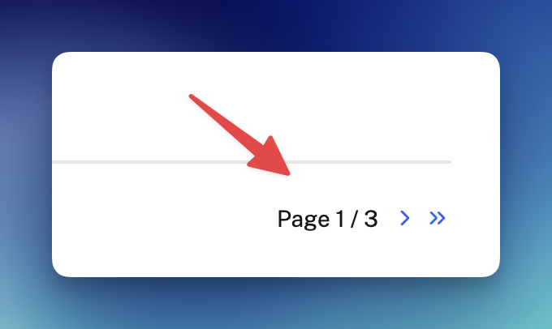
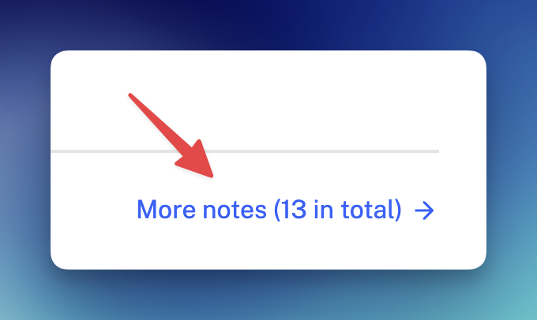

I just added pagination to note pages like [/notes](/notes) and [/notes/types/link](/notes/types/link), as the number of notes grows. Each page now shows up to 20 notes, and a tiny pagination indicator lets you navigate between pages without scrolling endlessly. I used [Astro's built-in pagination feature](https://docs.astro.build/en/guides/routing/#pagination). Here's the commit: [zlliang/zlliang@649a5df](https://github.com/zlliang/zlliang/commit/649a5dfd1914b71843c03ee92f99d87a2f841a81).

