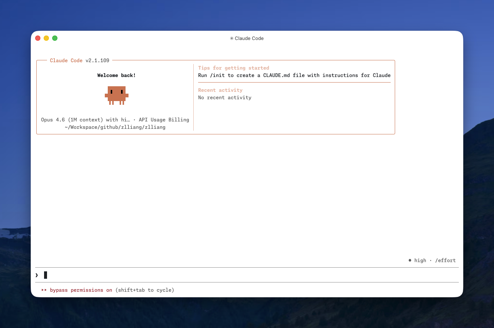
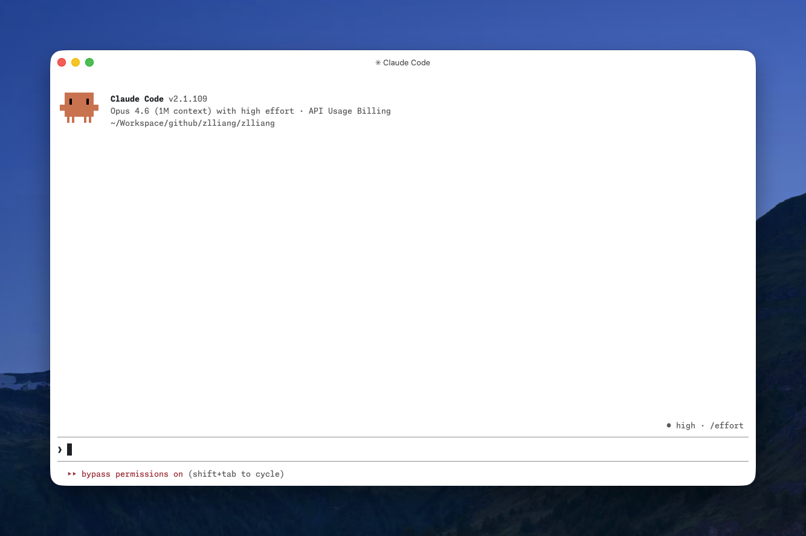

**TIL:** You can set `IS_DEMO=1` to simplify the welcome screen of Claude Code. There are two types of welcome screens (shown below), and there's no obvious logic behind which one appears for a given project — I found this annoying. After digging into it, I discovered an undocumented environment variable `IS_DEMO`[^1] that forces the simpler one. Run `IS_DEMO=1 claude`, or set it in Claude Code's `settings.json` under the `env` key.

[^1]: I found this under a GitHub issue: [anthropics/claude-code#2254](https://github.com/anthropics/claude-code/issues/2254#issuecomment-3724101193)
