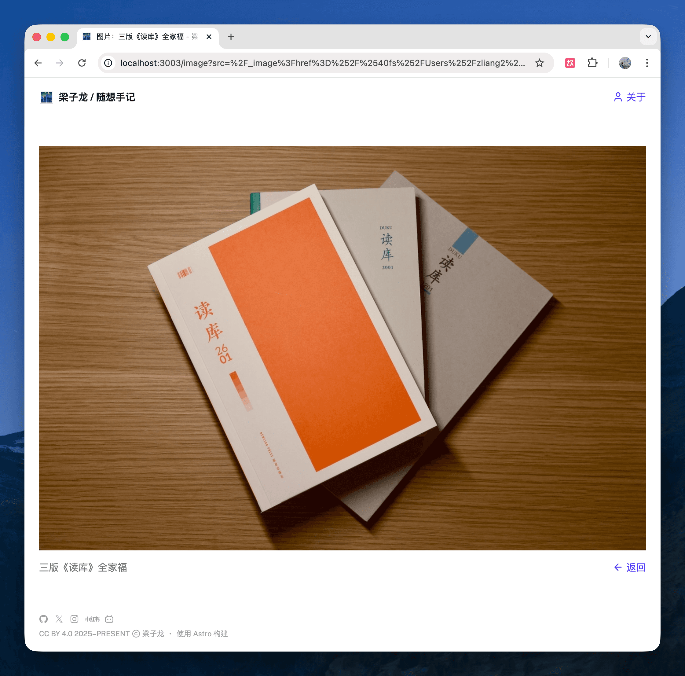

I just added a dedicated image viewer page to both [Hack](https://hack.zlliang.me) and [Muse](https://muse.zlliang.me). Clicking any image in a note or post now opens it on a clean, full-width page with the caption and a back link below.

I had originally planned to add a lightbox overlay, but decided to keep things simpler: a dedicated page is easier to implement, easier to share, and avoids the complexity of managing overlay state, scroll locking, and keyboard navigation. The URL carries the image source, caption, and origin page as query parameters, so the back link always returns you to where you came from — and when possible, it uses browser history to preserve your scroll position.

The commit is [zlliang/zlliang@4ccbab5](https://github.com/zlliang/zlliang/commit/4ccbab509c8f9b0cf7d2d71b92b854dcc37f96db). Most of the implementation was done with help from [Claude Code](https://www.anthropic.com/product/claude-code).
