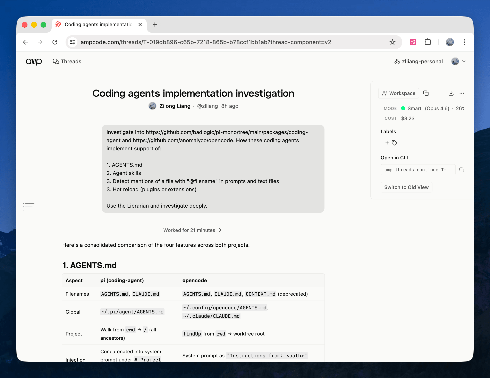

Today's observations:

- The [Amp](https://ampcode.com/) team is gradually rolling out updates. First a "new view" of the thread webpage, then I noticed the sidebar on this page is also changing quitely. Core member Thorsten Ball called it "[truly a peek behind the curtain.](https://x.com/thorstenball/status/2046915638287909238)" The new view looks like how the [Codex app](https://openai.com/codex) shows chat histories, which makes me wonder whether they'll release a desktop app too.
- I'm brainstorming my own coding agent. Using an agent thread, I investigated how to build a prototype with [AI SDK](https://ai-sdk.dev/), explored server-client architecture patterns, and looked at how open-source agents like [OpenCode](https://opencode.ai/) and [Pi](https://pi.dev/) handle harnesses like [AGENTS.md](https://agents.md/) and [skills](https://agentskills.io/). The original goal is to build a toy agent letting me play with [Kimi K2.6](https://www.kimi.com/blog/kimi-k2-6). Curious to see where this goes.

