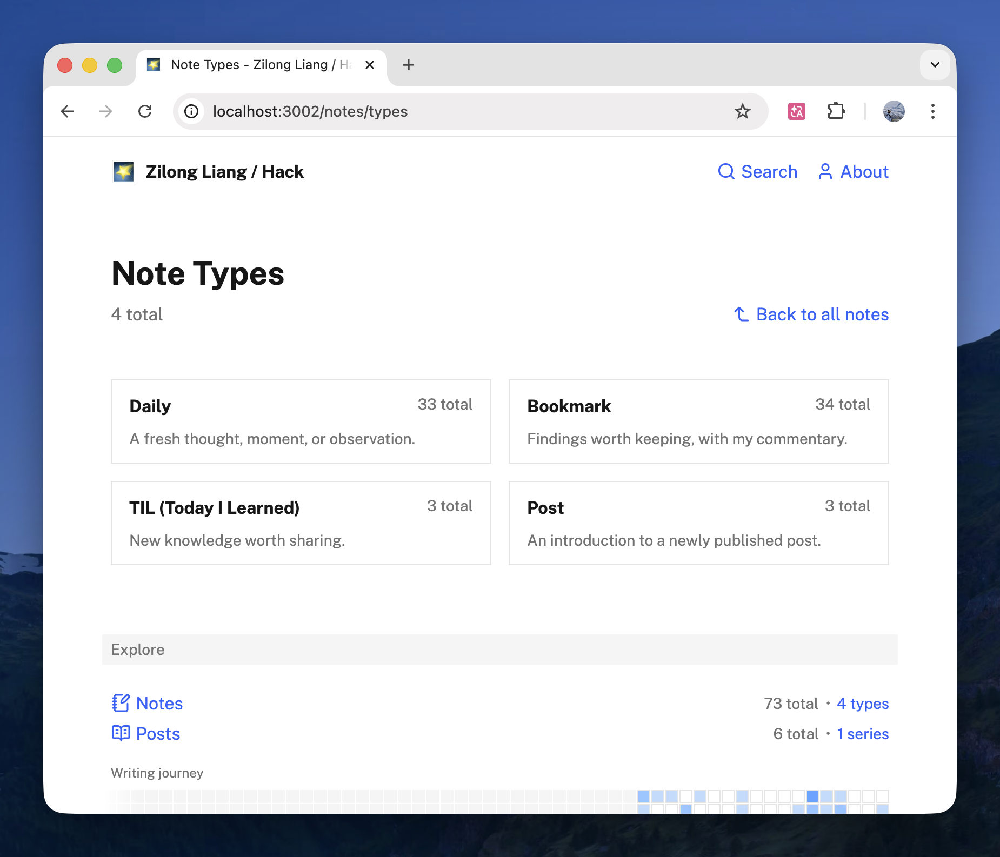

I just simplified the note type system on both [Hack](https://hack.zlliang.me) and [Muse](https://muse.zlliang.me), going from six types down to four.

The old `regular` type is now called `daily`, which better describes what it actually is: capturing a thought, moment, or observation while it's still fresh. The English slug now matches the Chinese display name (日常) that was already in use on Muse.

The bigger change is merging `link`, `collection`, and `quote` into a single `bookmark` type. These three all shared the same core job — consuming something external and adding my own voice — so the split never felt meaningful in practice. The new `bookmark` type keeps the structural flexibility: it can be a single annotated link, a curated list, or a quoted passage with commentary.

The final type list: **Daily**, **Bookmark**, **TIL**, **Post**. The commit is [zlliang/zlliang@1a162b9](https://github.com/zlliang/zlliang/commit/1a162b9).

**Update Apr 25, 2026:** A day after this consolidation, I removed note types altogether. The `type` field, the `/notes/types` pages, and the type chip in note metadata are all gone. See: [Eliminated note types](/notes/2026/04/25/eliminated-note-types).

