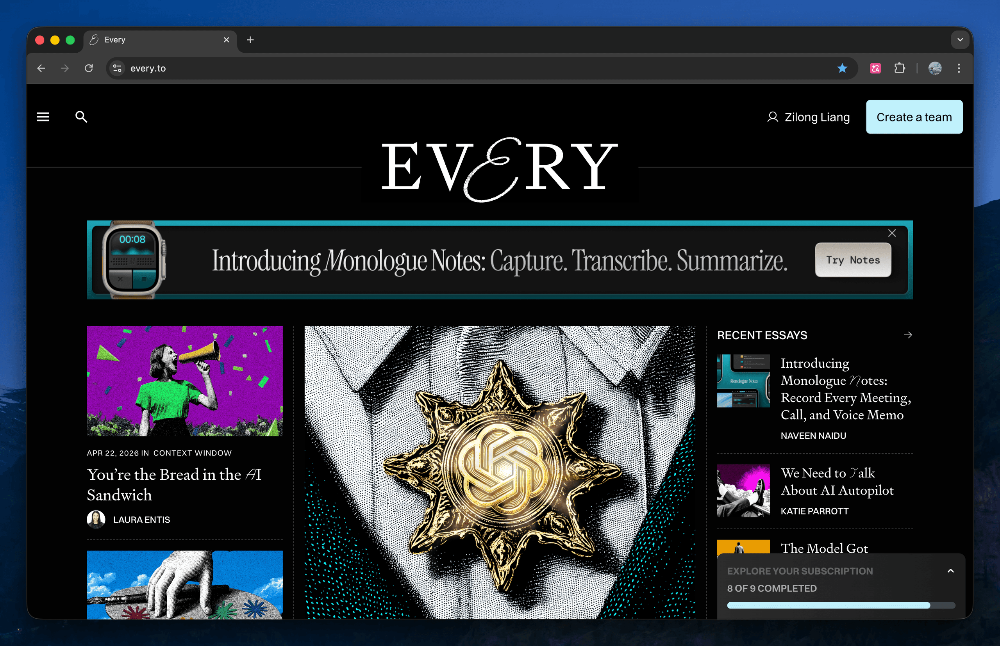

[Every](https://every.to/). A well-known AI publication I hadn't looked into until today, after I noticed it again in the [announcement of GPT-5.5](https://openai.com/index/introducing-gpt-5-5/).

At a first glance, it gives me a good feeling of taste. Skimming several articles enhances this feeling further. Its business model is unique: newsletter, columns, podcasts, and at least five AI software services are provided in a bundle. Its slogan is: "The only subscription you need to stay at the edge of AI."

Haven't fully figured out what it covers or how it will be useful to me yet, but it seems worth a try. I've signed up for a free account and will investigate whether it's worth becoming a paid subscriber.

