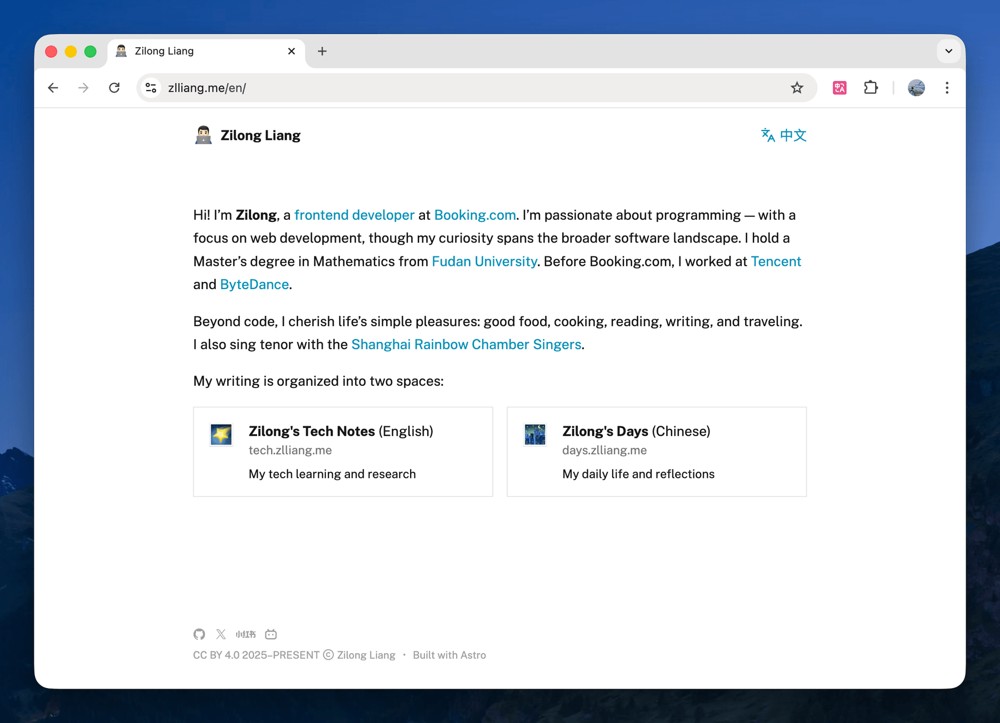
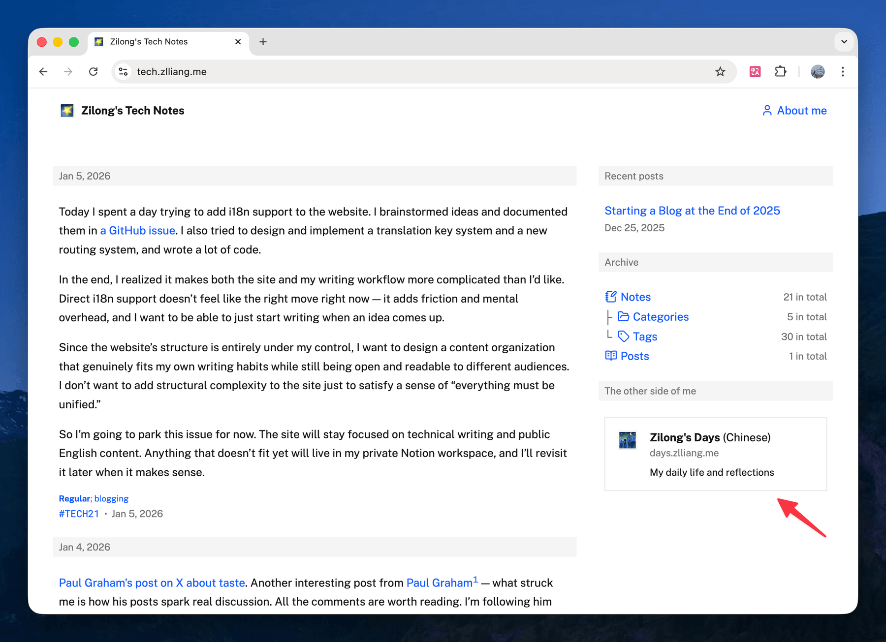
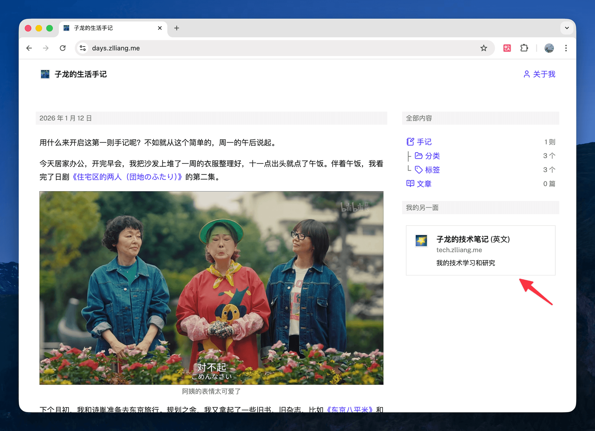
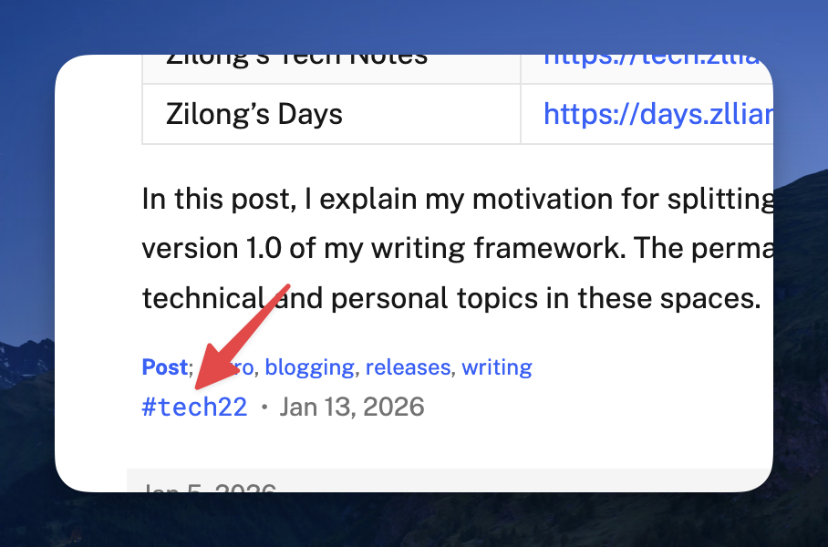

After starting my blog from scratch at the end of 2025, and writing for a few weeks, I started rethinking how I want to structure my writing for the next ten years.

In short, my personal websites are now organized into three parts:

| Website | URL | Note |
|---------|-----|------|
| Homepage | [https://zlliang.me](https://zlliang.me) | Brief introduction and navigation |
| Zilong's Tech Notes | [https://hack.zlliang.me](https://hack.zlliang.me) | English technical journal; now called **Hack** |
| Zilong's Days | [https://muse.zlliang.me](https://muse.zlliang.me) | Chinese personal journal; now called **Muse** |

## A week's journey

When I started this blog, I decided to write in English. My native language is Chinese, and I've never lived in an English-speaking country. I'm writing an English blog with a clear goal: not just to publish polished posts, but to internalize native-style writing intuition and build my own distinctive English writing style — to write with precision, logic, and quiet confidence. Also, English is the common language of the tech industry. I want to engage with the tech community by sharing my learning, research, and projects with readers around the world. The post I wrote last month explained my motivation in detail: [Starting a Blog at the End of 2025](/posts/2025/12/25/starting-a-blog-at-the-end-of-2025).

But after writing a bit, another side of me started calling out — the "personal" me. I also wanted to write about my personal life: my feelings and reflections on daily experiences — food, music, travel, and more. Writing isn't just about sharing with readers; it's also a way to think clearly. I believe writing about my life can help me rebuild my sensitivity to life and emotional expression, which I've been gradually losing these years. Without this part, my writing wouldn't be complete. And for these topics, I want to use the language I'm most comfortable with: Chinese.

It took me a week to find a solution. I considered mixing English and Chinese content in the same blog and delivering them bilingually with AI translation assistance — that way, I could unify all my writing in a single place. I brainstormed ideas and documented them in a [GitHub issue](https://github.com/zlliang/zlliang/issues/71), but eventually I still wasn't comfortable with that approach — it adds a lot of friction and mental overhead. You can read more in my [previous note](/notes/2026/01/05/spent-a-day-on-i18n-support).

In the end, I realized my writing can be viewed from two perspectives:

1. The goals. I write tech topics in English to practice my English writing skills and share my learning and research with the world; I write personal topics in Chinese to share my reflections and rebuild my sensitivity to life and emotional expression.
2. The target audience. Readers will be confused if they see too many topics in a single blog. I want my websites to be my writing "products" — with clear boundaries and self-contained experiences.

That's how I arrived at the current setup.

## Finalizing my writing framework

As a result, I split my writing into two spaces: Zilong's Tech Notes and Zilong's Days. There's also a personal landing page, https://zlliang.me, with a brief introduction that navigates readers to either space. My hope is that every reader (just me for now) can find all my work on the landing page and choose to follow either side of me.

I simply duplicated the original blog's codebase and changed the theme slightly to make "Zilong's Days" go live. Links to each other are also added.

Also, I updated the note number system for the two spaces. For example, `#tech123` for tech notes, instead of `#123` previously, and `#days123` for personal notes.

Last but not least, I formalized the writing workflows and reorganized my AI coding agent instruction files. All the work is tracked and documented in the [GitHub issue](https://github.com/zlliang/zlliang/issues/76).

Currently, the websites are three separate [Astro](https://astro.build/) projects in a monorepo, and the two writing spaces share a similar structure. There are short-form notes that can be categorized and tagged, and long-form posts that dive deep into specific topics. I'll write a bit more first and see whether I should extract the shared logic, or whether each space needs different structures and patterns.

Finally, the bad news: this split is a breaking change. Links to existing notes and posts no longer work. But I'm confident it's worth it. Finalizing my writing framework this early is a good move — fewer breaking changes down the road.

## What's next

Now I'm ready to mark the 1.0 version of my writing framework. I can freely write about anything in my career and life in the two spaces, and let them grow over the next few years. The links to notes and posts will always be valid.

As a follow-up task, I may write a post on each website to introduce what I'll cover on that site and how I write, and pin them as living documents.

Again, it's time to write, write, and write.

**Update Mar 13, 2026:** I reverted the note number prefixes on both sites. Notes are now shown as `#123` again instead of `#tech123` and `#days123`. I wrote a note about the change: [Removed the prefixes from note numbers](/notes/2026/03/13/removed-the-prefixes-from-note-numbers).

**Update Mar 18, 2026:** I removed note tags from both sites for now, simplified the sidebar, and improved the `/notes/types` page with a richer card-based layout. I wrote a note about the change: [Removed tags and refreshed note navigation](/notes/2026/03/18/removed-tags-and-refreshed-note-navigation).

**Update Mar 26, 2026:** Refreshed the site descriptions for both journals.

**Update Mar 30, 2026:** This entry reflects Jan 2026, when the two journals were still called **Zilong's Tech Notes** and **Zilong's Days**. They are now **Hack** at [hack.zlliang.me](https://hack.zlliang.me) and **Muse** at [muse.zlliang.me](https://muse.zlliang.me). I keep the original names above because they belong to that moment, but links in this entry point to the current sites. I wrote a note about the rename: [Renamed the two journal websites to Hack and Muse](/notes/2026/03/30/renamed-the-two-journal-websites-to-hack-and-muse).

