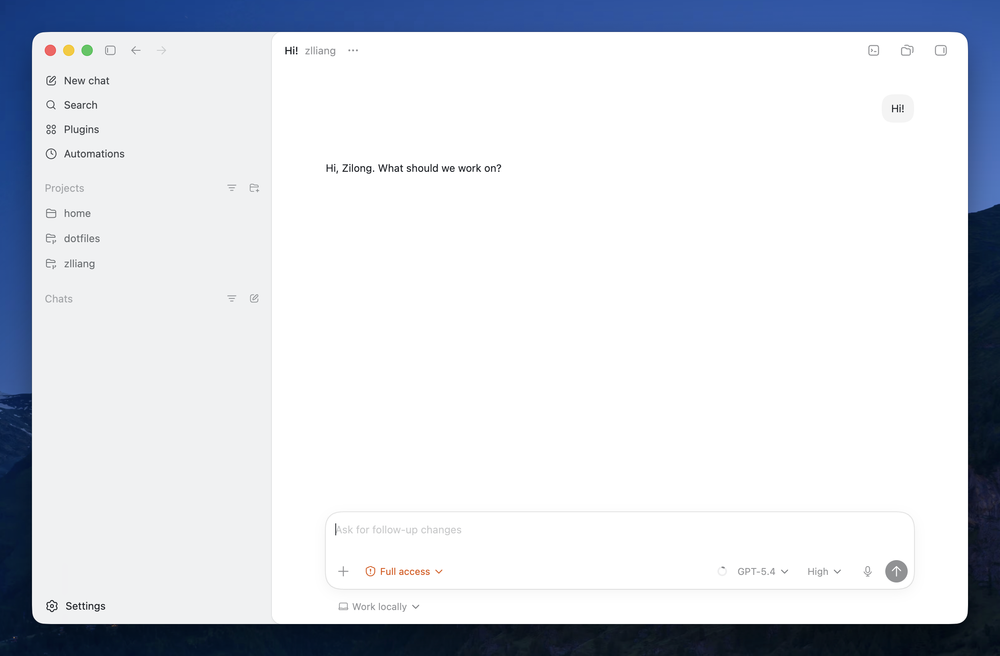
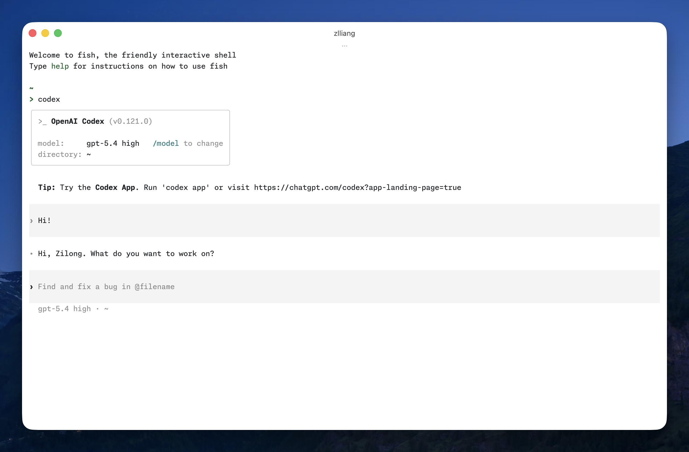
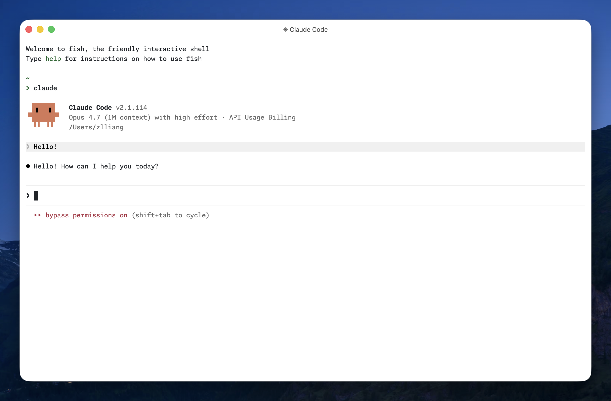

In this fast-changing agentic engineering world, I thought it's valuable to record and share how I use AI agents.

## Coding agents

### Amp

[Amp](https://ampcode.com/) is my primary coding agent for my persoanl use now. My profile here: [@zlliang](https://ampcode.com/@zlliang).

<div class="image-grid">


</div>

Amp doesn't provide a model selector, but leans on a managed approach of selecting models, system prompts, tools, and subagents as a bundle. They call them "agent modes". Now the smart mode uses Claude Opus 4.6, and the deep mode uses GPT-5.4 as main models.

It uses pay-as-you-go pricing policy.

The Amp team are actively developing the next evolution, and recently releases are not as much as last year. My experience on Amp are amazing, so looking forward to what they'll bring to us.

Here are my Amp settings:

```json:~/.config/amp/settings.json
{
  "amp.git.commit.coauthor.enabled": true,
  "amp.git.commit.ampThread.enabled": false,
  "amp.skills.path": "~/.agents/skills",
  "amp.skills.disableClaudeCodeSkills": true
}
```

### Codex

Codex is my secondary agent. I installed the standalone Codex app and use it in there mostly. I also installed the CLI, but barely use it. I use Codex through my ChatGPT Plus subscription on my personal laptop, and my company's ChatGPT Enterprise subscription on my work laptop.

<div class="image-grid">





</div>

Here are my Codex settings:

```toml:~/.codex/config.toml
model = "gpt-5.4"
model_reasoning_effort = "high"

[features]
memories = true
```

### Claude Code

I mainly use Claude Code on my work laptop, via my company's API gateway. On my personal laptop, I use it via Vercel AI Gateway.



From my short period of usage, I found several annoying things for Claude Code, like it silently installs the VS Code extension when I run it in the editor's integrate terminal; like it shows somehow different welcome screens, which I [took note on before](/notes/2026/04/15/the-is-demo-environment-variable-for-claude-code). Fortunately there are always relevant environment variables to control.

Here are my Claude Code settings:

```json:~/.claude/settings.json
{
  "env": {
    "CLAUDE_CODE_IDE_SKIP_AUTO_INSTALL": "1",
    "CLAUDE_CODE_DISABLE_EXPERIMENTAL_BETAS": "1",
    "IS_DEMO": "1"
  },
  "model": "opus[1m]",
  "effortLevel": "high",
  "skipDangerousModePermissionPrompt": true
}
```

### Skip permissions by default

I use the coding agents without annoying permission dialogs. The three agents above all provide settings to bypass permissons and allow the model run anything it wants. I haven't encountered any problems with this.

Here are my shell aliases:

```fish
alias amp "amp --dangerously-allow-all"
alias codex "codex --dangerously-bypass-approvals-and-sandbox"
alias claude "echo && command claude --dangerously-skip-permissions"
```

You may notice that I add a new line with `echo` when launching Claude Code to make it prittier. See the screenshot above.

## Harnesses

### AGENTS.md

My global [AGENTS.md](https://github.com/zlliang/dotfiles/blob/main/.chezmoitemplates/AGENTS.md). This file is stored in my dotfiles repository. It is synced by [chezmoi](https://chezmoi.io/) across all coding agents I'm using, including aliasing it to CLAUDE.md for Claude Code.

Project-wise, I'll create AGENTS.md and CLAUDE.md, and only fill `@AGENTS.md` in CLAUDE.md.

### MCP

I don't use MCP for my personal use. In my company, we have a unified MCP server providing access to multiple internal engineering platforms.

### Skills

I'm using [skills.sh](https://skills.sh/) to manage my skills, with the following general skills installed globally:

- [git-commit](https://skills.sh/zlliang/skills/git-commit)
- [gh-cli](https://skills.sh/github/awesome-copilot/gh-cli)
- [agent-browser](https://skills.sh/vercel-labs/agent-browser/agent-browser)

My company uses Google Workspace, and fortunately Google released a [CLI](https://github.com/googleworkspace/cli) and a bunch of agent skills to work with Google Workspace.

I install these skills under `~/.agents/skills` and symlink to `~/.claude/skills`. Project-wise: `.agent/skills` and `.claude/skills`.
