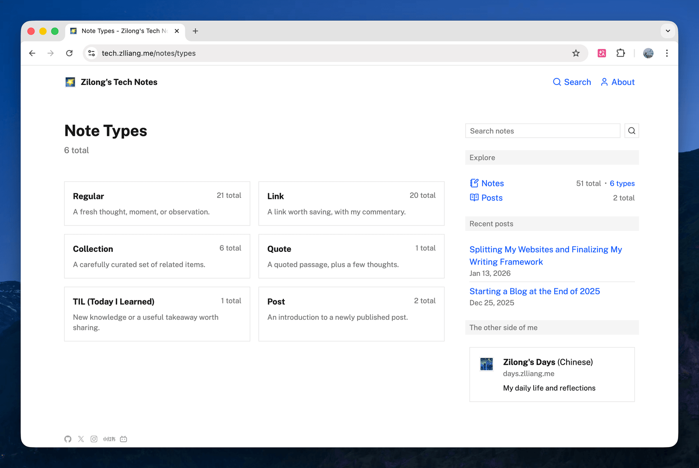

I just removed note tags from both [https://tech.zlliang.me](https://tech.zlliang.me) and [https://days.zlliang.me](https://days.zlliang.me).

While writing notes, I kept thinking about how tags should be organized. Sometimes I would spend quite a while deciding which tags to use, and that gradually turned them into a writing burden instead of a helpful tool. I found that tags are simply hard to plan well and maintain over the long term. On top of that, after [adding search to notes](/notes/2026/03/16/added-search-to-notes-and-reworked-pagination) a few days ago, part of the original value of tags was already covered. I would rather leave tags out for now and add them back only after I find a better way to organize notes.

Along the way, I also simplified the sidebar and reworked the [/notes/types](/notes/types) index page. The sidebar is now flatter and quieter, and the type index uses richer cards with counts and short descriptions.

The main commit is [zlliang/zlliang@8381e33](https://github.com/zlliang/zlliang/commit/8381e33dc0f9ba7affabae99923c362f8134c4fd), a cleanup and simplification pass across both sites that removed tags, flattened the sidebar, and improved how note types are presented. Most of the code was written with the help of the Codex app.

**Update Mar 22, 2026:** Removing tags also removed their old URLs, so I later added middleware handling for those legacy routes. Old tag pages now return `410 Gone` while the other migrated note URLs keep working through redirects, which should make the cleanup clearer to search engines.

**Update Mar 30, 2026:** In late March, I renamed my two journal websites. They are now Hack [https://hack.zlliang.me](https://hack.zlliang.me) and Muse [https://muse.zlliang.me](https://muse.zlliang.me). See: [Renamed the two journal websites to Hack and Muse](/notes/2026/03/30/renamed-the-two-journal-websites-to-hack-and-muse).

**Update Apr 25, 2026:** Following the same simplifying instinct, I later removed note types altogether. The refreshed `/notes/types` page described above is gone; old type URLs now redirect to `/notes`. See: [Eliminated note types](/notes/2026/04/25/eliminated-note-types).

**Update Apr 27, 2026:** I renamed the English site again — Hack is now Mesh at [https://mesh.zlliang.me](https://mesh.zlliang.me). The previous `hack.zlliang.me` redirects to the new domain. See: [Renamed Hack to Mesh](/notes/2026/04/27/renamed-hack-to-mesh).

