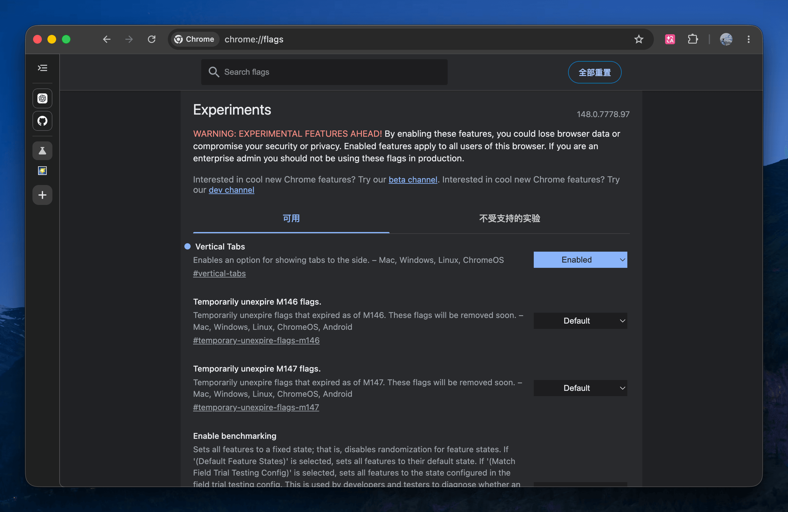

I started using Chrome's experimental vertical tabs. They were introduced in early April[^1], as a response to the warm reception of similar features in competitors like Arc and Dia.

It's currently behind a feature flag — enable it at `chrome://flags/#vertical-tabs`.

The UI feels more compact and the browsing experience more immersive. So far, so good.

Along with this, I'm also trying out pinned tabs for daily-use sites like [ChatGPT](https://chatgpt.com) and [GitHub](https://github.com).

[^1]: Google Chrome blog: [Get more done with new vertical tabs and immersive reading mode in Chrome](https://blog.google/products-and-platforms/products/chrome/new-chrome-productivity-features/)
