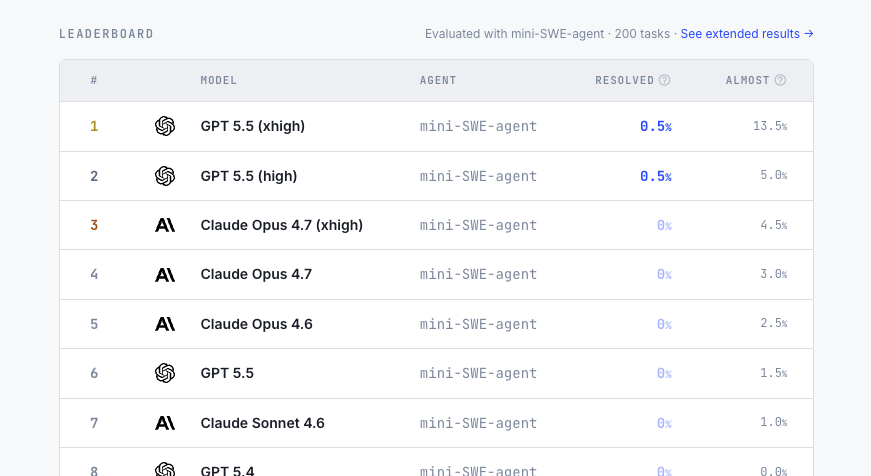

[ProgramBench](https://programbench.com/)[^1]. A new benchmark that evaluates whether language models can rebuild black-box software systems from scratch.

It was created by Meta, and co-first author John Yang is also the creator of [SWE-bench](https://www.swebench.com/).

Unlike previous benchmarks such as SWE-bench, which work with existing codebases, each ProgramBench task gives the model only a compiled binary and its documentation. The model must then implement a complete codebase that reproduces the original program's behavior. During this process, the model has no internet access, and decompilation tools are banned.

This is a difficult benchmark. As of today (May 14), only one task had been fully solved by GPT-5.5[^2], giving it a score of 0.5% across the 200 tasks.

[^1]: [Post on X by Kilian Lieret](https://x.com/KLieret/status/2054215545663144217)
[^2]: ProgramBench blog: [GPT 5.5 high Solves First Instance!](https://programbench.com/blog/gpt-5-5-first-solve/)
