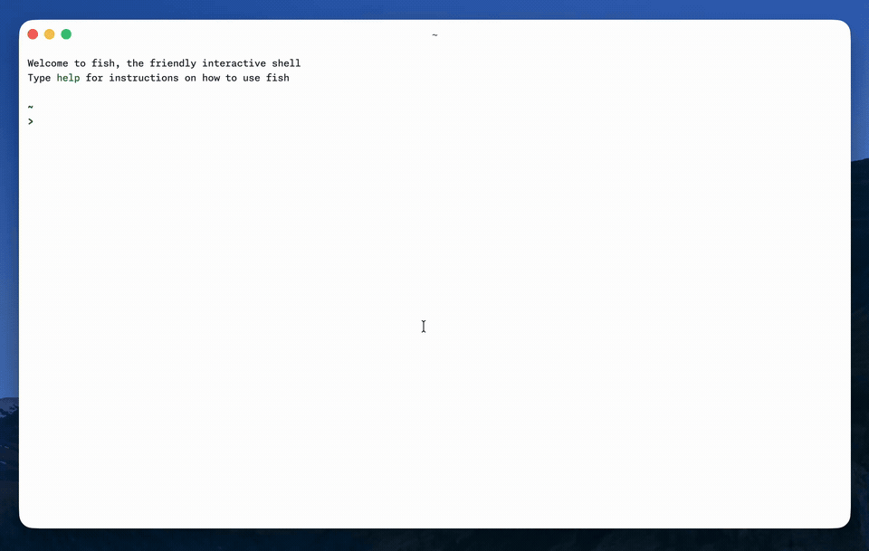

Today I finally got access to [Amp Neo](https://ampcode.com/news/neo), a full rewrite of my primary agent [Amp](https://ampcode.com). The TUI is more polished, and features like remote control keep it on the frontier. They also released [experimental model provider support](https://ampcode.com/settings/model-providers), so I can use Amp's `deep` mode with my ChatGPT subscription, which makes Amp more affordable!

