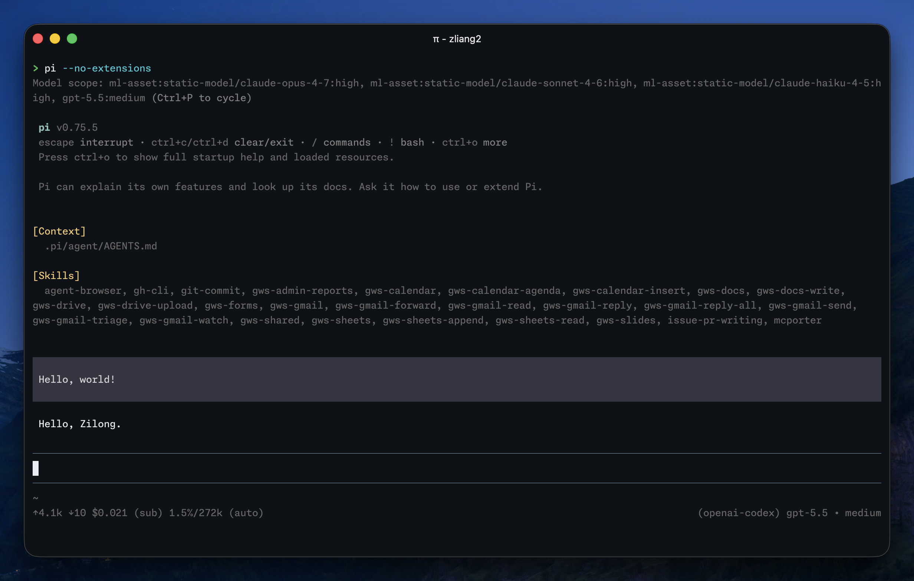

Today, I started trying out [Pi](https://pi.dev), the minimal coding agent created by [Mario Zechner](https://mariozechner.at/) and now developed at [Earendil](https://earendil.com/). It is known for its minimal harness, few tools, no built-in MCP support, etc., and high extensibility.

I haven't settled on my perfect Pi setup yet, but I've already found a neat way to add MCP support with [MCPorter](https://github.com/openclaw/mcporter), which lets me use [Exa MCP](https://exa.ai/mcp) for web search. I also discovered that defining a [custom provider](https://pi.dev/docs/latest/custom-provider) makes it easy to use my company's API gateway, which was originally designed for Claude Code.

Overall, Pi's minimality and flexibility make everything clear and nothing magical, which feels very developer-friendly. I'm considering dropping Codex and Claude Code, and using Pi along with Amp as my main agents.

Here are some articles and videos I bookmarked about Pi:

- Mario Zechner's original post where Pi originated: [What I learned building an opinionated and minimal coding agent](https://mariozechner.at/posts/2025-11-30-pi-coding-agent/)
- Armin Ronacher's introduction: [Pi: The Minimal Agent Within OpenClaw](https://lucumr.pocoo.org/2026/1/31/pi/)
- Mario's post announcing Pi and his move to Armin's company Earendil: [I've sold out](https://mariozechner.at/posts/2026-04-08-ive-sold-out/); and meanwhile, Armin's post: [Mario and Earendil](https://lucumr.pocoo.org/2026/4/8/mario-and-earendil/)
- Armin's post: [Building Pi With Pi](https://lucumr.pocoo.org/2026/5/24/pi-oss/)
- Videos on YouTube:
    - [Claude Code is overkill - Pi is All you Need](https://www.youtube.com/watch?v=AEmHcFH1UgQ)
    - [A love letter to Pi | Lucas Meijer](https://www.youtube.com/watch?v=fdbXNWkpPMY)
    - [I Hated Every Coding Agent, So I Built My Own — Mario Zechner (Pi)](https://www.youtube.com/watch?v=Dli5slNaJu0)
    - [Building pi in a World of Slop — Mario Zechner](https://www.youtube.com/watch?v=RjfbvDXpFls)
    - [Building Pi, and what makes self-modifying software so fascinating](https://www.youtube.com/watch?v=n5f51gtuGHE)
