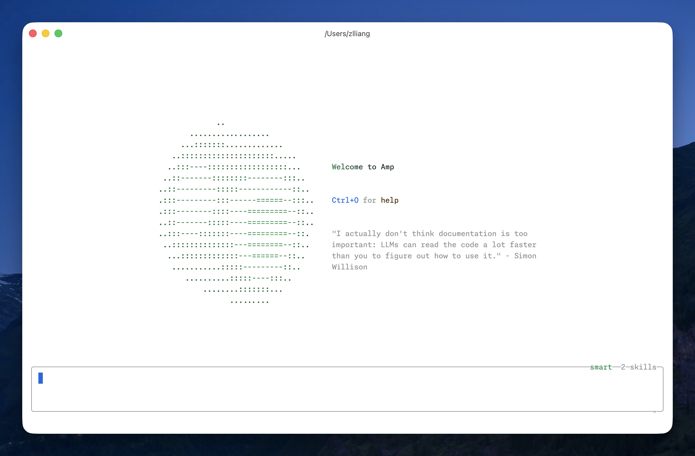
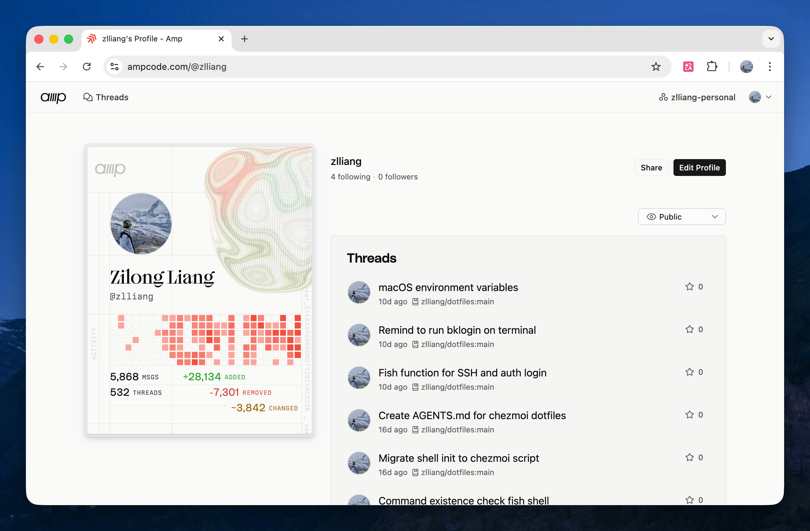
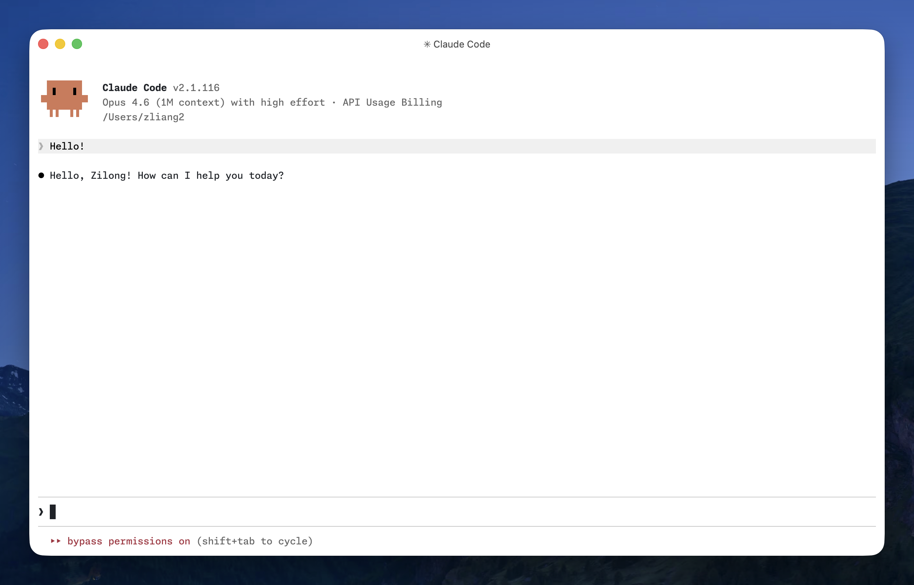

In this fast-changing world of agentic engineering, I thought it would be valuable to record which AI agents I use and how I use them.

## Coding agents

### Amp

[Amp](https://ampcode.com/) is now my primary coding agent for personal use. My profile is here: [@zlliang](https://ampcode.com/@zlliang).

<div class="image-grid">





</div>

Amp doesn't provide a model selector. Instead, it uses a managed approach that bundles models, system prompts, tools, and subagents into what it calls "agent modes". At the moment, `smart` uses Claude Opus 4.7, and `deep` uses GPT-5.5 as the main model.

Recently, the Amp team has been building the next version, [Amp Neo](https://ampcode.com/news/neo), and gradually rolling it out. By cutting features they do not see as part of the future and adding new ones, Amp stays close to the frontier of agentic engineering workflows.

Amp uses pay-as-you-go pricing. Not cheap, to be honest, but the frontier experience is worth it. I got access to $10/day in [free credits](https://ampcode.com/free), which covers a large part of my daily usage.

Here are my Amp settings:

```json:~/.config/amp/settings.json
{
  "amp.git.commit.coauthor.enabled": true,
  "amp.git.commit.ampThread.enabled": false,
  "amp.skills.path": "~/.agents/skills",
  "amp.skills.disableClaudeCodeSkills": true
}
```

### Codex

[Codex](https://openai.com/codex/) is my secondary agent. I installed the standalone Codex app and mostly use it there. I also installed the CLI, but I barely use it. I use Codex through my ChatGPT Plus subscription on my personal laptop and my company's ChatGPT Enterprise subscription on my work laptop.

The Codex team has been shipping new features very actively over the past few months. Recent additions like [computer use](https://developers.openai.com/codex/app/computer-use), [browser use](https://developers.openai.com/codex/app/browser), and [Codex for Chrome](https://developers.openai.com/codex/app/chrome-extension) have hugely expanded its capabilities. Codex now feels like it is growing into a [superapp](https://openai.com/index/codex-for-almost-everything/), not merely a coding agent. Also, GPT-5.5, released in late April, is a very strong model.

<div class="image-grid">


</div>

Here are my Codex settings:

```toml:~/.codex/config.toml
model = "gpt-5.5"
model_reasoning_effort = "medium"

[features]
memories = true

[plugins."computer-use@openai-bundled"]
enabled = true

[plugins."browser-use@openai-bundled"]
enabled = true

[plugins."chrome@openai-bundled"]
enabled = true
```

### Claude Code

I mainly use [Claude Code](https://claude.com/product/claude-code) on my work laptop, via my company's API gateway. On my personal laptop, I use it via [Vercel AI Gateway](https://vercel.com/docs/ai-gateway/coding-agents/claude-code).



From my short period of usage, I have found several annoying things about Claude Code. For example, it silently installs the VS Code extension when I run it in the editor's integrated terminal. It also shows somewhat different welcome screens, which I [noted before](/notes/2026/04/15/the-is-demo-environment-variable-for-claude-code). Fortunately, there are environment variables to control these behaviors.

Here are my Claude Code settings:

```json:~/.claude/settings.json
{
  "env": {
    "CLAUDE_CODE_DISABLE_EXPERIMENTAL_BETAS": "1",
    "CLAUDE_CODE_IDE_SKIP_AUTO_INSTALL": "1",
    "CLAUDE_CODE_NO_FLICKER": "1",
    "IS_DEMO": "1"
  },
  "theme": "auto",
  "model": "opus[1m]",
  "effortLevel": "high",
  "skipDangerousModePermissionPrompt": true
}
```

### Skip permissions by default

I use coding agents without annoying permission dialogs. The three agents above all provide settings to bypass permissions and allow the model to run commands directly. I haven't encountered problems with this yet.

Here are my shell aliases:

```fish
alias amp "amp --dangerously-allow-all"
alias codex "codex --dangerously-bypass-approvals-and-sandbox"
alias claude "claude --dangerously-skip-permissions"
```

## Harnesses

"Harness" has become common jargon for the setup surrounding a coding agent: project instructions, personal preferences, tools, and integrations that help the agent work better. [AGENTS.md](http://agents.md/), [MCP](https://modelcontextprotocol.io/), and [skills](https://agentskills.io/) are three common examples.

### AGENTS.md

My global [AGENTS.md](https://github.com/zlliang/dotfiles/blob/main/.chezmoitemplates/AGENTS.md) is stored in my [dotfiles repository](https://github.com/zlliang/dotfiles/). It is synced by [chezmoi](https://chezmoi.io/) across all coding agents I'm using, including aliasing it to [CLAUDE.md](https://code.claude.com/docs/en/memory) for Claude Code. It describes my basic personal information, communication preferences, and instructions on writing and coding.

Project-wise, I create AGENTS.md and CLAUDE.md, and only mention AGENTS.md in the latter:

```md:CLAUDE.md
@AGENTS.md
```

### MCP

I don't use MCP for my personal use. In my company, we have a unified MCP server providing access to multiple internal engineering platforms.

### Skills

I'm using [skills.sh](https://skills.sh/) to manage my skills, with the following general skills installed globally:

- [git-commit](https://skills.sh/zlliang/skills/git-commit)
- [issue-pr-writing](https://www.skills.sh/zlliang/skills/issue-pr-writing)
- [gh-cli](https://skills.sh/github/awesome-copilot/gh-cli)
- [agent-browser](https://skills.sh/vercel-labs/agent-browser/agent-browser)

My company uses Google Workspace, and fortunately Google released a [CLI](https://github.com/googleworkspace/cli) and a bunch of agent skills to work with it.

I install these skills under `~/.agents/skills` and symlink them to `~/.claude/skills`. Project-wise, I use `.agents/skills` and `.claude/skills`.

This setup will probably look different in a few months. The agent space is moving fast, and many of these tools are still changing their core interaction models. For now, Amp is my daily driver, Codex is the most rapidly expanding alternative, and Claude Code remains useful in work environments where it is already integrated.
