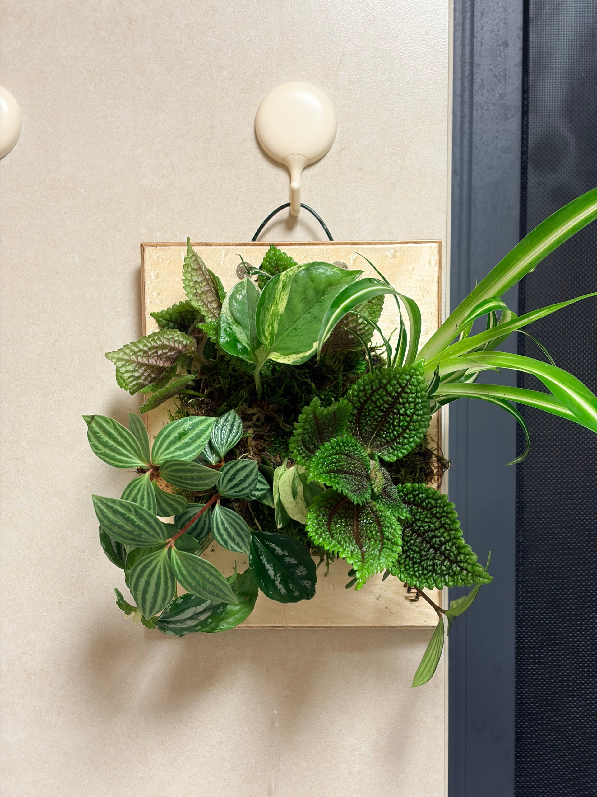
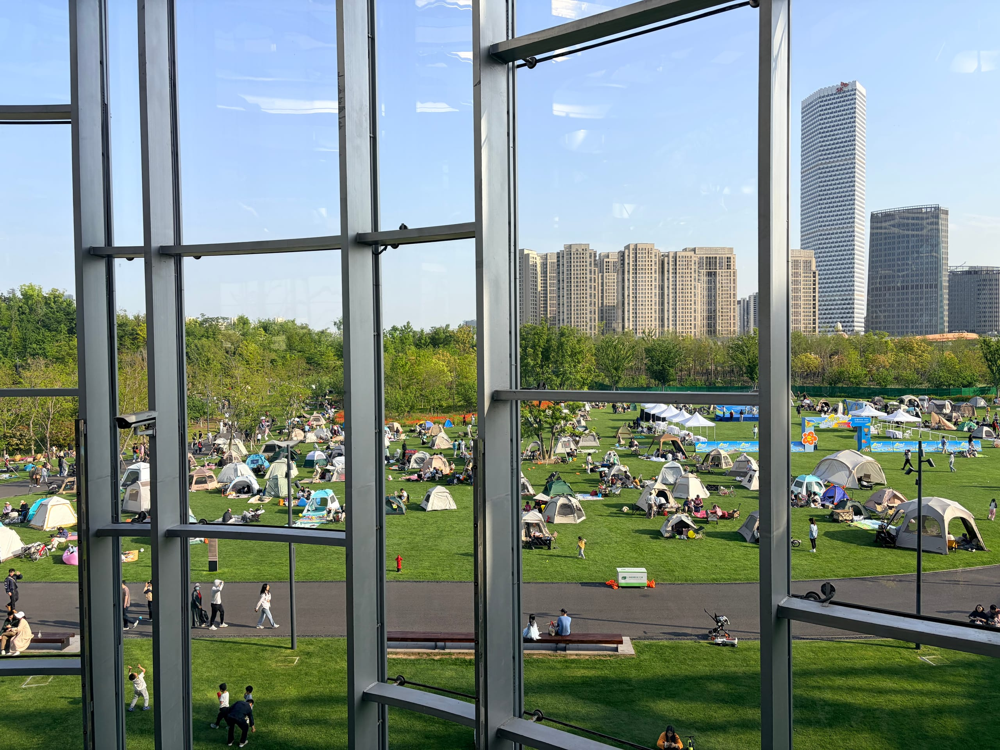

周六，今天仍然是户外日！诗胤把我从玩 AI 的走火入魔中拽出来，午餐之前就出门。

先去新天地，吃过饭后，偶遇太平湖公园正在进行的花卉展。四月是花卉的季节，从昨天在共青森林公园看到的，到今天太平湖的各色花卉，色彩眩目。今天又遇到了杜鹃花，我居然能认出来了。

下午，去一家服装店手作植物造景，是诗胤前几天在这里给我买衣服时预约的活动。在铁网上铺一层水苔，插上几种绿植，然后再拿苔藓盖住并绑定，就完成了。在店员的指导下开工，半个小时后，我们多了一小株可以挂在墙上的绿植。店员说水苔保水，定期浸湿就能让它存活。

然后去世博文化公园，小红书又在这里办活动，山坡上铺满了野餐垫。我们还去温室花园逛了一圈，从花园的室内看窗外，帐篷一座挨着一座。

