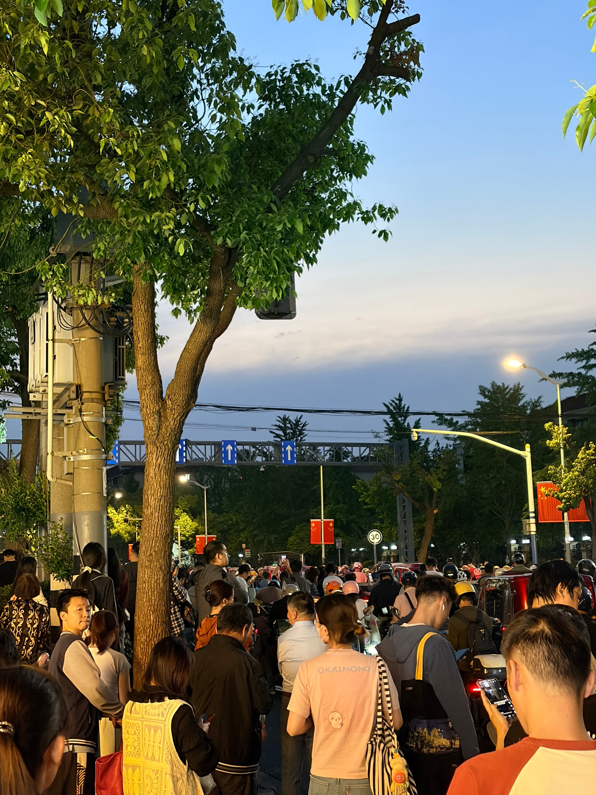

最近几天工作忙，具体表现为在 Claude Code 上花了好多公司给的 token 额度。今天花了一百多美元。

中午，陪诗胤种牙齿。去诊所之前在楼下吃味千拉面。种完以后，他那颗牙的位置钉了一颗大钉子，两周后要再去。

晚上下了地铁，又遇到拦路过火车。但过去十几分钟火车都没来，人越挤越多。有人给家里报平安，有人开始生气，尤其是外卖骑手们。后来都快半个小时了也没动静，很反常，我猜是新换的拦路装置坏掉了。等候的人挤到了地铁站门口，最后开了闸口，两边的人都要到对面去，又挤得动弹不得，还有人骂街。

你看，我开始读《富士日记》后，这就在学着武田百合子的口吻来写日记了。
