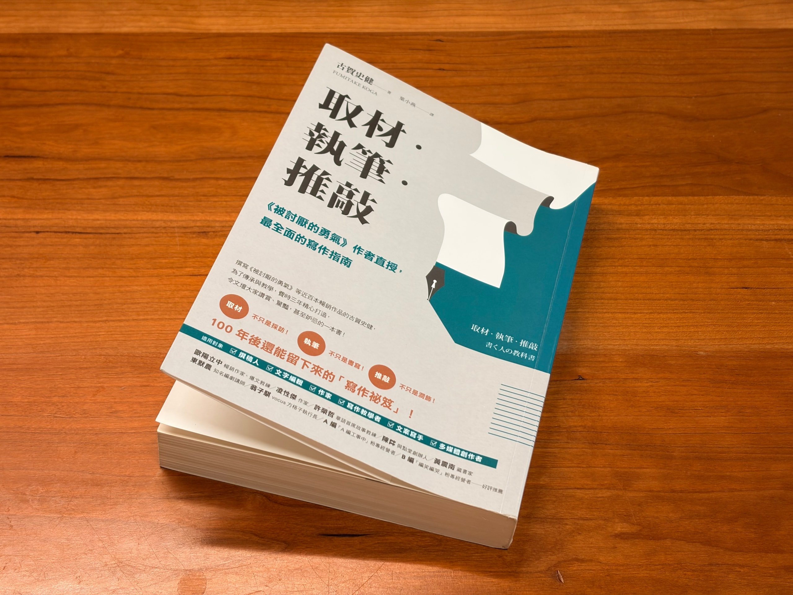

读完了《[取材・执笔・推敲](https://book.douban.com/subject/35887138/)》。这是一本关于写作的书。三月开始读，四月寥寥翻了几页，五月下决心读完。于是花了一周左右就读完了。

为什么读得慢、读得动力不足？一是竖排读起来困难，二是讨论的抽象层次比较高，三是因为这本书主要面向的是「职业写手」，里面讲了大量关于采访和职业心态的事情。有段时间，我会在睡前读这本。后来在地铁上，翻开这本书，会条件反射般地打哈欠。

话虽如此，书里还是有不少当下就启发到我的思考方式：

- 所谓的写手，就是「取材者」。写作之前的取材，要阅读书籍，也要像阅读书籍般阅读全世界。
- 写作就是在「翻译」。通过逻辑结构，把所想讲的「事情」，翻译成语言。
- 站在读者的视角上，设计「阅读体验」。一本书那么厚，其实想讲的事情只有几句话。书的价值不在于信息量，而在于「体验」。
- 像剪辑电影一样，设计镜头、场景和场景序列。
- 所谓推敲，就是「对自己的取材」。像剪辑师不用了解拍摄的辛苦那样，推敲时，要忘记写作时的自己，客观面对素材。
- ……

这本书读得不轻松，我放回书架的时候，有点如释重负。但我想，这些思考方式，应该会在我越写越多之后，浮现其价值。

