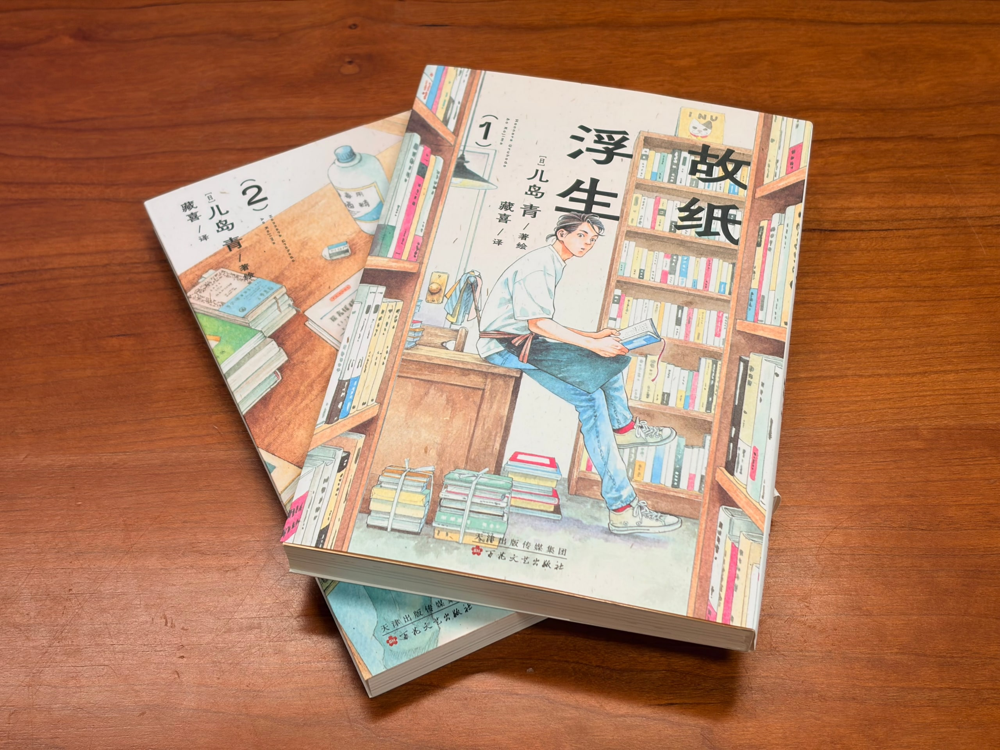

漫画《[故纸浮生](https://book.douban.com/subject/37648813/)》第一、二卷到了。很久没读漫画了，我迫不及待想开始读。

最近买的书挺多。手头在读的是这本漫画，还有已经读了一周的《[富士日记](https://book.douban.com/subject/36883000/)》。到了月底，读库年度订阅的新一期也会发来。

所以对于「如数家珍」这个词，我觉得很惭愧。就连自己家书架上的书，没读过的都有好多。日语中有一个词叫「积读」，说的就是这件事。因为感兴趣买了很多书，但很多都没读完，甚至有的没打开。因为读书需要持续的兴趣、时间和体力。

要一本一本好好读过才行。
