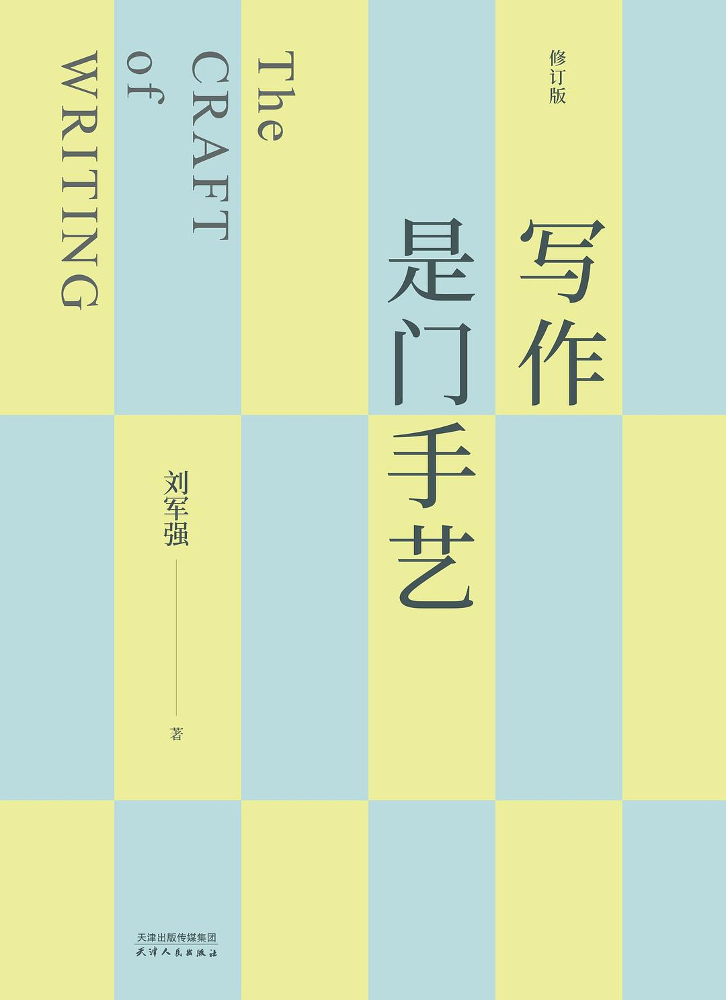
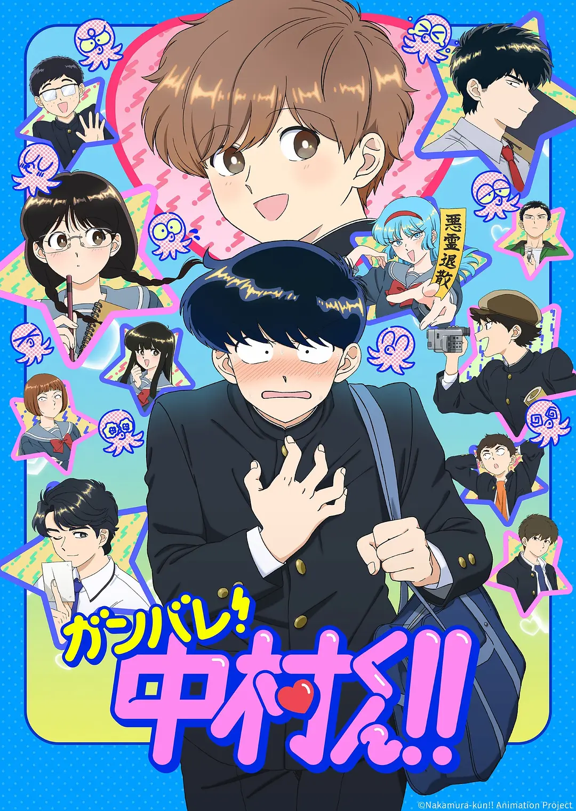

从上周四下午开始，我突然陷入一阵莫名的烦躁：逛街没意思，吃饭没胃口，看书看不进，工作没干劲……这种状态持续到今天，终于有所好转。我无法解释原因，只能趁现在心情好一点，记录一下周末发生的事。

状态不好的时候，读一些只需要理性、不需要感情的工具书，或许是个好选择。这几天我翻完了《[写作是门手艺](https://book.douban.com/subject/38184860/)》修订版。

时隔几年重读这本书，依然如遇宝藏。写作的方法论重要，观念心法更重要。关于阅读、关于结构、关于说与写的区别……书里的内容和我最近读过、看过的写作相关材料不谋而合。大概非虚构写作真正的“要点”是很少很精炼的，需要的就是不断实践。就像序言中说的：不写，此书无用；少写，此书有点用；多写，此书真有用。

周五晚上，诗胤加班到很晚。我们去吃了烧烤，我拿着手机质问老板：「你们这里一串牛肉要三十啊」，老板不做声，只是跟我招手，让我去冰柜那里看，好大一串，确实值三十。

回家看刚刚直播完的《[歌手 2026](https://movie.douban.com/subject/37816937/)》第一期。每年万人关注万人骂的节目，骂也是喜欢。这一期，我很喜欢胡彦斌和窦靖童的歌。

最后，让我起死回生的一大因素，是发现了 BL 喜剧动漫《[加油吧！中村君！！](https://movie.douban.com/subject/37007231/)》。我发现兴趣的流动真的是「无独有偶」，最近刚看了一本漫画，就又遇到一部非常喜欢的动漫。面对中村和广濑，我无法控制自己露出痴汉笑的那一面。

周末在朋友的婚礼中结束。周日这天，我们上午出发，在如皋水绘园里找了一间咖啡馆，看书工作，等着晚上参加婚礼。不知道是不是因为下雨，这个古镇一样的地方，人很少。

我觉得人总有非常不适应的场合，对我来说婚礼就是一种。即使同桌的朋友我也都认识，还是局促。结束后，我们迎着雨回去，到家已经十一点半。诗胤说：为什么明天就要上班了啊。
