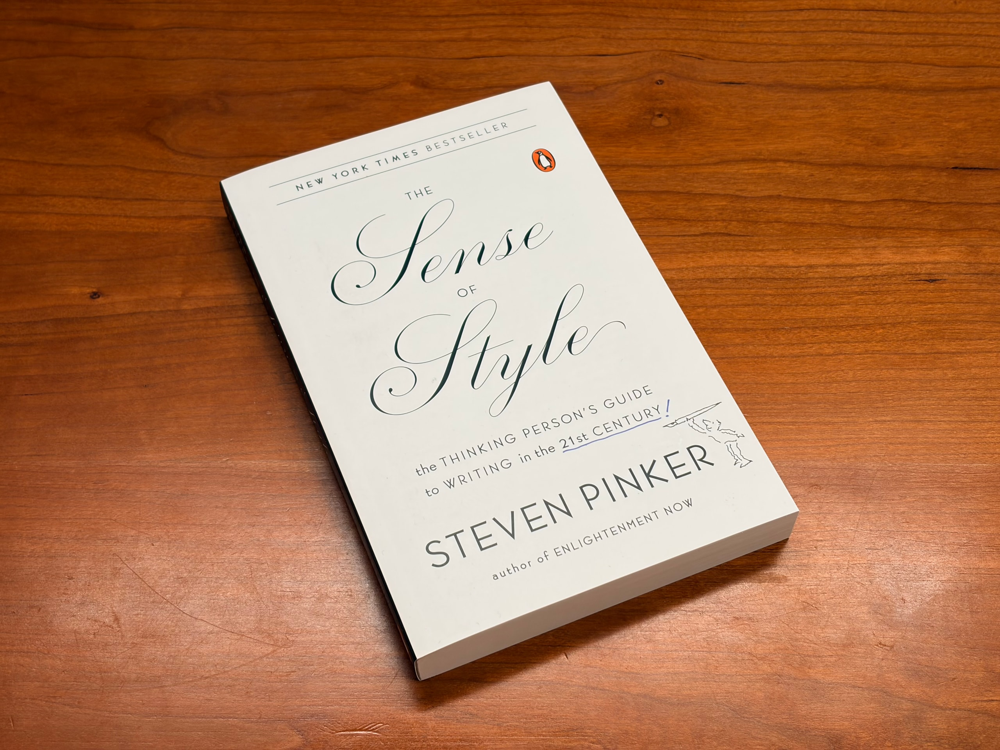
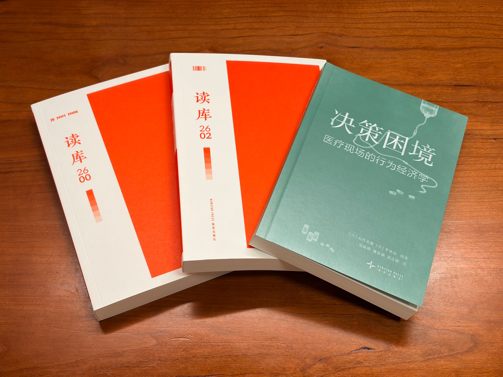

一周不见了。为什么上周没写呢？一方面是工作突然忙了起来，另一方面是开始沉迷 [pi](https://pi.dev/) 这个 coding agent。它的初始状态极度简单透明，只提供必需的功能，又开放了大量的扩展 API，用户能自行定制各个角落的体验，灵活性无穷。

我年初就知道了 pi，但一直没尝试。上周碰巧开始玩，结果我一玩就停不下来，像拿到一款开放世界游戏。如今一众 agent 不停卷功能、体验越发臃肿，从 pi 的简单基础上实现属于自己的体验，戳中了我的优雅癖。一周过去，我开发了 [pi-spark](https://github.com/zlliang/pi-spark) 这个扩展包，决心不断把 pi 打磨成我的主力 agent 来用。

那么，来说说上周的事。可能是 Q2 即将结束的关系，工作突然变得忙了起来，之前大半年都没有碰过的项目，一下子都来了活儿。此外，彩虹合唱《星河旅馆》专场，下周就要在武汉首演，加排密集。

无独有偶，诗胤回去工作两周，老板说要以正式员工的要求来对待他，眼看着比前段时间实习要忙不少。毕业答辩近在眼前，他也开始了最后的、也是分量最重的准备。不光这样，恐怕他脑子里还盘旋着科目三的事情。他一下子面对着多重压力。

这么写下来，发现真的挺忙的。两人愁眉苦脸，明潮暗潮都汹涌。

但忙里也能偷闲。《[歌手](https://movie.douban.com/subject/37816937/)》我们没落下，还一起在吃饭的时候追上了《[加油吧！中村君！！](https://movie.douban.com/subject/37007231/)》的进度。我上周在公司通勤路上，继续读《[富士日记](https://book.douban.com/subject/36883000/)》，上册快要读完。

临近月底，我又收到几本书。Steven Pinker 的《[The Sense of Style](https://book.douban.com/subject/25846315/)》，补齐了我的第一版[写作书单](https://www.douban.com/doulist/163190488/)；还有新一期读库订阅，包括《[读库 2600](https://book.douban.com/subject/38494172/)》、《[读库 2602](https://book.douban.com/subject/38427435/)》和《[决策困境：医疗现场的行为经济学](https://book.douban.com/subject/36546340/)》。我准备把《富士日记》上册先读完，然后开始读这几本。

这是上一周，也是五月的最后一周。这样一想，又得写新一篇「生活月刊」了呀。

