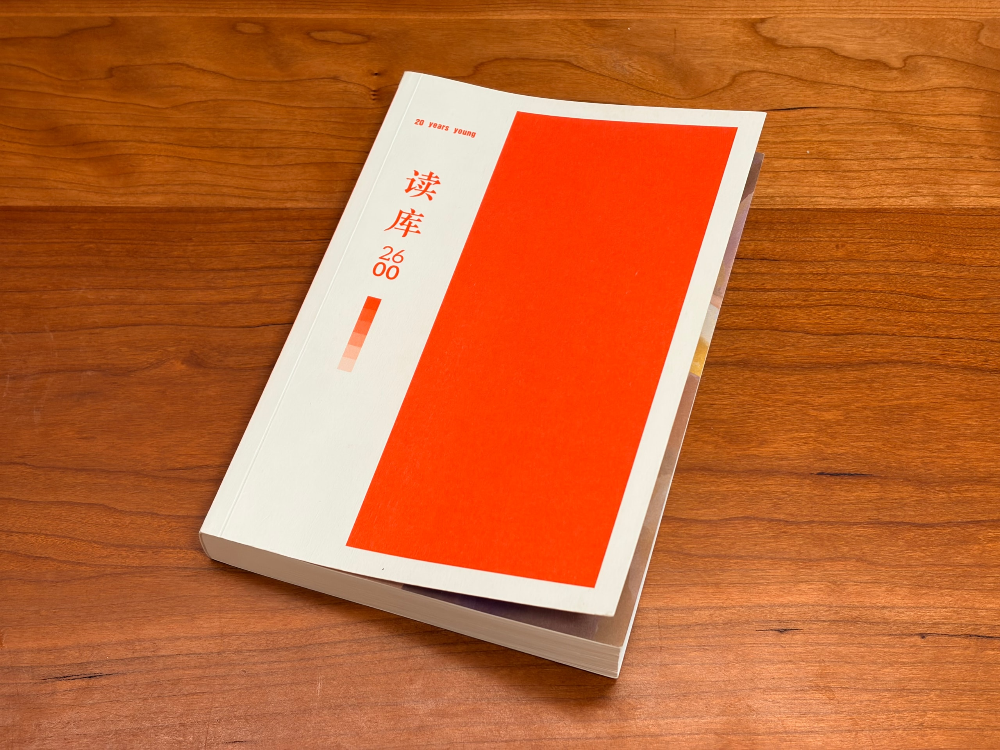

果然，飞机上最适合阅读。上周回老家的航班上，我开始恢复阅读，从读到一半的《读库 2600》开始。在家的一周，悠悠读完。

每年的「00」号，是《读库》的非正式出版物，涵盖过去一年读库的对谈和编辑笔记等等。今年的有所不同，因为读库迎来二十周年，主编老六放进去的是去年年底开始的「二十城记」随笔，在二十多个城市和读者对谈的纪实。后面跟着的是几位作者在读库写作的缘起，再之后仍然是编辑笔记。

这类文章我最爱看，关于书本身的文章。就像在看最近很火的视频播客。

接下来，就该在上下班的地铁上读《读库 2602》了。

