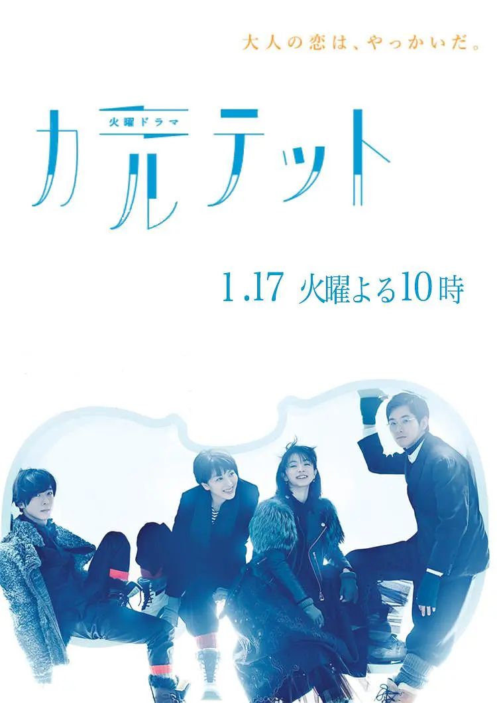
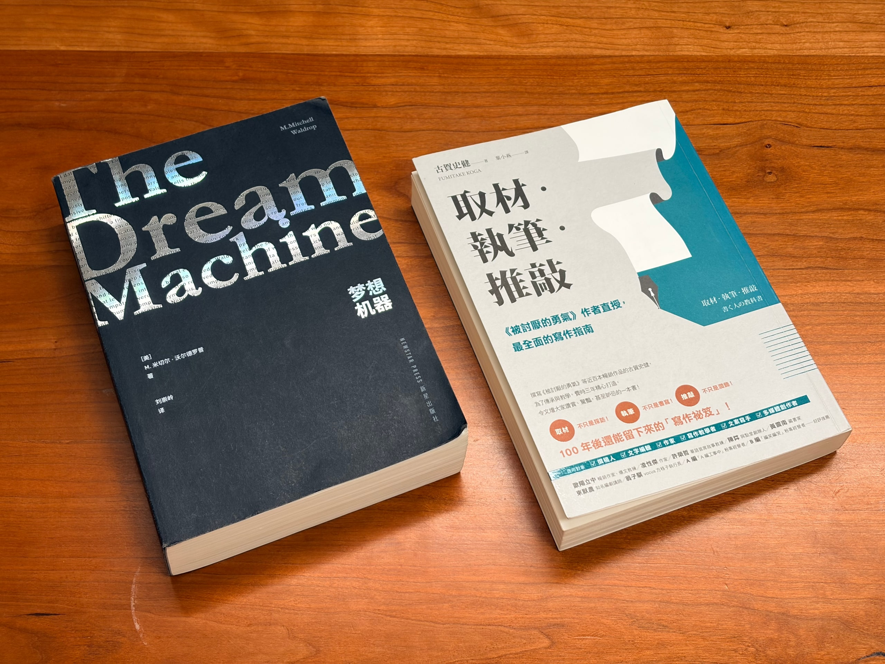
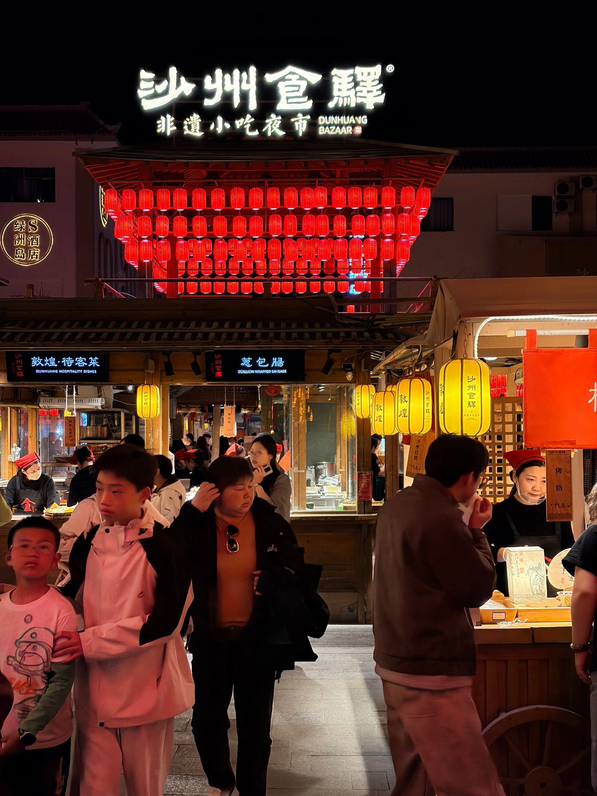
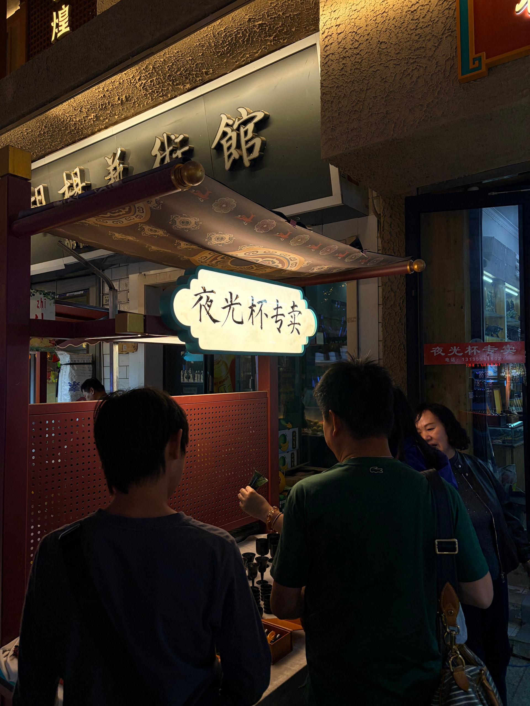
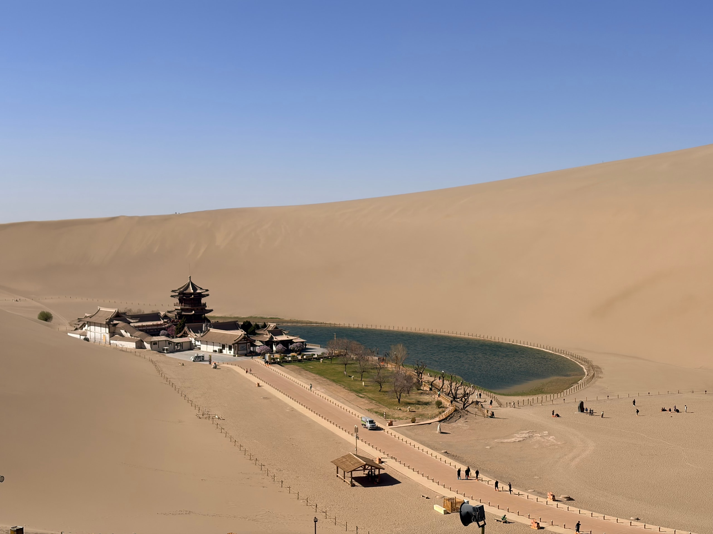
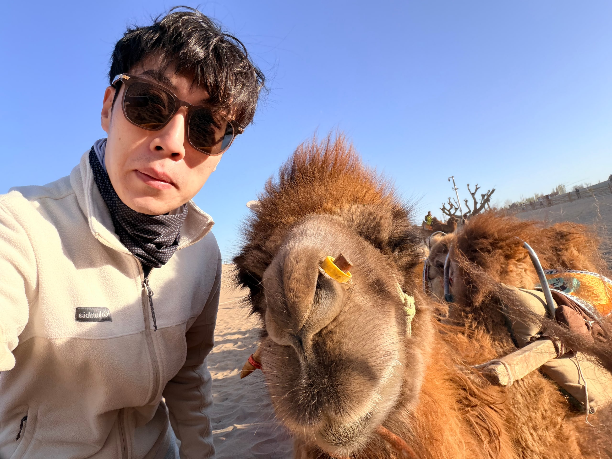
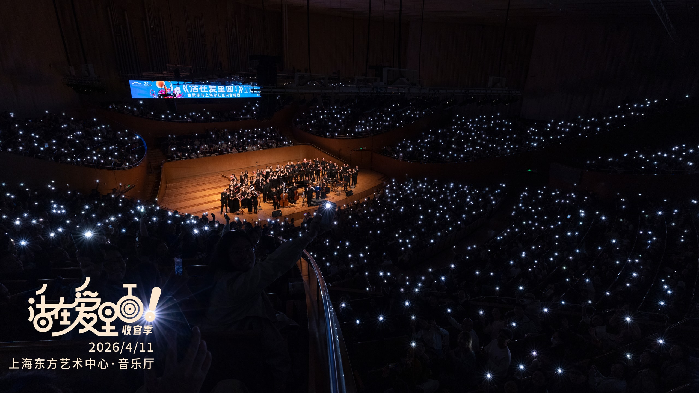
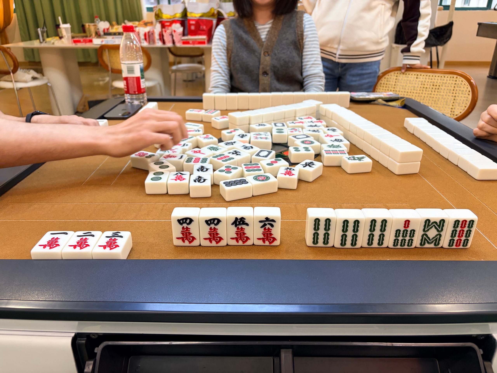
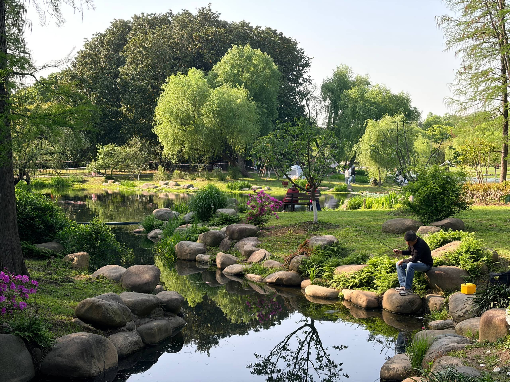
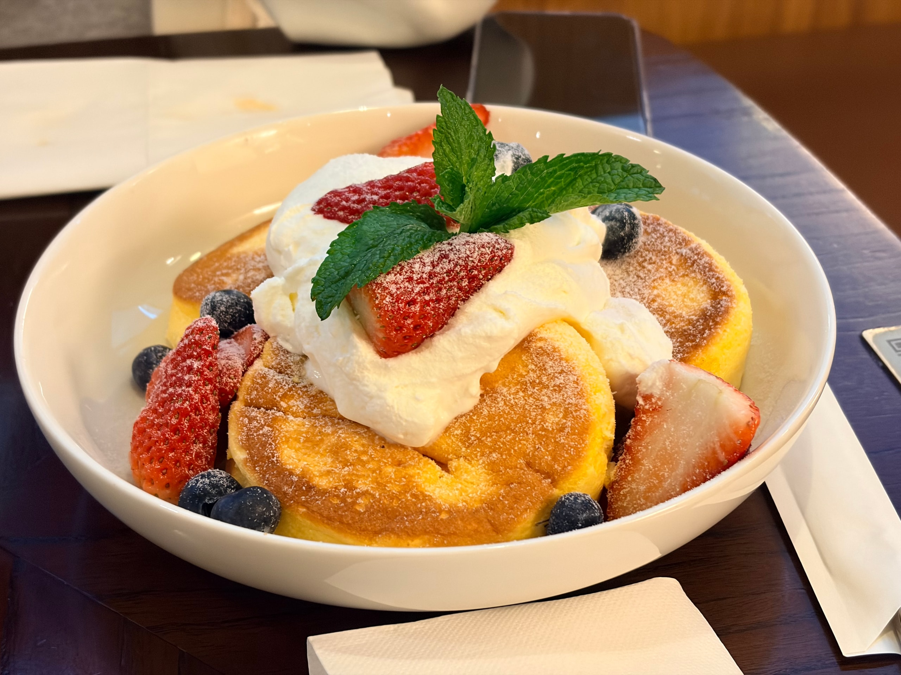

回忆四月精彩。所谓精彩，并不总来自顺利和成就。就像我拖着还没完全从生病中恢复的身体，坐在鸣沙山坡上，还是能感受到舒服的风。

## 本月视听读

月初推荐诗胤看了美剧《[纸牌屋](https://movie.douban.com/subject/6037429/)》，一集后他拍手叫绝，我才知道他最爱这种类型，于是顺势又跟他重看了好多类似的剧。《纸牌屋》看完了经典的前两季，《[半泽直树](https://movie.douban.com/subject/24697949/)》两季看完，《[Legal High](https://movie.douban.com/subject/10491666/)》差不多看完了第一季。这几部我都已经不知道看了多少次，但还是永远爱看。生活里有点放不开手脚的人，就是靠这些剧来代为供给缺失的爽感。

我喜欢的另一种，是在日常的氛围中穿插离奇事件，揭示细腻人情、引发启迪的那种剧。这个月重看了《[四重奏](https://movie.douban.com/subject/26895171/)》，好像首播以后没再看过第二遍。这次看过之后，总感觉还是坂元裕二后来的《[大豆田永久子与三名前夫](https://movie.douban.com/subject/35365608/)》更好看一点。另外，第二次尝试看《[悠长假期](https://movie.douban.com/subject/1436674/)》，看完第二集后又搁置了。我发现，现在看一部没看过的剧，要花费好大的决心。

---

这个月断断续续听完了《[无人知晓](https://www.xiaoyuzhoufm.com/podcast/611719d3cb0b82e1df0ad29e)》播客单集：[孟岩对话李继刚：人何以自处](https://www.xiaoyuzhoufm.com/episode/69a64629de29766da93331ec)。三个半小时，听得有点如坐针毡，但还是听完了。嘉宾李继刚讲 AI 如何重塑他的工作流，以及他对 AI 时代的看法和对世界走向的判断。在我听来，是吹大 AI 泡沫、夸大 AI 对于这个世界的重要性的一集。

---

《[梦想机器](https://book.douban.com/subject/38373965/)》，读库 2026 年阅读计划第一期随附的新书，正文足足七百页，陪伴了我的整个四月。恰好这本书是讲我非常感兴趣的科技史，围绕着一个核心人物 J. C. R. 利克莱德，像一部群像剧，讲计算机和互联网在整个二十世纪的步步发展。维纳、香农、图灵、冯・诺伊曼、约翰・麦卡锡这些传奇人物，还有 ENIAC、阿帕网、达特茅斯会议、Unix 这些举足轻重的名词，我又重新跟着这本书认识了一遍他们背后的故事，妙趣横生。所以这本书虽然厚，但是我并不觉得枯燥难读。四月末，我已经读了大概百分之八十。

《[取材・执笔・推敲](https://book.douban.com/subject/35887138/)》这个月其实没读几页，还是停留在第三章。可能这一章讲的大多是采访、取材之类的内容，离我现在的写作实践还是有点距离。我想在五月把它读完，然后可以当作我的写作参考书来用。

今年的书读到现在，其实我心里隐隐形成了一个阅读原则：一本书拿起来就要好好读完，同时在读的书最多两本。好好读完的意思是，只要这本书是因为我感兴趣而拿起来的，那么我就要让它好好陪我一段时间，在我的阅读体验里刻上一刀。否则，刷刷社交媒体就会发现，想读的书每天都在增加，我总不能吃着锅里的看着盆里的，一本没读完就丢掉开新坑。而在同一时间内，又要允许有一本是需要精力去啃的，一本是读起来很轻松的。这样，遇到难读的书，不至于读着读着就失去了耐心，去刷手机。虽然在四月，我只有《梦想机器》这一本，有点需要去啃的大厚书。

## 鸣沙山下

清明假期前后，我和诗胤去西北旅行。计划是先到兰州住一晚，然后去敦煌看沙漠和莫高窟，再沿着「青甘大环线」自驾到西宁。

那天傍晚我们落地敦煌，惊叹在沙漠中建起的城市竟然这么干净，然后去市中心的「沙洲夜市」吃小吃。夜市的审美非常好，仿古的建筑风格和导视文字，加上色调统一的灯光、独具风情的音乐，仿佛置身异域。随处可见的「反弹琵琶」彩塑，和我之前阅读《敦煌艺术通识课》提前做的功课悄悄产生了共鸣。我们说，这个夜市好像《神探狄仁杰》里的突厥石国，树枝上挂的诗词彩灯又像是模仿西安大唐不夜城的装饰。

结果当天晚上，我就病倒了，上吐下泻。凌晨四点，我浑身酸痛，让诗胤陪我去医院挂急诊。抽血后诊断是肠胃感染，不知道前几天是什么吃坏了，然后在医院输了半上午的液。

因此，计划打乱，我一边输液一边和诗胤重新安排这次旅行。重新预约莫高窟的参观，重新订酒店和租车。其实直到第二天晚上，我们两个纠结的人，才最终根据我病情的好转情况，决定还是保留一半的自驾行程，不要错过公路旅行的体验。输液的这天，回酒店是早上九点出头，外面阳光很足，我却虚弱地只能在床上动弹不得。

我确实已经很久没有这么急地生病，尤其是在旅行当中。我一向觉得我的肠胃还不错，没有「换水土」的说法。所以现在回想这次旅行，很大程度上回想的是这次生病的经历，还有诗胤陪我输液、陪我吃了几顿我一口都吃不下去的饭的经历。

到第二天下午，我终于恢复得差不多，我们也就兴冲冲地恢复旅行，打车去了鸣沙山。说实话，此前我一直以为这样规模的沙漠已经不复存在，所以看到山峦一样的沙丘时，实在震撼。我们穿戴上提前买好的鞋套和面罩，开始沿着步梯登上去。好陡，走三步要歇一步，但是转过头来，就看到月牙泉的一片绿洲在斜阳下金灿灿的，瞬时感到一阵微风。

据说月牙泉之前因为开采地下水已经干涸，现在是通过一些人工手段维持着水位，我们一边在湖边休息一边说。走到滑沙坡道，好想再滑一遍，但是还要再次爬上山坡，想想就好累。最后诗胤在景区门口的餐厅，等我去骑了一阵骆驼。骆驼可真乖，眼神清澈，牙齿脏脏的。

我们在鸣沙山待到傍晚。我说，等月牙泉一旁的小楼亮起灯来，我们就回去。然后我们就这样在山坡上坐一会。这天人不多，用手机外放一点音乐也听得见。太阳渐渐落了，最后山下的接驳车站大声喊着「最后一班」的提醒，我们踩着沙飞奔下去，回酒店后，还是从鞋子里、衣服里倒出了不少的沙子。

后来的几天，我们在看完莫高窟之后，开启心心念念的公路自驾。从敦煌到青海，路上看着一座座雪山从远处慢慢到近处，然后我们从中穿过。在大柴旦，我第一次体会到高原反应，脑袋胀胀的，诗胤说这一天晚上不能洗澡。翡翠湖和察尔汗盐湖，水面呈现不寻常的彩色，可惜这里的景区运营实在很差，提供的路线和服务只是为了迎合「出片文化」，且随处可见和景观不搭调、自以为是的庸俗装饰。

所以的确，青甘环线的美，还真的都是在路上，看地势变化的风貌，还有偶尔发现的野生动物。在格尔木，我们把租来的车还掉，然后等着出租车来。诗胤说，来给这次旅行的几个景点评评分吧。我说排第一的还是鸣沙山。

## 告别一段苦恼

其实伴随着西北旅行的，还有一桩缠着诗胤的苦恼事。

二月底，他报名了一家驾校，兴冲冲地开始学。按照我的经验，一个月出头应该就能学完，刚开始的科目一更是只需要一周就能搞定。但是当诗胤苦哈哈地拿着 iPad 刷了一段时间视频学时之后，驾校却开始了百般推诿和使坏。在约定的费用之外巧立名目多收费、迟迟不推进面签、态度蛮横要求诗胤自行处理很多事情，等等。到三月底，居然连科目一的约考都没能完成。

诗胤开始苦恼，在旅行当中也不自觉地带着这份苦恼。我们决定找驾校退学退费，但继而发现最开始签的合同就不正规，驾校又利用我们在沟通当中出现的疏漏反咬一口。我们终于认识到，这家驾校的真面目就是通过拖垮学生的心态来让学生自行要求退费，从而赚取合同上写的违约金。

诗胤的心情差，我的心情也不算好，眼看着，这桩因他人的卑鄙手段而引起的风波，就要影响到我们之间的沟通和相处。我只记得，那几天打了很多电话，越打越生气，越打越不知道事情究竟该如何收场。

其实仔细想想，这事本应该是生活中无足轻重的一件事。学个驾照而已，再怎么样也无需影响到生活的步伐和心情。但因为「不争馒头争口气」，以及实在可恶的一干驾校恶匪，我们两个犯了怂也犯了气。我们都是很不喜欢正常的生活节外生枝的人，如果生活中出现了这种糟心事，我们就很难控制着不去想。

回上海后没几天，事情总算有了结局，驾校同意退部分的费用。其实算是他们得逞，但我们也得到了解脱，终于可以把注意力还给生活。我们在顾村公园散心，谈论彼此在这件事上的心态变化，谈论着这桩苦恼事在我们生活中的意义。

也是恰好就在那天早上，诗胤联系到了一位新教练，在一个小时内就完成了上一家驾校拖了一个月的面签。几天后，他顺利通过科目一考试。

## 绿意和暖呼呼的舒芙蕾松饼

从西北回来，上海一下子有了浓浓的绿意。天气一点点变暖和，眼见着植物绿得发亮，小区里还因为树长得过于茂密而做了几天修剪，锯子声吵闹。

就在这样的变化当中，彩虹合唱为期四年的《活在爱里面》乐季收官，在上海开了最后两场音乐会。我也扮演了最后两场「杰克」，因为是收官，跳得更起劲了。

我所在的公司部门，也组织了上半年的团建，在一家轰趴馆度过了一天。占用上班时间做不上班的事情，很开心。

月末，我和诗胤趁着天气好，连续几天在外面玩。在共青森林公园，我认识了杜鹃花，还看到一队长枪大炮的「老法师」在「打鸟」；在新天地，偶遇太平桥公园正在进行的花卉展，去一家服装店手作植物造景；在世博文化公园，小红书又在这里办活动，山坡上铺满了野餐垫；还去温室花园逛了一圈，从花园的室内看窗外，帐篷一座挨着一座。

去吃了很久没吃的舒芙蕾松饼。就得这样的暖意，和暖呼呼的松饼才搭配。有一天晚上，还收到了上个月在景德镇做的瓷器，颜色精美，烧出来的确变小了不少。

## 即将到来的五月

四月的最后一天，家里长辈来访，我陪他们在上海玩了一天。晚上回家后，都没发觉第二天就要到五月了。

下个月，首先是五一假期的巴厘岛度假旅行，和我的三十岁生日。快到三十岁，我以为心中总该有千种感慨、万般情绪，我也经常想过三十岁会是多不一样的自己。结果呢，好像就很平常，并准备在这种平常中悠悠度过。

四月末在工作上接到一件急活儿，突如其来的忙碌。我预计这份忙碌在五一节后仍将继续。同时，诗胤在节后也要忙毕业、忙工作。

那么，下个月见。
