## 本月视听读

很少看电影的我们，这个月居然看了两部热门新片，也熟悉了从没去过的地铁站边上的电影院。《[穿普拉达的女王 2](https://movie.douban.com/subject/36956594/)》里，最后一个镜头安迪的蓝色毛衣赚足情怀；《[给阿嬷的情书](https://movie.douban.com/subject/37116446/)》则让我想起二月去潮汕玩的那几天，那里人的说话方式、街道的布置，就是那样。

[《致命女人》第一季](https://movie.douban.com/subject/30401122/)，太好看了，我频频称奇。用命案吊足胃口，到最后「杀夫」变成了最无关紧要的一件事。三个时代交叠，好笑、揪心、爽快。

似乎逐渐陷入剧荒。我和诗胤之间，你看过我没看过的剧、我看过你没看过的剧，差不多都带对方巡礼过一轮。《[唐顿庄园](https://movie.douban.com/subject/4769314/)》看了一季多一点，到后面家长里短，我之前也没尽数看完过。然后是《东京大饭店》，诗胤说「这里面的菜我估计都会觉得难吃」。这是近期的最后两部。

月底，发现《[加油吧！中村君！！](https://movie.douban.com/subject/37007231/)》，是还在周更的一部 BL 喜剧动漫。可爱的画风一下抓住了我，遂强迫诗胤陪我一起看。面对中村和广濑，我无法控制自己露出痴汉笑的那一面。本来想大嗑 CP，却发现两人互动并不多，大多是中村的超绝单方幻想，好笑又心疼。

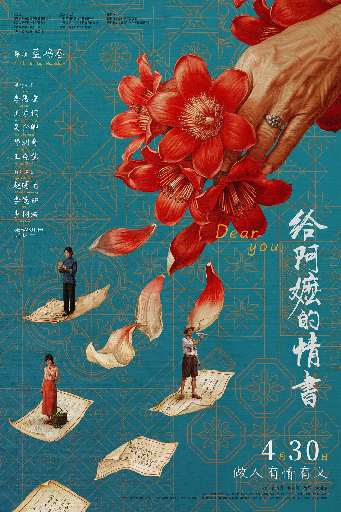

---

《知行小酒馆》播客单集：[疲惫经济学：为什么技术进步了，我们却更累了？](https://www.xiaoyuzhoufm.com/episode/69b3b675772ac2295bfc01d0)开车听完的一期。给人的感受比上个月听的那期更积极、更务实。不过现在人人讲 AI，每天都是这样的信息和观点涌进来，也觉得乏味。

《陈鲁豫・慢谈》[对谈刘晓庆的一期](https://www.bilibili.com/video/BV1v6dMBWELe/)。刘晓庆真的是非常直爽的性格，诗胤笑着说：鲁豫根本都拽不回她来。

David Perell 的《How I Write》，[对谈 Steven Pinker](https://www.youtube.com/watch?v=nBQPnvmaNcE)，关于写作的一期视频播客。听完这期，我把收藏已久的《[The Sense of Style](https://book.douban.com/subject/26110221/)》买了。

---

《[梦想机器](https://book.douban.com/subject/38373965/)》陪伴了我整个四月，到五月初终于看完。近八百页的大部头，仗着是我喜欢的话题，让我悠悠啃完。啃完这一本，也增加了我继续读好书、读厚书的信心。

《[富士日记](https://book.douban.com/subject/36883000/)》，三月了解到的书，日本作家武田百合子在十三年间的山居日记，从 1964 年到 1976 年。日本是日记的国度，我买来是想学学人家对日常生活的感受力，以及如何把生活原本写出来的。读着读着，逐渐被她们一家吸引。我边看边查地图，看看她们从东京到富士山别墅的三小时车程都经过哪些地方；有时候读着就能想象到她们夫妻吵架的样子、夏天在湖里游泳的样子、石匠大叔和加油站大叔慷慨的、胖胖的样子。这套书一共三册，到五月底，差不多读完一册，讲到 1966 年底。

《[取材・执笔・推敲](https://book.douban.com/subject/35887138/)》和[《写作是门手艺》修订版](https://book.douban.com/subject/38184860/)，都是几年前或多或少读过的写作书。今年在努力让自己重新进入阅读和写作的世界，所以这类书自然就会想起来要读。为自己的目标做见证，也为写作补充一点方法论。

随着读书的兴致变浓，又开始看一些「关于书的书」。《[故纸浮生](https://book.douban.com/subject/37648813/)》第一、二卷，我忘记读漫画速度会很快，有天中午拿到这两本，晚上就已经读完了。平静温柔的故事、令人会心一笑或无言动容的人情桥段。

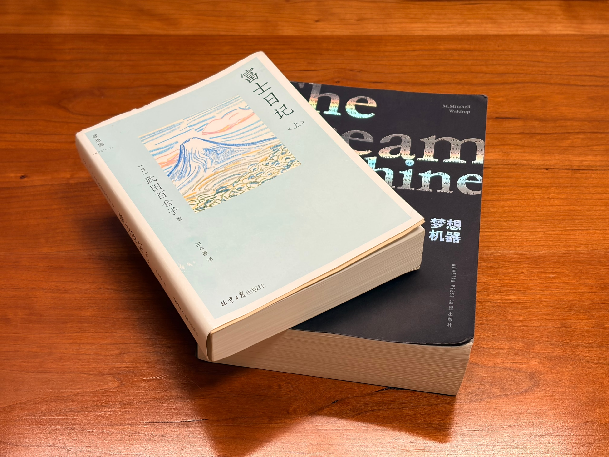

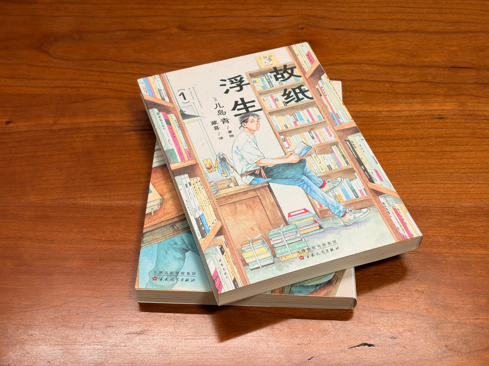

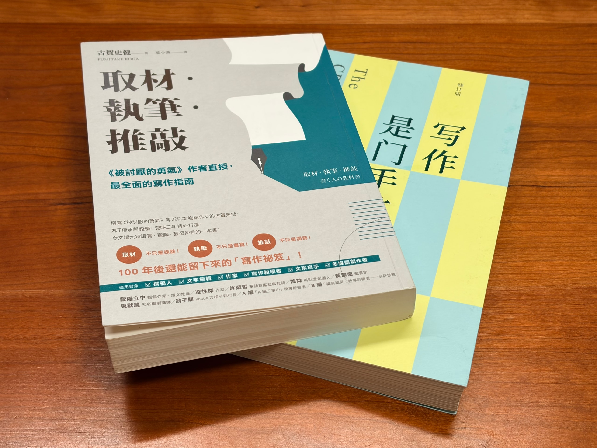

## 日晒也觉风轻

五一假期，我们前往巴厘岛度假。多亏有诗胤来选机票，选到了相对经济的航班，还能在香港、新加坡逗留。这是我们的度假瞬间。

---

香港雨夜。吃完晚餐回酒店的路上，有条喧闹的街，满是卖肉、卖菜、卖杂货的小店。我们想买把伞，老板娘说只能用现金。很不会做生意。

雨夜中的维多利亚港，几座标志性的大楼被云遮住。诗胤说：「就这？」我同意。那次去重庆我就说，两江夜景更胜维港。

不过星光大道有一处，很多人撑伞驻足，铭牌前放着不少花束。原来是张国荣的位置。

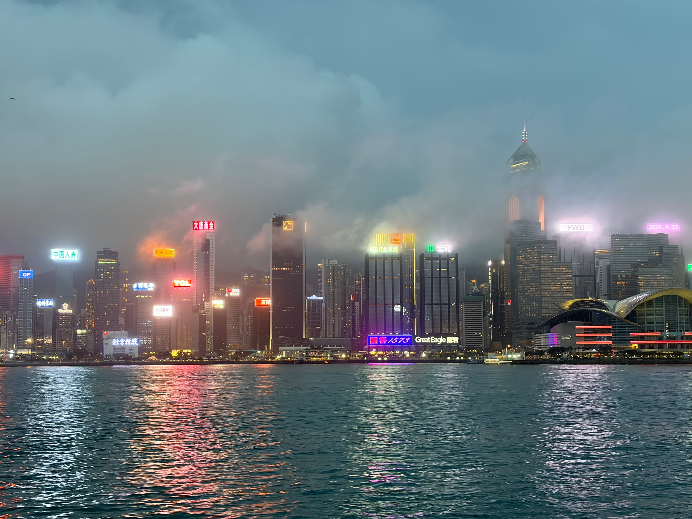

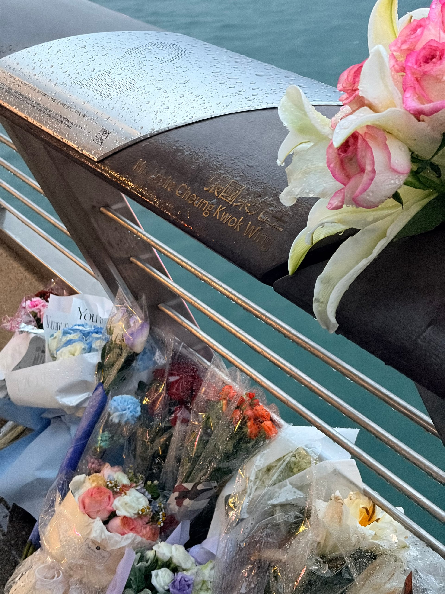

---

到达巴厘岛的傍晚，吃过晚餐，沿着海岸，走过一家家度假区。餐厅和音乐的风格变幻，但都是暖黄色的荧荧灯光，同享一片温柔的海风。

我正坐在酒店的阳台上，外面突然下起了雨。是从一点点风声，变成一点点水声，然后变成一大片水声和雾气的夜雨。仿佛住在了森林里。

午餐后，蝉鸣的下午，我们躺在海边的凉亭里。诗胤坐起来，转过头来说：「你说，沙爹什么的，还挺有名的啊，但是为什么这么难吃啊！」

我生日这天，换到一家从高处临海的别墅酒店，景色壮阔。我们把晚餐点到房间里，像在家一样，边看剧边吃。四周寂静，灯光昏暗。就这样悄悄地，幸福度过。

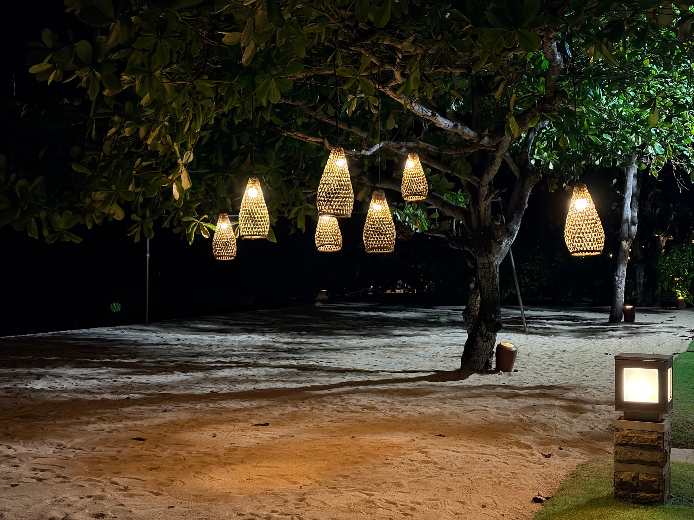

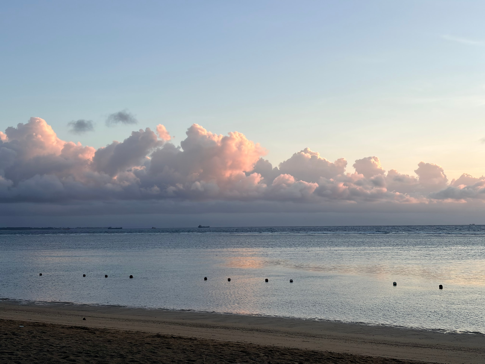

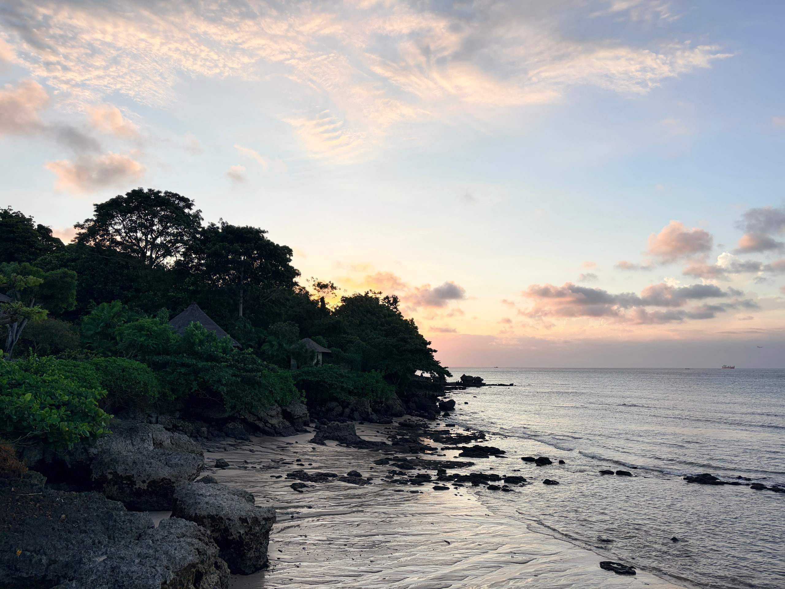

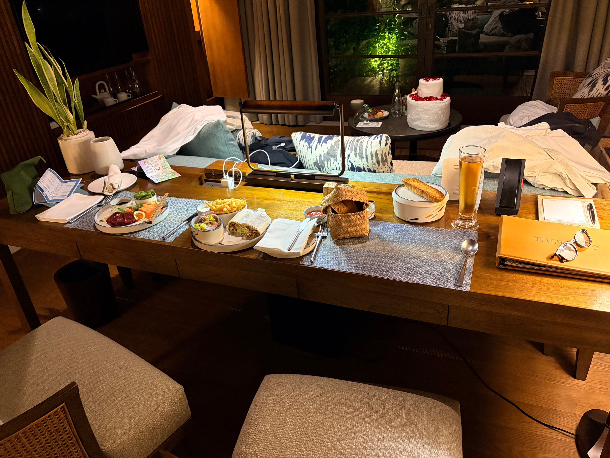

---

最后一天途经新加坡，终于看到了樟宜机场的瀑布和小火车。商场和中国没什么两样，我甚至喝了瑞幸咖啡。这里的寿司郎好像不用排队，但我还是没去吃。登机前，我和诗胤讨论，新加坡没有「国内出发」这件事。

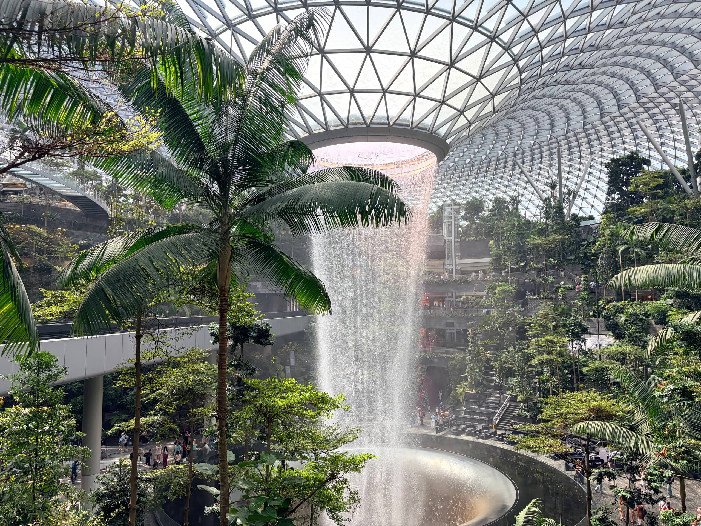

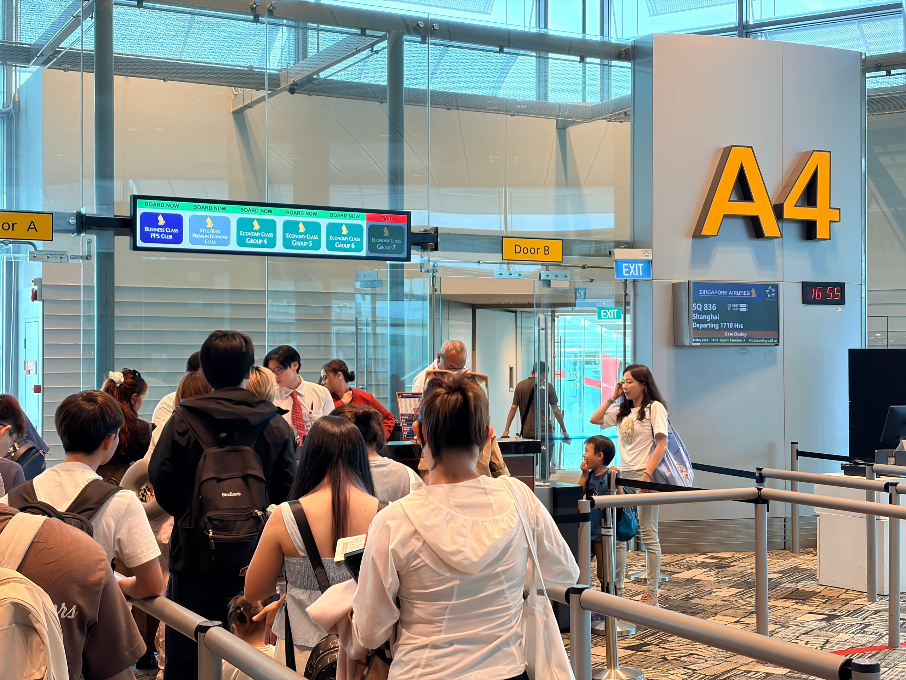

---

度假结束才知珍贵。站在五月的末尾再回想，没有事情要想、只有凉亭长憩的那几天，日晒也觉风轻。

## 明潮暗潮都汹涌

这个月，合唱团没有演出，全力备战六月要在武汉复演的《星河旅馆》套曲。这套作品是我 2019 年加入彩虹后排的第一套，首演是在次年一月底，那也是我在彩虹的首演。结果，庆功宴的第二天，疫情爆发，全国封锁。那一晚的酒馆版《醉鬼的敬酒曲》几年后放出，令人动容。不知道复演的第一站选择武汉，是否暗藏用意。

虽然是唱过的套曲，但技术要求、演绎方式相较于前一版都有变化。加排不算多，任务却不算少。团里又安排了四人小组的作业：四个声部每部一人，一起站在镜头前，从头到尾把这十三首歌演唱一遍。唱完这一遍，体力耗竭，瑕疵也抓大放小，目的是为了让大家预估好、分配好一场演出所需的精力。说实话，现在觉得《星河旅馆》甚至比后来的一套《罗刹国纪》还费劲。

工作这边也没饶了我。我在[四月那篇](/posts/2026/05/12/apr-2026-beneath-mingsha-mountain)提到，四月底接到了一件急活儿，突如其来的忙碌。这件事让我五一节后几天的休假都有点不好意思。回到岗位后，赶紧拿出专业度，冷静解决。但没想到的是，到了月中、月底，事情反而越来越多。好像商量好似的，不相干的任务一件一件堆来。堆到第六个的时候，老板和合作的同事默契地来找我，一起盘算我的人力资源。

好在，很多活儿是雷声大雨点小，实际干起来没那么苦恼。所谓的急活儿直到五月结束都没有完结，如今看来也没那么急；再加上，代码开发已经慢慢变成工作中最简单的一环，有 AI 相助，不能做的事变得能做，能做的事变得更快。与之相比，难搞的还是「工作」本身：沟通、决策、对齐。

说到 AI，到了五月底的时候，我开始了新一轮的沉迷折腾，围绕 [pi](https://pi.dev/) 这个 coding agent 做了很多探索，逐渐把它打造成了我的主力。我接受新技术总是观望先行，一旦深入进去，就说明已经倾心于此。不断折腾的过程中，我其实是在形成自己的理解和实践。这一行也实在变化太快，每天没事就刷刷 X，肯定能刷到新消息、新名词。结果，下半月折腾过度，读书、写博客略显怠惰。

---

诗胤在这个月也面对着几件大事。在离开巴厘岛的飞机上，诗胤说：「我不能想回去要做的事情，要享受当下。」这说明他正在想。

一件是学车。在经历了四月的「磨难」之后，这次学车算是顺利，除了起得太早以外，教练负责，练习时间足，他本身也饶有兴趣。在不算拥挤的停车场里，我让诗胤拿我的车来练手。这个月，他通过了科目二，我猜下个月就能把这事了结。

一件是回公司上班。时隔三个月回到之前实习的公司，老板说要以正式员工的要求来对待他，眼看着比之前要忙不少。对这份工作的内容和前景，他的感受也不能算好。琐碎的事、没有价值的事、没有勇气去做的事，这是他在职业初期的一些挣扎，也是在不景气的市场背景下的无奈。

最后一件是准备答辩，这是大事。正因为是大事，焦虑也会稍稍扯着他。五月的最后几天，诗胤坐在电脑前，鞭策 AI 帮忙写 PPT，又自己一点一点改，再对照着论文，重新查资料、想措辞、写讲稿，跟老师开完一次会后，结构又要大改。我好像已经忘了准备答辩是什么感觉，反正看着他写得很痛苦，我只能在一旁，能帮的就帮，适时「话疗」，缓解他的焦虑。

---

这么写下来，发现我们真的挺忙的。两人愁眉苦脸，明潮暗潮都汹涌。

月底的一个周末，我们驱车到江苏参加朋友的婚礼。我觉得人总有非常不适应的场合，对我来说婚礼就是一种。即使同桌的朋友我也都认识，还是局促。结束后，我们迎着雨回去，到家已经十一点半。诗胤说：「为什么明天就要上班了啊。」
