六月端午假期，我和小李一起去日本九州玩了几天。这几天是连绵的雨声，还有雨中的街道、山林。

## Welcome to Fukuoka

九州是我收藏已久的目的地。据说这里城市氛围轻松，如果要在日本选一座城市生活，福冈会是不错的选择。去年就想来看看，如今终于成行。下飞机后，大厅的「Welcome to Fukuoka」宣告旅行的开始。

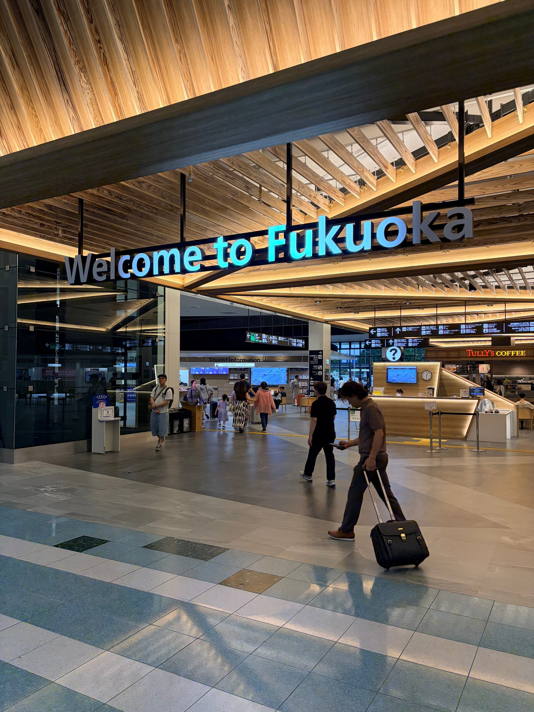

相比东京、大阪，在这里出行更多时候要坐公交，而不是电车。从机场到博多站，就是一趟公交。排队的时候，有位大姐让我们帮忙看着行李箱，去旁边的便利店里买东西。结果她还没回来，就已经要上车了。我们不知所措。

公交车上的乘务员，胸前别着块徽章，写着「中文」，讲话带有台湾口音。据说除了中国游客，福冈的韩国游客也尤其多。

酒店房间很小，我和小李都抱怨。他说，你怎么一下子连订三晚，不然还能换换；我说，哪有一天一天分开订的。然后我们进行了一波 J 人和 P 人的讨论。

雨夜，七点半走到附近的一家烤肉店，店员说八点来可以有座位，于是我们想去附近走走。出来玩，到达目的地的第一天总是最兴奋、最想到处走走。但是雨越下越大，想在一家便利店里坐一会儿，发现也没座位。

我们回到那家烤肉店门口站着等，不一会就吃上了。烤肉香嫩，满足的一餐。有一道生拌牛肉，我爱吃生食，眼里冒光；小李则眉头紧皱，我逼他尝一口。最后的甜品，我纳闷怎么没勺子，还跟店员要，吃了一会发现，应该是直接上手，用饼皮夹着冰激凌吃。

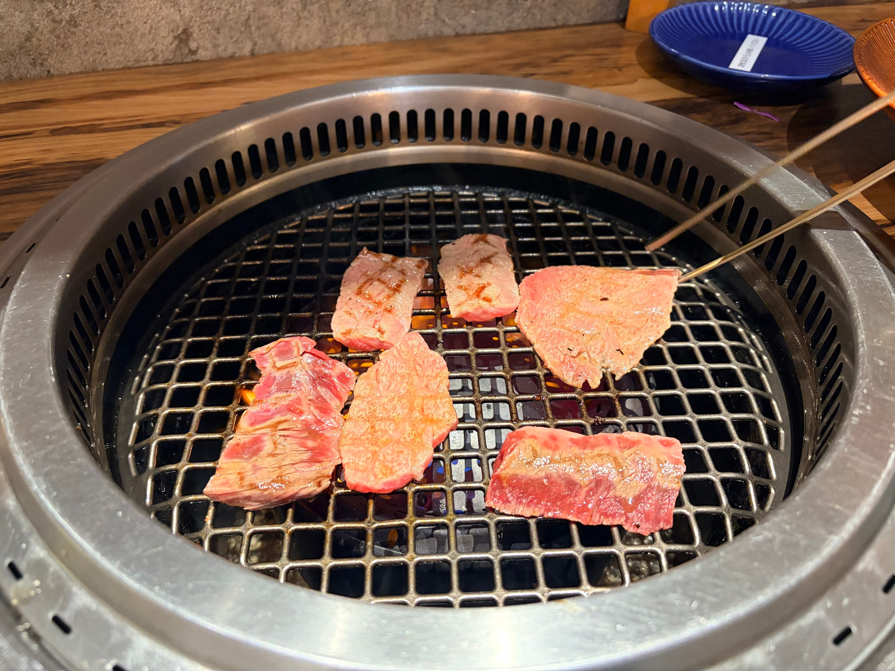

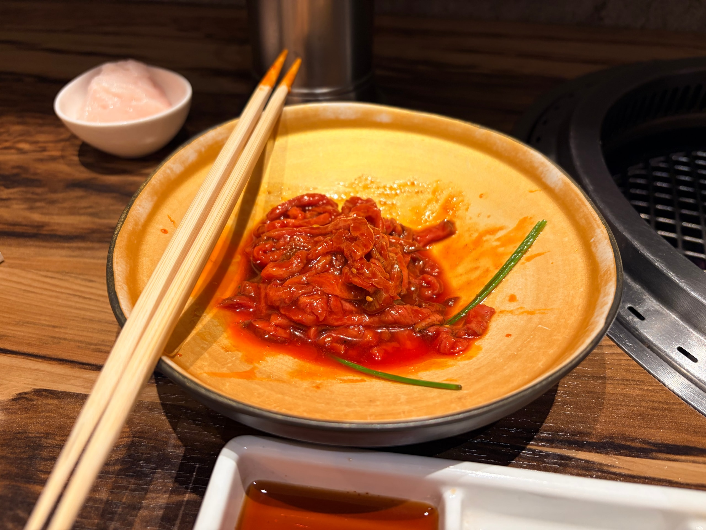

## 太宰府

太宰府是福冈附近必去的名胜。博多巴士总站里，去往太宰府的大巴单开了一条粉色的指引通道，接驳的巴士叫做「旅人号」。小李在车上睡着了，没关系，过几天才会发现，这条进出城的路，天天都会走！

去往太宰府的街道保持着古朴的风格，到处都在卖这里的名小吃「梅枝饼」，基本就是红豆馅饼。有点懊恼下雨，尤其是刚刚下车的时候，雨正不小。走在庭园里，小李却说，就是要这样的雨天，氛围很足。

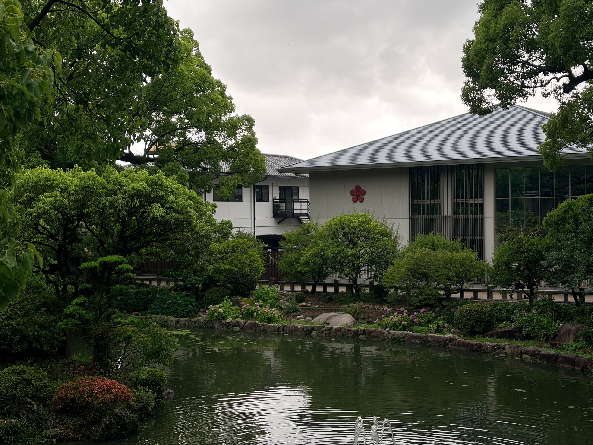

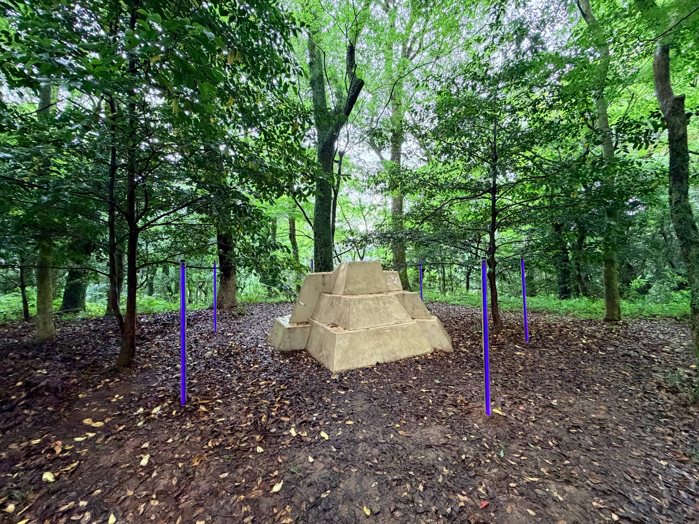

雨天里，树和草丛呈现暗绿色，灰白色的建筑藏身其中，河水把视线引向更幽深的地方。我们在一处地图前规划，怎么能绕一圈游览。走着走着，人变得很少；再走着走着，出现了陡峭的台阶和神社鸟居。没想到还会在这里爬山啊。

果然是少有人走的路，上山累人，下山的时候石阶残破，路上只有两个南美长相的大哥，忽前忽后地和我们一起踩着石阶。山中还有一尊装置艺术品，孤零零在树丛中立着。我跟小李说，这旁边的六根柱子晚上应该会亮起来吧，估计更吓人。

梅枝饼吃了、附近好评的虾味拉面也吃了，爬小山的疲惫才算缓解。不过气人的是，刚坐上回福冈的大巴，天居然开始放晴。

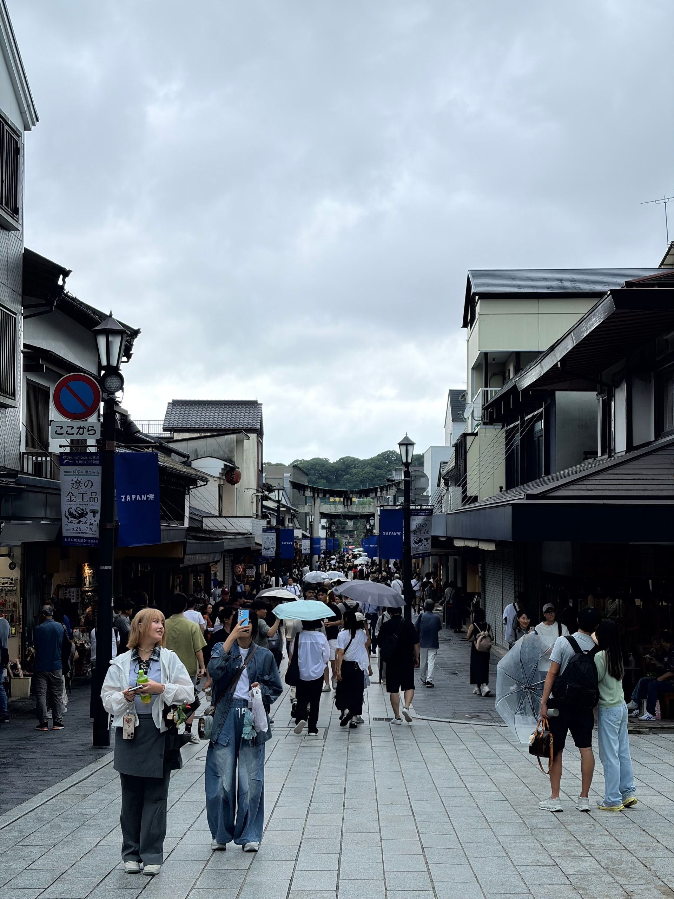

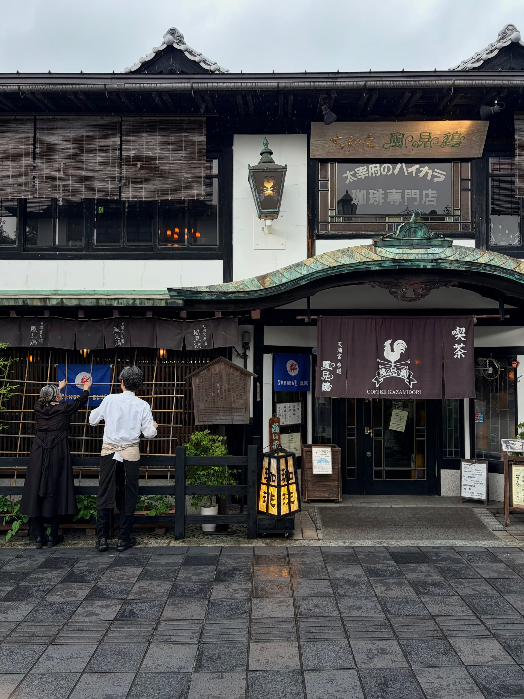

## 漂亮饭，吃不惯！

这天晚上我预约了一家日式法餐。因为之前在家一起看了《东京大饭店》，里面那些人吃着菜会哭出来，会激动地说话都不利索，我们也想这么急头白脸吃上一顿这种类型的，体验一下。

店里客人不多，气氛优雅，我俩有点拘束。好在服务小哥很热情，每一道菜都尝试让我们了解是怎么做的，该怎么吃，还拿出手机来把一些词儿翻译成中文给我们看。天色渐渐暗下来，店员把窗帘打开，河对岸的楼开始闪烁。我们手边，姜汁汽水一点点冒着气泡。

前菜、肉、海鲜……在听完小哥介绍后，我们迫不及待塞进嘴里，然后大多只是相视一笑。嗯，不能说不好吃，就是……很特别。

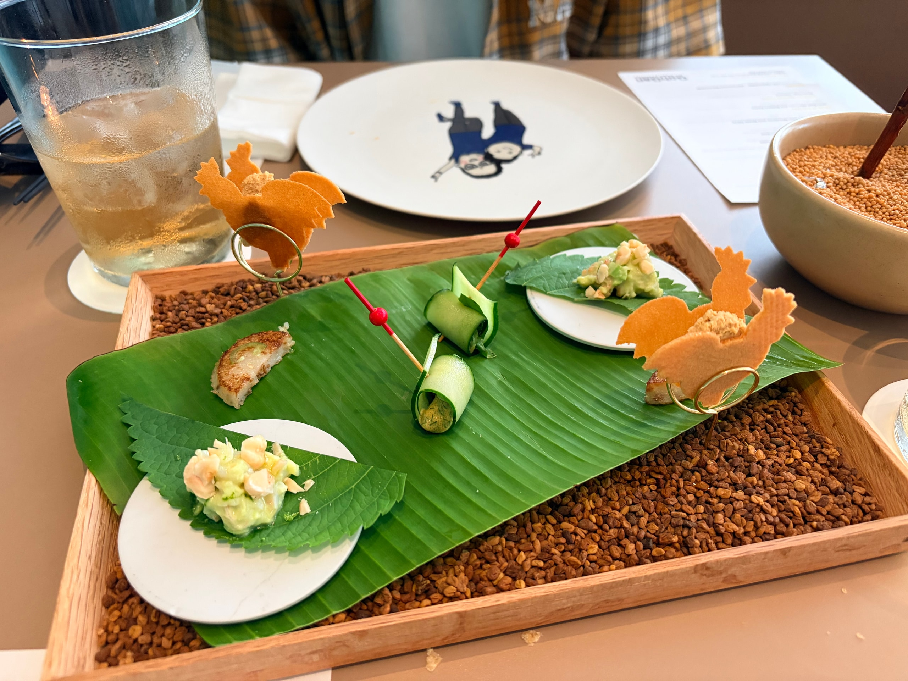

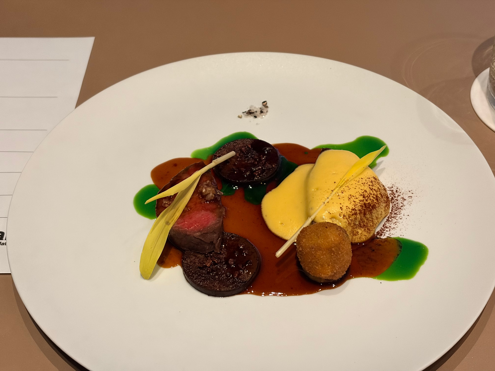

每道菜分量都不大，氛围确实像电视剧里的样子。虽然每一桌到达的时间不同，但店家最终把所有客人都调整到了同一节奏。我俩都是吃得很快的人，每次吃完一道，看看旁边一桌，人家才动了三分之一。

喝完最后一杯茶，我们结账离开，成为最早离席的一桌。有种解放的感觉啊。走在河边，看到福冈特色的屋台夜市，觉得还是这样的庶民之乐更好。小李也说，刚刚那些菜里，还就那一道雪蟹咖喱饭，真好吃。

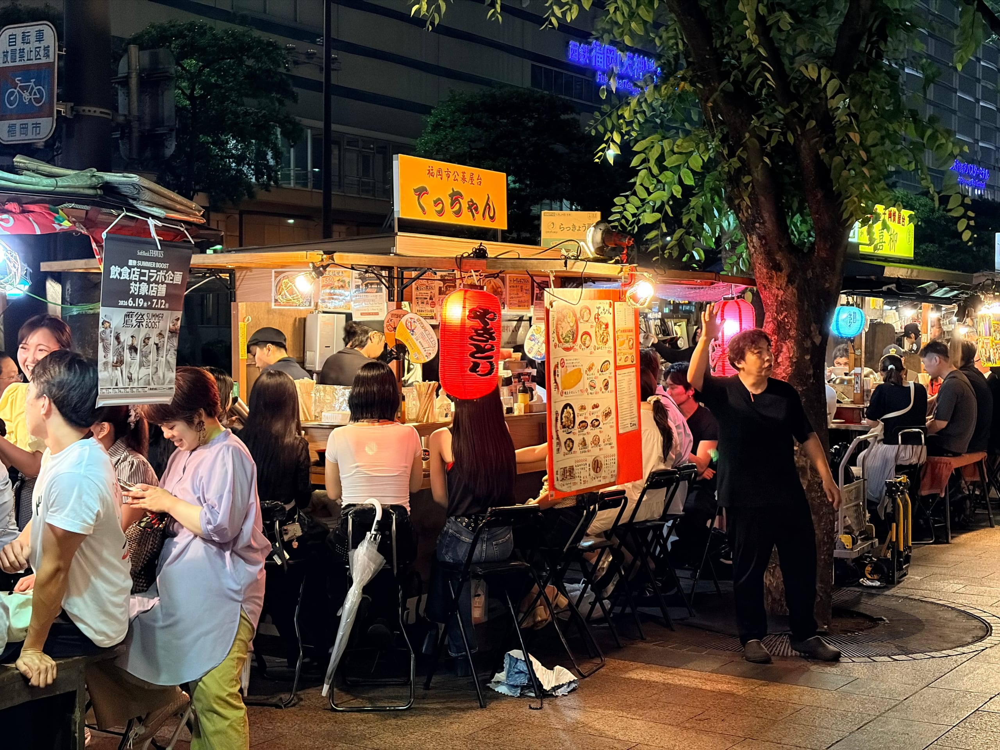

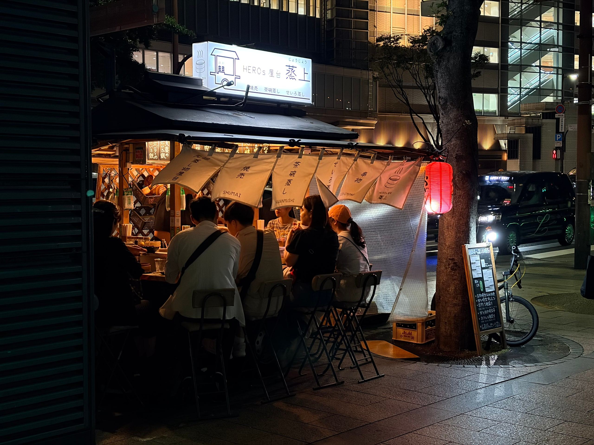

## 志贺岛骑行

天气预报说不下雨，于是我跟小李说，我们去志贺岛骑车吧。

这算是没有事先计划的决定，于是早上显得手忙脚乱。吃完早饭查轮渡班次，发现已经快要错过一班，一边下楼一边看，坐电车来不及，打车才可能赶得上。我的蹩脚日语没说清楚目的地，司机大叔挠头疑惑。他嘴硬心软，一路上说「堵车啊，赶不上可不关我的事哦」、「你提前准备好现金……没有现金啊，刷卡可比较慢哦」，但是脚上又一路用力蹬，把我们及时送到码头。

三十分钟的轮渡，下船后发现，这真是座偏僻的岛，路上几乎没什么人。租自行车的店有点 fancy，和小岛的风格不太搭，但又和外面不远处的海浪很搭。我们租了两辆电动自行车，店老板说，一般开二档就够啦，开三档会太快。

结果小李一骑起来就追不上，说「我得开三档了，太慢了」。他和屋檐、和海岸融为一景，我们都是。沿着海岸边，骑着车从风中打开一条路径，旁边的海浪冲刷着堤坝，仿若盛夏。突然觉得，生活中没什么可烦心的。

正这样想着，雨又打了下来。我们在路边的小店屋檐下躲了一会儿，看雨势没有变小，索性开到小岛另一侧的酒店，吃饭等雨停。

下雨也没关系，虽然眼镜也打湿了，样子一定很狼狈，但好像从没这么轻松过。

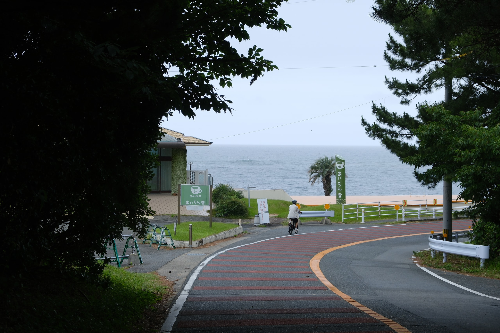

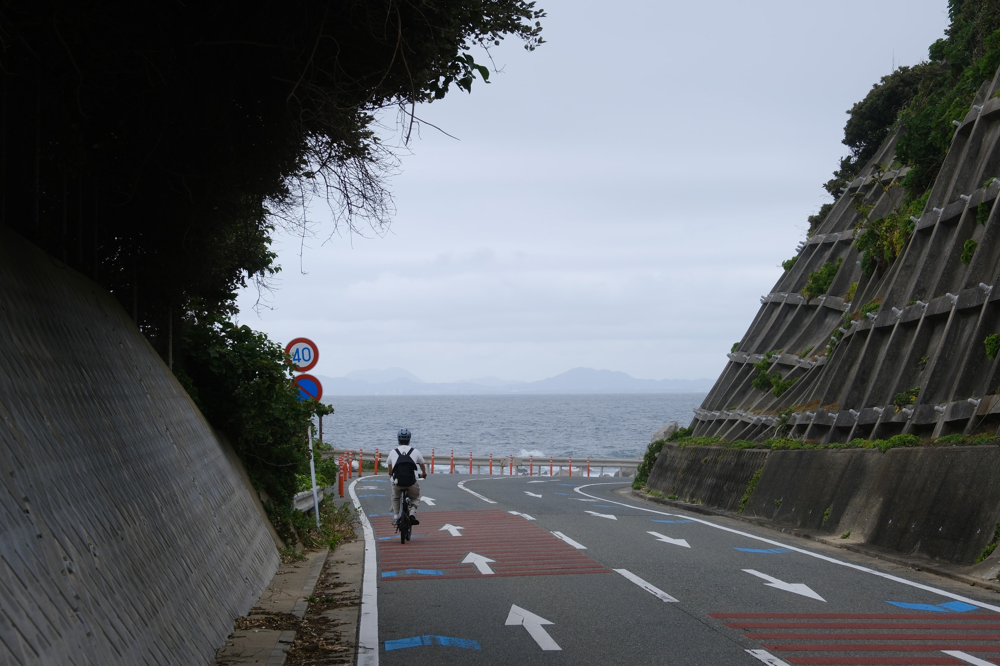

我们把车就放在酒店门口，吃了两份套餐，喝了红茶。这家酒店满是上世纪风格，红茶也是装在古朴的保温瓶里。我跟小李说，原本去年计划来的时候，就是想住这家来着。

从小岛的另一边回去的路上，海浪依旧，还有不怕人的大乌鸦。经过一处神秘的鸟居，台阶通向幽暗的小山坡上。这处神社大概是我见过最老旧的一座，上去走到木质护栏旁边，能看到海，还有我们刚骑过的路。

和前一天的太宰府一样，骑行结束反而放晴。没关系，在堤坝边听到的海浪声和雨声，都太棒了。

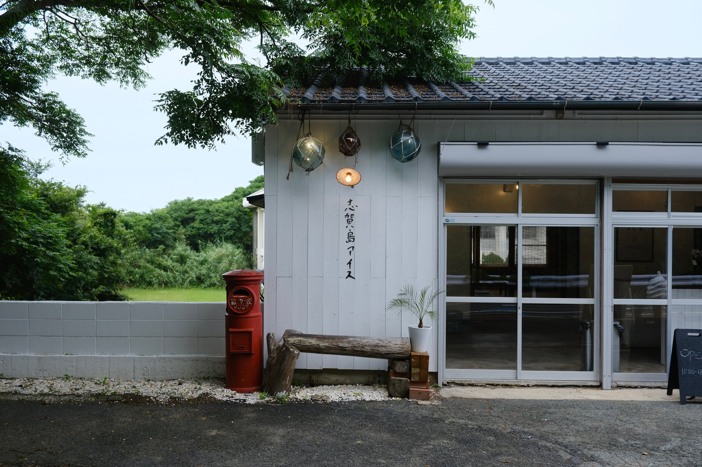

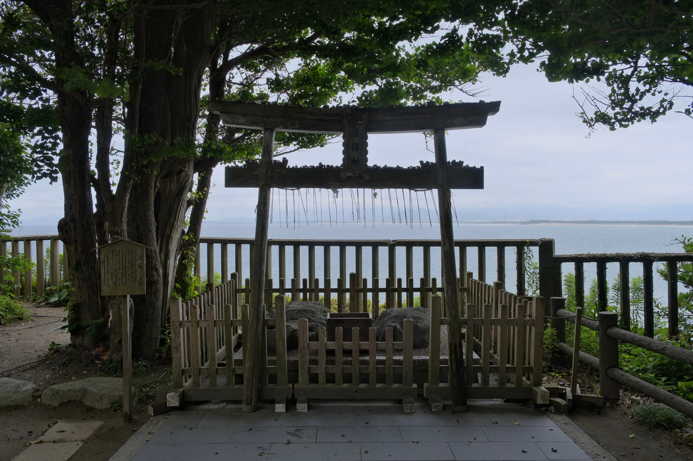

## 深山温泉

旅行的最后一天，是我早早订下的黑川温泉乡日式旅馆，我俩期待异常。将近两个小时的大巴一天只有两班，下车后是小小的一个公交站，再坐接驳车，终于深入山林。

办入住的时候，是一位中国姑娘迎接，东北口音，让人一下子放松下来。同一辆车过来的，加上我们一共三组、六个人。结果有一组是香港人，一组是台湾人，还有我们这一组是大陆人，两岸三地在此奇妙汇合。

旅馆安静，房间古朴宽敞，正是我心里想的那一种。去年在北海道住过一次这种类型之后，就很喜欢。在旅馆里吃一餐舒心的晚饭，泡温泉，然后回房就是在榻榻米地板上铺好的床。可能是因为新鲜，睡在地板上会有种幽幽的安逸感。

拉开纸门，落地窗外是山林和溪水，正好在风雨中簌簌响动。昏暗的灯光下，坐在花布椅子上，仿佛回到上世纪。

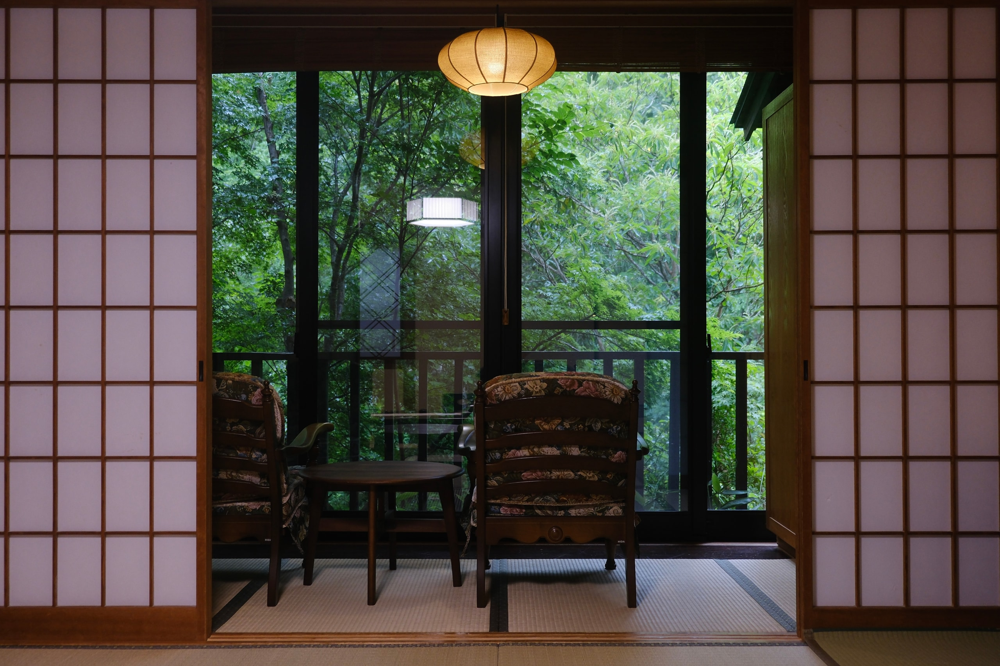

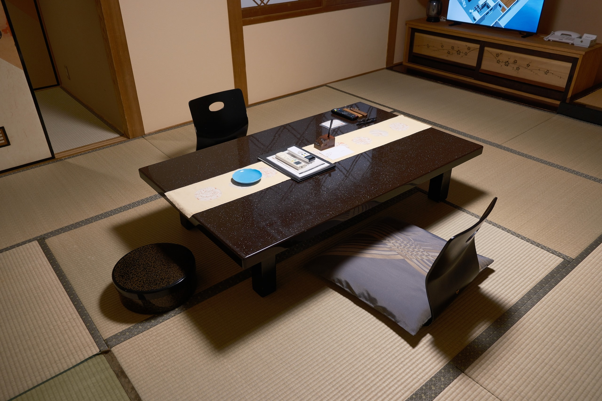

我们去泡露天温泉，穿过一座小庭园才能到。雨水还不停，溪流声也不停。一位大叔看到我们，想了一会，然后把屋檐下的位置空出来一点，说你们过来吧。

晚餐同样是一道道上，但不同于生疏的融合料理，这里的菜味道柔和，让人放松。

据说隔壁家旅馆也是同一个老板开的，我们也能去泡。于是吃完晚餐，我们走到那边的浴场。一个人都没有，让人怀疑是不是真的开放。我们俩在那边的露天温泉，又独享了二十分钟。

这样的山林里大概只有一个缺点，就是生态繁荣，虫虫众多。到了晚上，先是瓢虫，再是纸窗上的蜈蚣。小李吓坏了，晚上没有睡好。

凌晨醒过来，他说睡不着了，于是我们坐在窗前看剧，看着看着我又慢慢睡着。

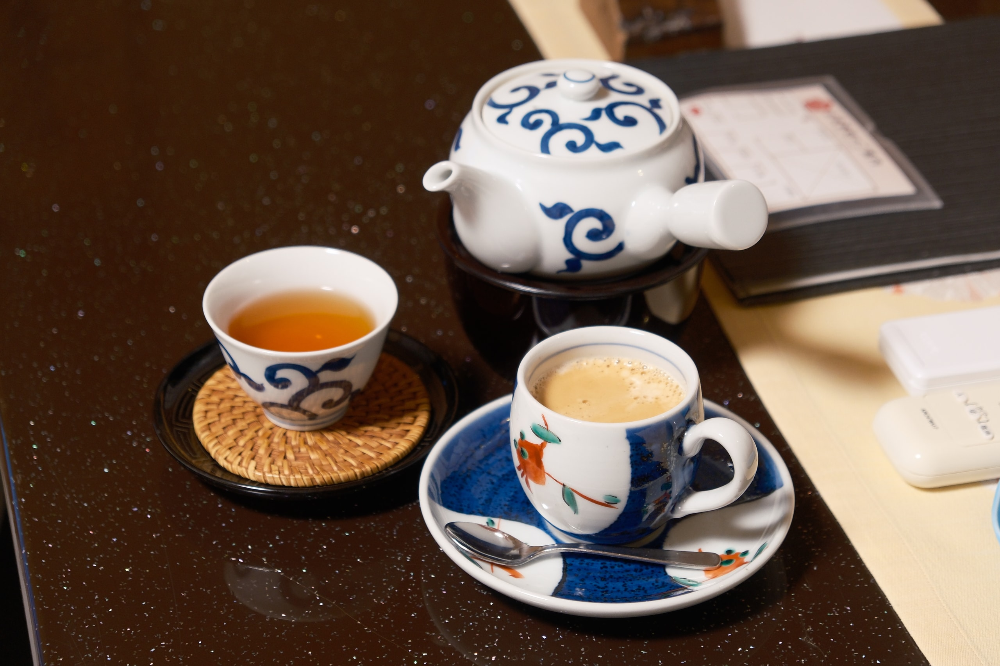

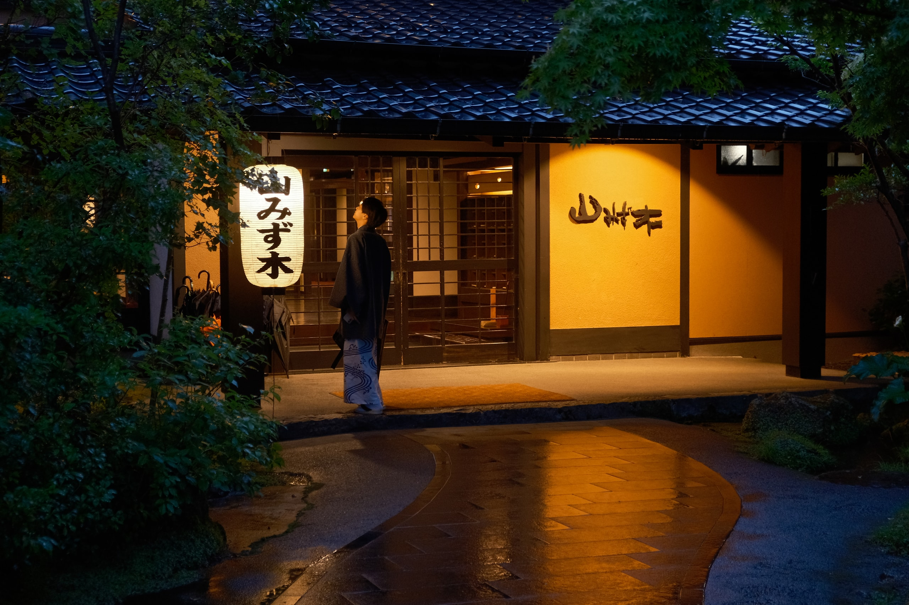

旅行的最后，我们又坐上大巴回到城市，路上担心着雨势会不会让大巴晚点，我们会没时间再逗留一会、逛逛街。回家之后，工作还会继续忙，小李也要毕业，脑子嗡嗡的。这会儿，就让我们在雨中再待一段吧。
