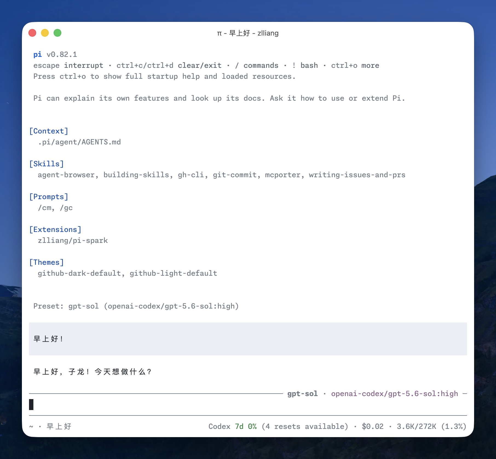
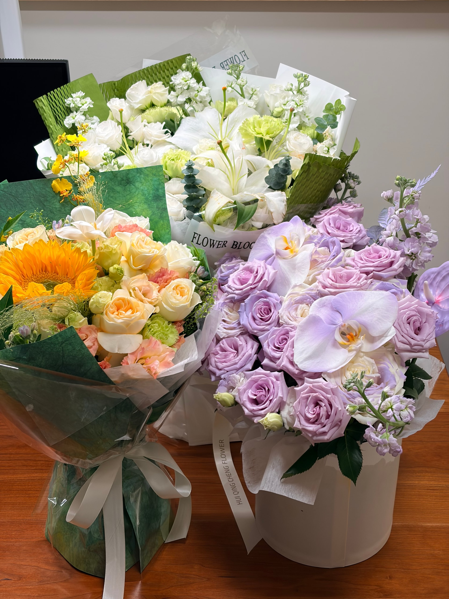
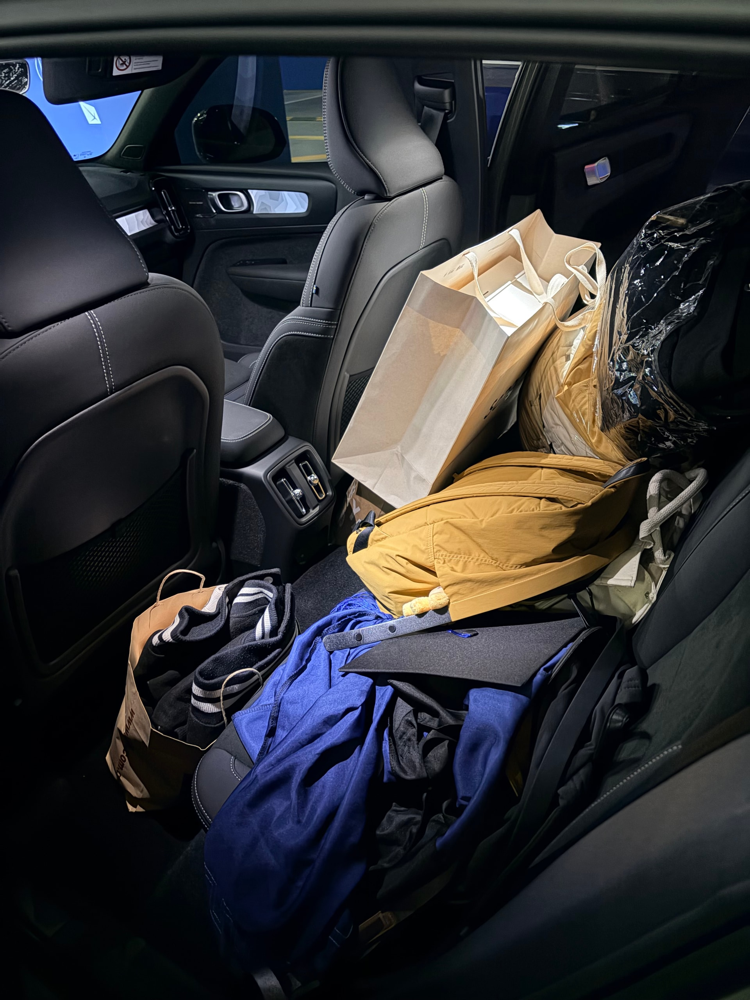
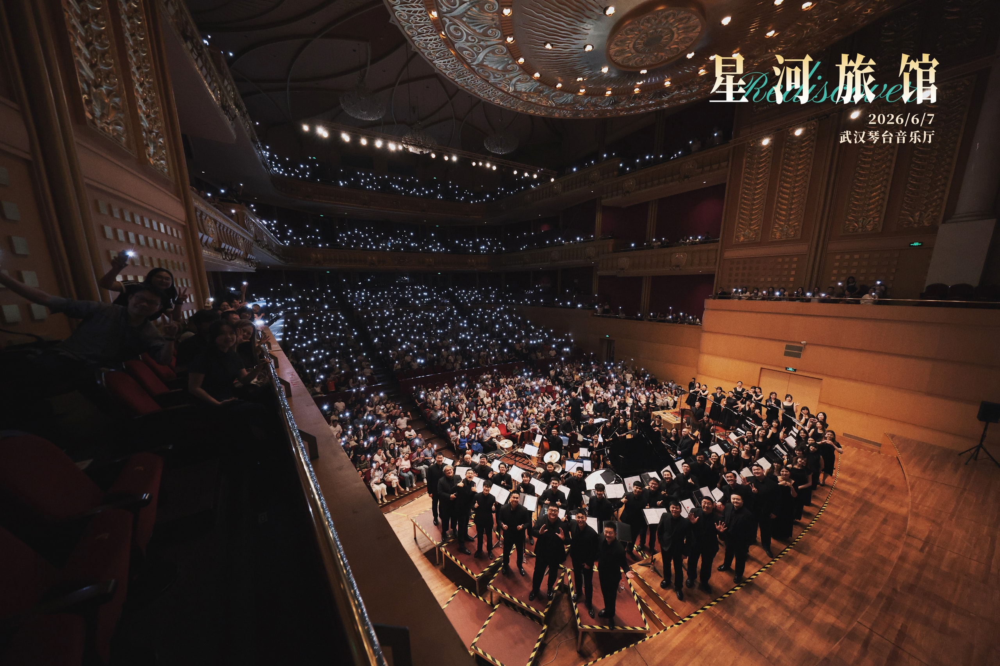
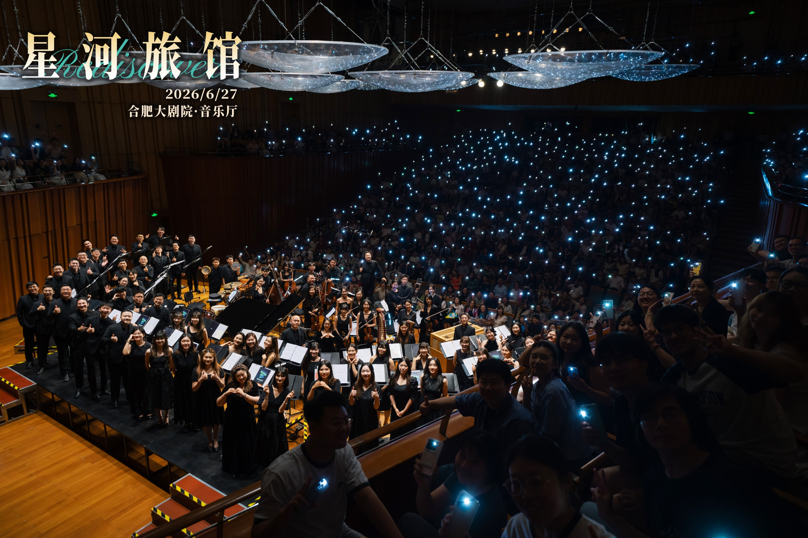
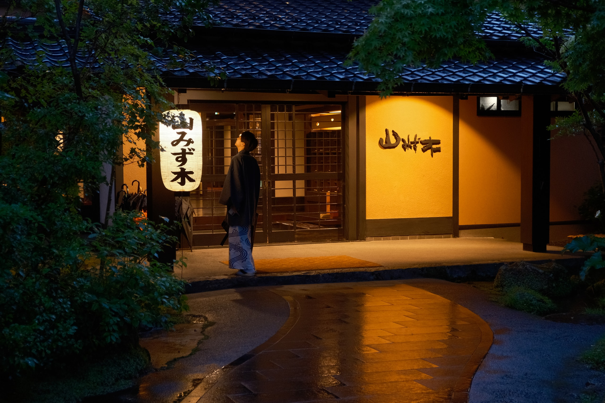
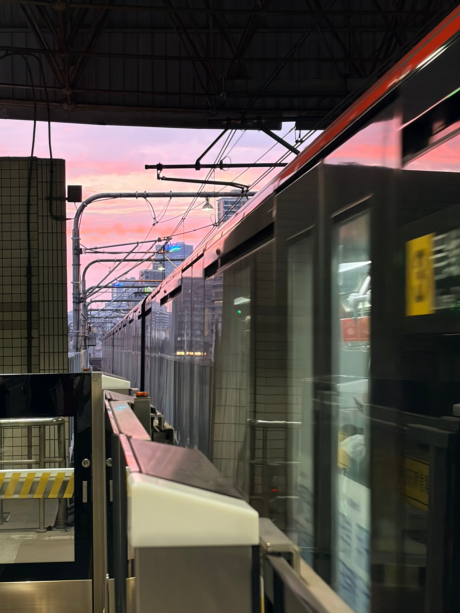

一个多月以来，我搞 AI 搞得沉迷，网站上的文章空空荡荡。让我擦擦灰，补上这些日子的亏空。

## 搞 AI

从五月底开始，读书、写作的热情降了一点温。想想我一直都这样，专注的东西，一阵子就会变一下。

这阵子，我的注意力又转向了 AI。直到现在（七月底），我都习惯每天没事的时候就刷刷 X 和 Hacker News 之类的，蹲新模型、新实践、新工具的消息，就像十多年前爱好科技的小孩一定会关注苹果发布会似的。

如我[之前所说](/notes/2026/06/01/why-i-didnt-write-last-week)，我一直在打磨 [Pi](https://pi.dev/) 这个 agent，开发了 [pi-spark](https://github.com/zlliang/pi-spark) 扩展包，一个月里有什么点子就往里填，竟搞出来 50 多次版本发布。如今它已经像编辑器一样，成为我打开电脑后绕不开的一个工具，用得很顺手。pi-spark 甚至还不经意地获得了几个用户。在公司里，我也找到了机会，做一些小工具、分享自己的实践。从兴趣生发出的探索和互动，让我总能找到充实的价值感。

时间来到 2026 年中，我想没人能再否定 AI 给大家带来的变化。我妈妈有事就会问豆包；合唱团休息室我也能看到朋友在用 Codex 干活。公司里没人再手写代码，公司外也是。同事说最近部门里的 AI 经验分享太多，已经快要烦死了，但是出了门，你也能在街上听到无数人嘴里吐出黑话。

我没做好的一点是，在这样的沉迷中，没有好好多写点[技术笔记](https://mesh.zlliang.me)。明明这些纷乱复杂的学习和探索，是很好的素材。我分析自己还是有「病态的完美主义」，觉得没有很好的理解就不能去写，而且我之前的笔记，也的确有点浮于表面，缺少自己的实践和见解。但仔细想想，如果不写，就永远没办法深入到那一步。

当然，这一段的鸡血最终也会消退。其实最近已经有点烦了，想把没读完的《读库》和《富士日记》再捡起来。这不，周末也在连轴转，狼狈地补补文章。

## 生活路标

小李在六月顺利通过答辩，然后毕业。五月份为准备答辩皱的眉头，终于在答辩结束那一晚，变成三捧庆祝的鲜花。

月末，我跟他一起把宿舍退掉。他一件件收拾出东西，说这个还要吗，我说扔吧扔吧。办退宿的老师说，登记完抽个奖，抽到了一张明信片。我想起我那一年上海疫情刚刚缓解，管理严格，毕业离校的时候只能算是落荒而逃。

那天太阳好，后来小李叫了朋友一起拍毕业照，朋友推荐了校友馆里好看的拍照机位。走在路上小李说，学生卡下个月过期，就要变成校友卡啦。

六月中，我也达成了在 Booking.com 上班的一周年。在明确的职责、舒服的氛围中工作是件可遇不可求的事。结果就是，这一年感觉过得飞快。

## 再会《星河旅馆》

时隔五年，彩虹合唱的《星河旅馆》套曲迎来新一轮演出，首演定在六月初的武汉。整个五月都在排练，我觉得一切都很熟悉，好像上一轮演出就是昨天，我甚至能直接背谱参加首演。但演出的心态和掌控力上，似乎又有差别。

至少，《醉鬼的敬酒曲》不再是如临大敌的一首。

首演前的中午，第十三首《星河》的念白还要做最后的调整。大家聚在指挥的房间，有的人像没睡醒，有的人敷着面膜。但当第一声开始，所有人都在寻找空气中漂浮的韵律，想要抓住名为浑然天成的东西。

六月一共在武汉和合肥演了四场，紧张充实，作品也在此期间继续打磨。月末合肥场前，指挥带大家在线上练习，还是这一段念白。网络各有快慢，麦克风各有个性，练习起来没什么感觉。不过那天，指挥细讲了每一句背后的故事、动机、情绪。我看首演这天聚起来练的时候，大家想抓住的就是这些。

## 梅雨中，九州漫步

六月的最后几天，我们在梅雨中的日本九州度过。我们忘掉一切，沉浸在雨中的街道和山林。下半年，小李也开始上班，这样假期就会变少了啊。

关于雨中的记忆，我另外写成了一篇：[梅雨中，九州漫步](/posts/2026/07/24/strolling-through-kyushu-in-the-rainy-season)。

## 接下来

昨天刷到一篇小红书，说感觉一年过得比一年快，并不是因为年龄增长，而是「惊讶的次数」变少了。生活中的一切都变得熟悉、缺少意外，记忆里留不住，所以感觉快。

可时间过去半年，又确实发生了许多。在我没有意识到的缝隙里，生活的专注点经历了几次转折。

毕竟，这一年开始的时候，承载这篇文章的网站还不存在，我还是「古法编程」的拥趸，小李还在担心期刊文章能不能发出来，毕业还是否有望。

还好都有写下来。

