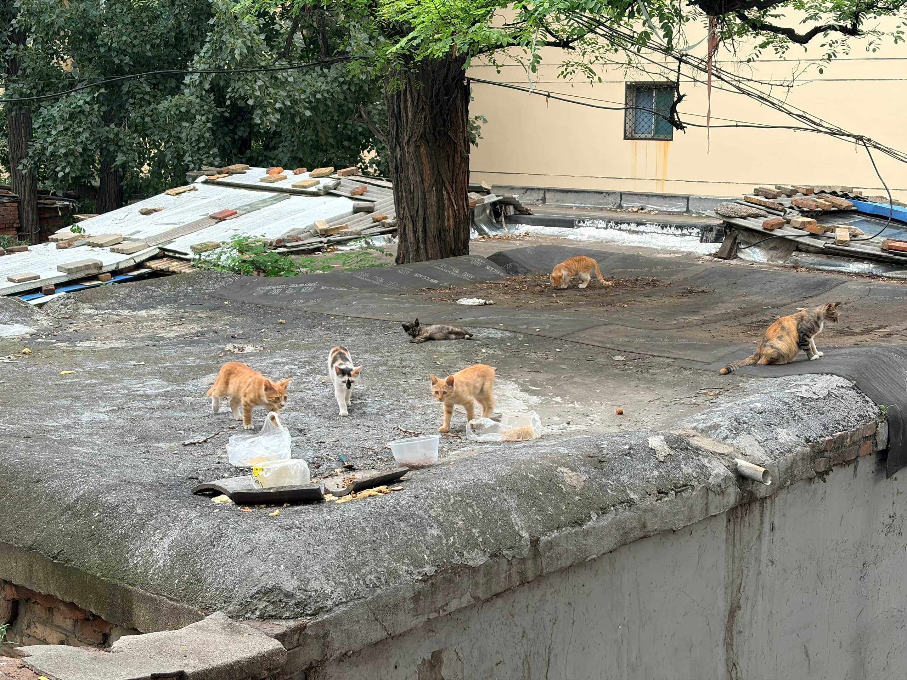
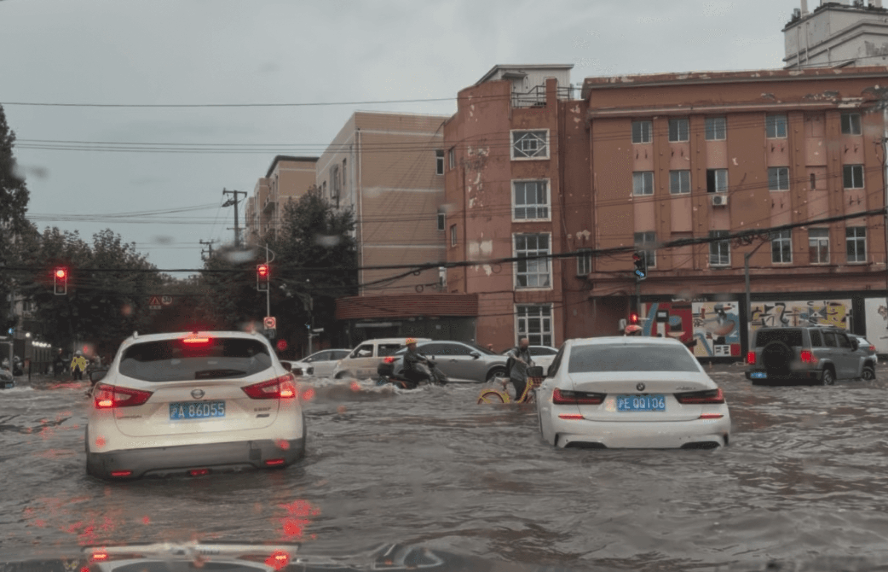
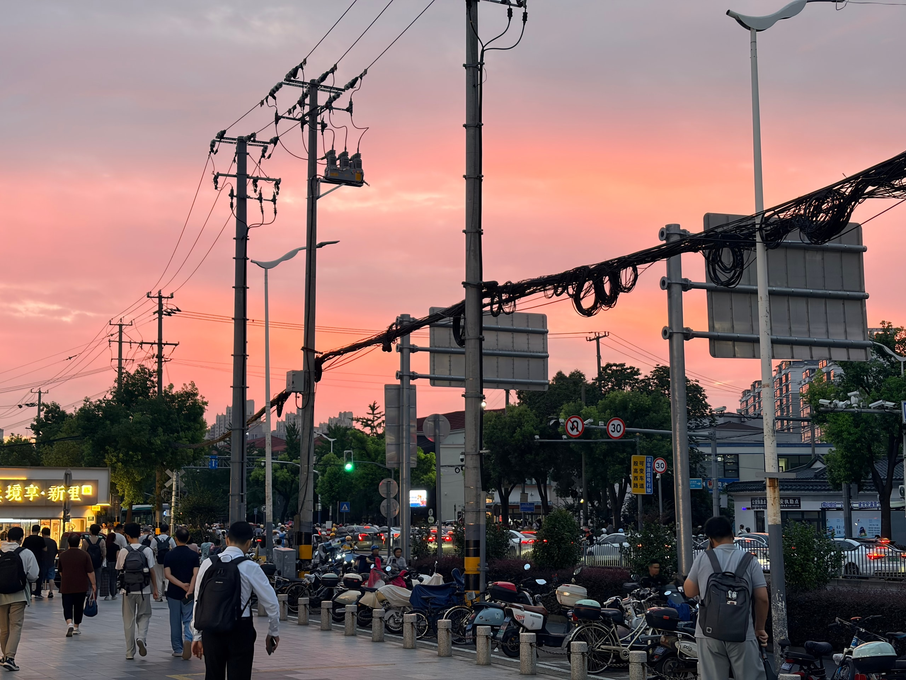
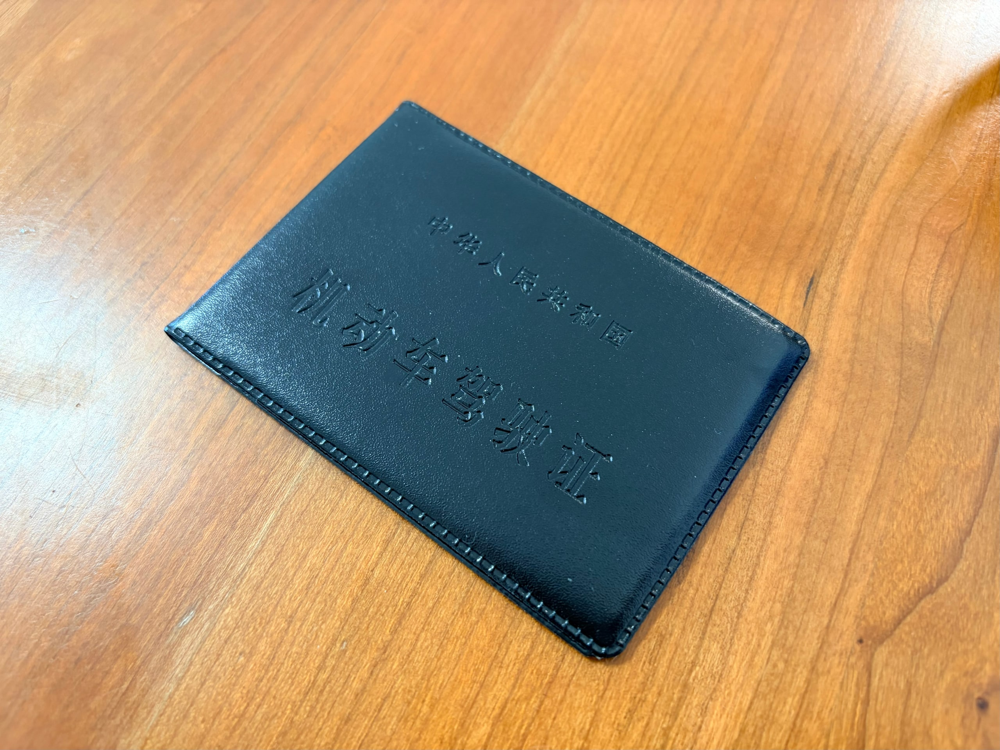
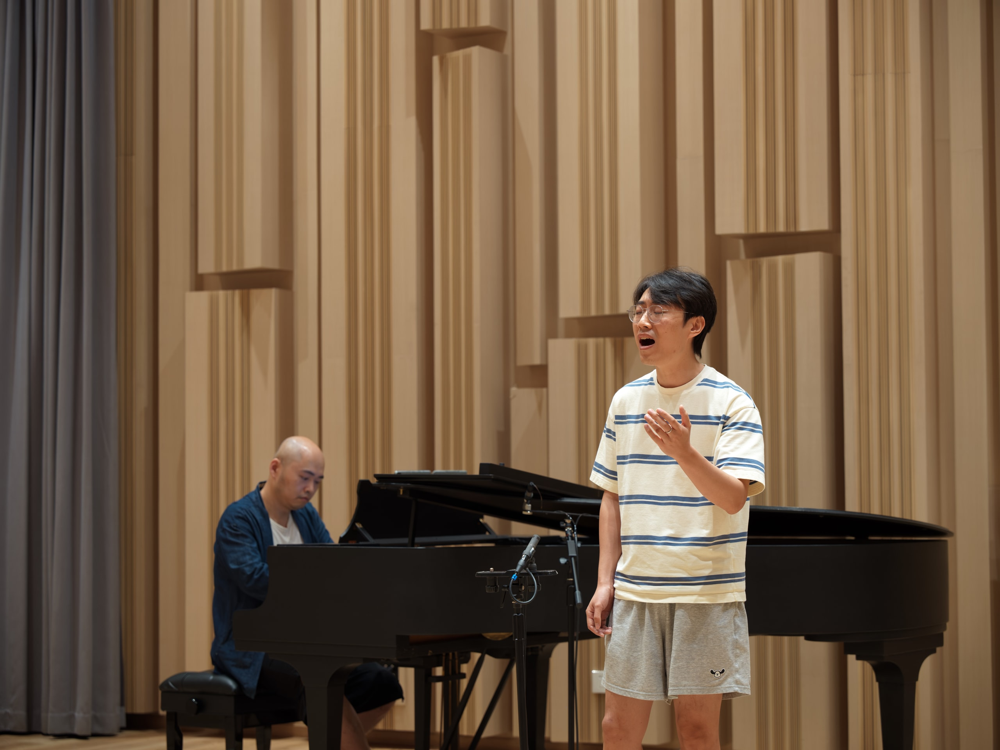
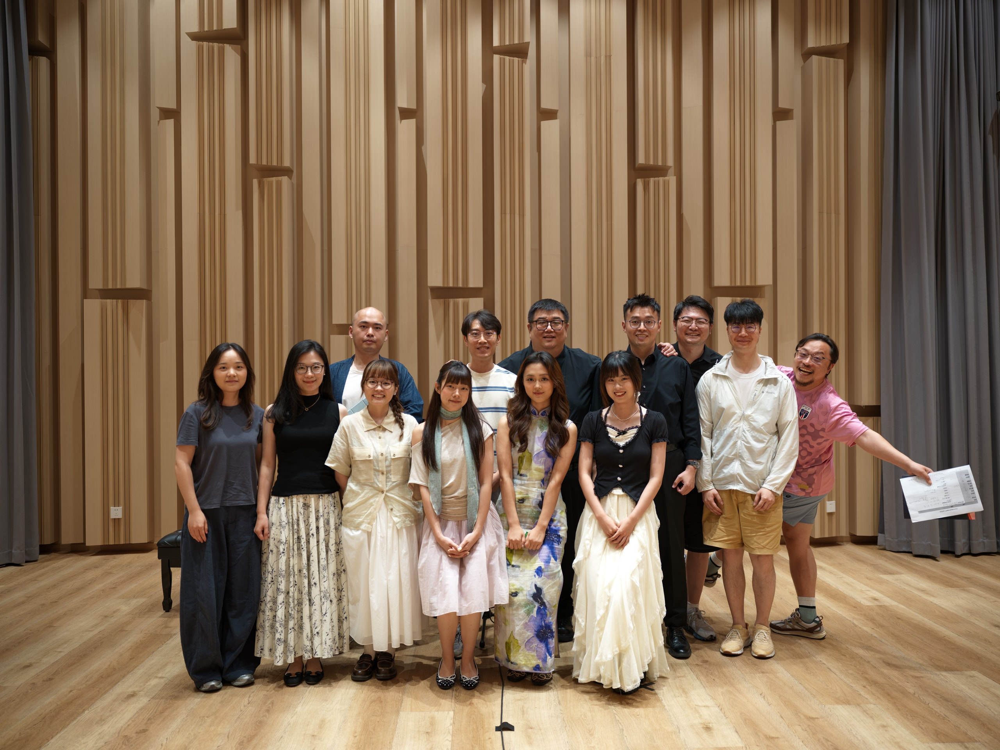
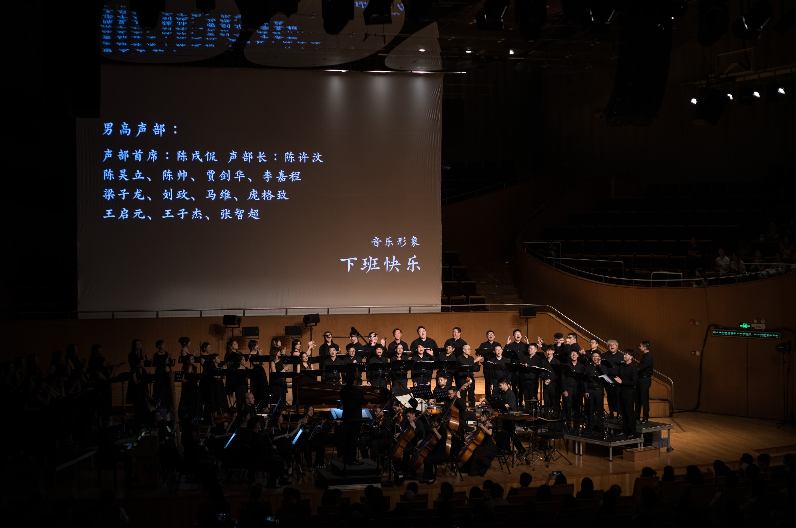
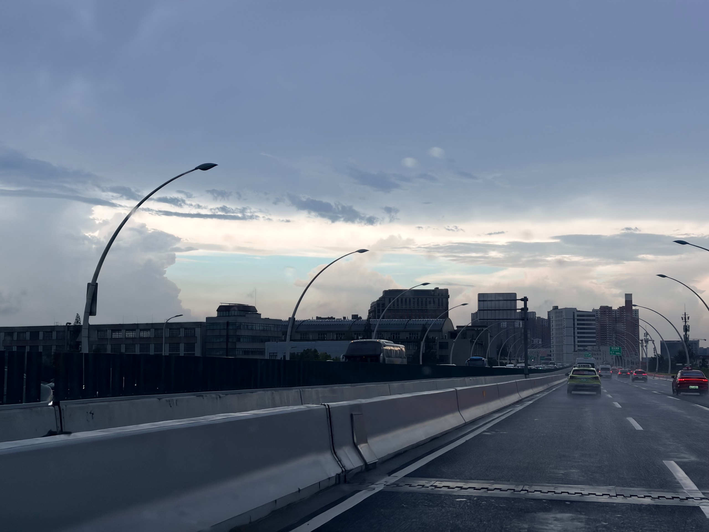

七月初夏，上海好像没有热几天，我只记得时时袭来的雷暴雨。

## 家庭时刻

七月一开头，妈妈和姨妈来上海玩，看脱口秀节目的录制。正巧在那天，我在同一片影棚，参加彩虹合唱的演出录制。但我没告诉妈妈，不然她会说我不好好上班。

后来她俩开着我的车，俩人没事去浙江逛了一圈，还去海宁给我买了件皮衣。我从没穿过皮衣，我说这个脏了怎么洗，妈妈惊呼：可不敢拿洗衣机洗，脏了拿布子擦擦就行了。

因为台风预告，她俩不敢多待。但其实那个周末，雷声大雨点小，台风根本是查无此人。

月末，我又回了趟山西老家，给我外婆过生日。我家换了台一百寸的大电视，占满了一面墙，看新闻都像是在看电影。倒是这几天晚上真看电影时，妈妈总是看着看着就睡着，一部《碟中谍 3》，看了三天才看完。

这次回来，还见到了近十年没见到的另一位姨妈，她们一家在美国工作。因为是稀客，加上外婆生日，所以连着几天聚餐不断。姨妈和我交换了打工经验，加上了 LinkedIn。居然，是加 LinkedIn。

回上海的航班，久违地睡着，一直睡到被空乘叫醒说「您该调直座椅靠背了」。虹桥机场暴雨，小李说浦东是大晴天。

## 夏日鬼天气

这个季节，天气预报反着听就对了。台风和下雨呢，就是预告了就收敛，不预告反而猛烈袭来，还经常是周末袭来。七月的一个周六，杨浦五角场局部暴雨，小李拿着刚热乎了一周的驾照，在积水路段开上了船。无知者无畏，我们一路上见到把轮胎淹没的积水，在水中蹬自行车的人，好奇到不行，拿出手机拍，开着车一点点挪。后来才越发害怕，这样的积水真的是能把车开坏的，路上有越来越多的车抛锚，到晚上积水消了都没能开走。

那天，还有人在大学路上，真的把桨板划起来，小红书上好多人在发。

## 司机新增一名

刚刚说了，小李在七月拿到了驾照。这件事从五月折腾到七月，最终却是同一天完成了科三、科四、拿驾照全流程。于是第二天，我就兴冲冲地开始让他上路实战。我居家办公的日子里，以往傍晚我会去地铁站接他，现在我到了地铁站就往副驾驶坐，让他开。

我想起我刚开上这辆车的那天，五百米就汗流浃背，必须要找个停车的地方缓一缓。小李说自己真是胆子不小，说我也真是能放心他。我说，嘟。

这大半个月，他从九成的紧张逐渐变为七成，再变为五成；我从全程指挥逐渐变成零碎提醒，再变成可以开始在旁边玩手机。到月底我回老家的时候，他已经可以独自驱车，往返公司几十公里了。两个人都能开车后，生活又会灵活不少。

## 声乐发表会

彩虹合唱《星河旅馆》七月在上海演出。演出之后，就快要放暑假。但在放假之前，还有件事让我紧张：声乐课的期末发表会。

这个学期，参加团里组织的声乐课。每周一小时，和王欣老师一对一，目标是纠正发声方式，然后用一首独唱曲来展现进步。学期末会有一个周六，所有参加这一期声乐课的学员，十个人左右，要聚起来做一次小型发表会，挨个独唱。

这已经是我第三次参加声乐课，但是紧张程度更胜从前。前两期发表会我记得我都表现一般，而这学期的《阿妹》，在一整个学期的课上，我甚至没能在整学期的课上完整唱完一遍而不破音。一首歌越唱到后面，气息和发声方式就越稳不住。

我看其他人也是一样紧张。发表会上大家都说，希望抽签抽到早一点唱。还没唱的人一声不吭，正襟危坐，当然也不排除有人越紧张话越多。唱完的人，从姿势就可以看出来，他唱完了，松下来了。

我相信合唱团员多少是有点独唱羞耻的，仅仅是在十几个人面前唱下来就很难。好在我正式唱的这次，绷住了，没有破音，虽然也在边缘了。后面再看，有的人甚至能在唱好歌的同时带上表演，让我知道这功夫还差得深着呢。

话说回来，通过这学期的课，我确实能找到一点正确的感觉，然后用在演出中。加上发表会表现也还可以。那么心里就可以告诉自己说，这学期没白上吧。

## 新生活的序曲

小李工作之后，通勤成了个问题。现在租的房子，离地铁站不近，坐地铁去他的公司也非常远。再加上房子本身就小，衣柜逐渐放不下我们两人的衣服，吃饭休闲都变得局促。于是我们准备找新的住处。

都说现在房租比前几年便宜了，但是实际看起来，刷刷刷，还是很难找到条件、价格都合适的。七月中的两周，我们一路看一路纠结。

正巧，那几周正好是小李练车的时候，也正是雨没来由地下的时候。开船事件就是在一次看房路上发生的。

看房的过程中，先入为主的印象最重要。往往是看了一套觉得不错之后，再看后面的，就会拿第一套来对比，找到 PK 掉它的理由。这和工作的时候「还是选第一版方案」的笑话有异曲同工之妙。

所以，我们这次也是。小李找到的第一套就是面积宽敞、装修干净，只是位置有点远，从现在的家搬过去，纵跨整个上海。我有点纠结这一点，于是之后的一周又去看了其他的，但对比之心早已隐隐发作，加上中介一贯的、引人焦虑的催促，我们就定下了这第一套。

那天晚上，我们说有点舍不得现在这个小小的家，却又打开地图，规划搬家后通勤的六种不同方案。我打开看房时拍的视频，说现在的书柜、桌椅，到时候应该放在哪里；说厨房变大，我练习做饭有更好的战场了。吵闹，又安静，这就是家里的每时每刻。

