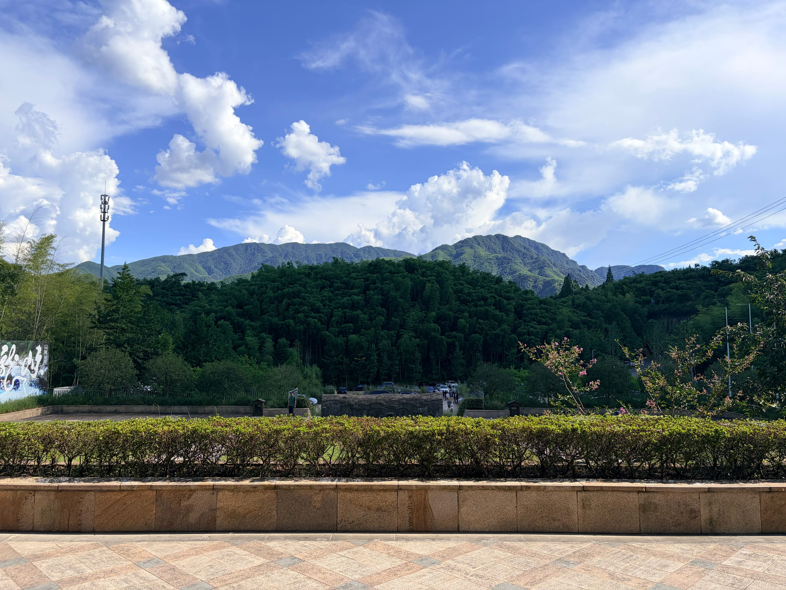
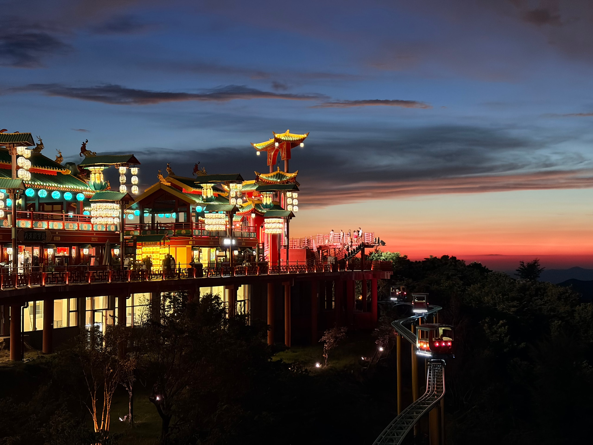
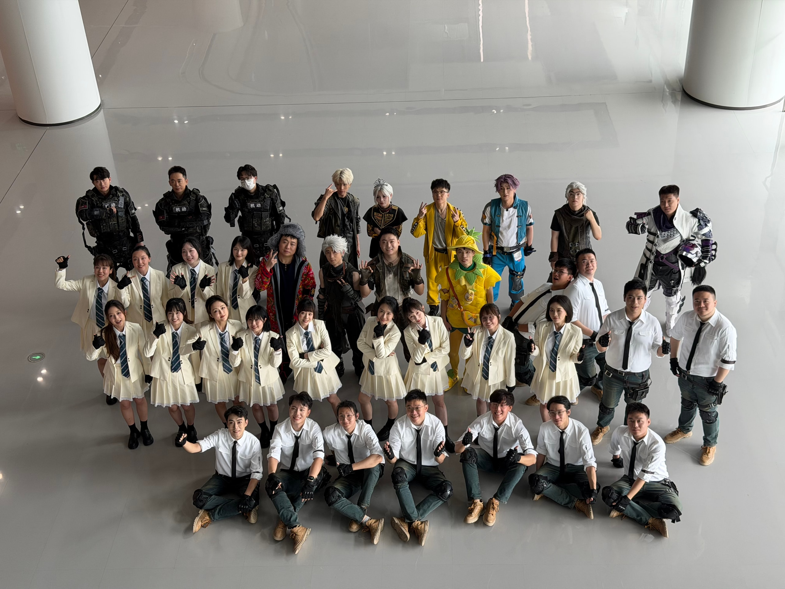
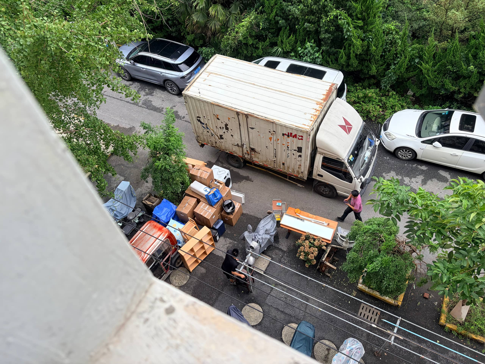
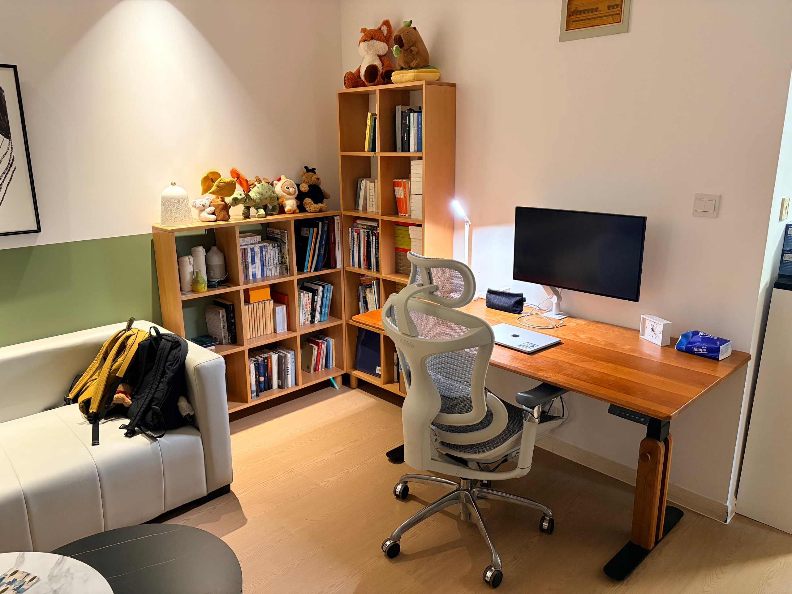
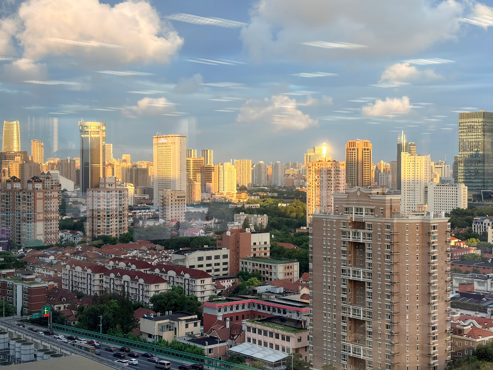

七月底写六月，八月底写七月，前两个月我都是这样，拖到次月的最后才写。此刻，八月最后一个周日下午，我刚游完泳，坐在咖啡馆，终于决定一鼓作气，回顾本月。

## 本月视听读

前两个月都没怎么读新书、看新剧。不知怎的，八月井喷，于是本栏目重启。

回老家的航班上，开始读《[读库 2600](https://book.douban.com/subject/38494172/)》，八月初读完。读库迎来二十周年，主编老六放进去的是去年年底开始的「二十城记」随笔，在二十多个城市和读者对谈的纪实。后面跟着的是几位作者在读库写作的缘起，再之后仍然是「00」系列必会收录的编辑笔记。

《[我的恐怖妻子](https://movie.douban.com/subject/26741568/)》，几年前看过一集多的剧，小李最近刷到，兴奋得不行，于是一起来看。男主「小明」大愚若智，被女主「真理亚」玩得团团转。剧情离奇，男二、女二、邻居一家纠缠不休，发展到后面已经分不清是惊险还是抽象，甚至越发偏向一个搞笑片。但没想到，一众人物花了九集斗法，结局还是包饺子大团圆。

《[欢迎来龙餐馆](https://movie.douban.com/subject/35811064/)》，之前从没听到风声，但是上映后大家都去看。中东背景，幽默开场，却一步步深入战争的冷酷。后来同事们讨论，说这部电影很血腥，堪比《红海行动》。

搬家之后，有宽敞的屋子和大沙发，晚上适合窝着看电影。我和小李对着哔哩哔哩的电影列表上翻下翻，看了《[无间道](https://movie.douban.com/subject/1307914/)》和《[律政俏佳人](https://movie.douban.com/subject/1304854/)》。之前没看过，看的时候才发觉，好多经典台词和音乐都出自《无间道》，包括那句「有内鬼，终止交易」。而《律政俏佳人》很像前几年上映的《芭比》，粉色亮眼，情绪明快，法庭反转让人拍手称快。

CNN 纪录片《[温莎：皇家王朝](https://movie.douban.com/subject/35359695/)》，也是哔哩哔哩上随便找到的。小李一直对英国王室很感兴趣，我们也一起看过几季《王冠》和《唐顿庄园》。这次的纪录片，印证了之前看剧的一些印象，六十年代之后的一系列事件也补上了课。看完觉得，王室都乱成这样一锅粥了，英国人是怎么还能接受的。

兴趣是一个循环，所以电视机下伫立着的 PS5 不会永远吃灰。八月我又鬼使神差地打开它，开始玩《[只狼：影逝二度](https://www.douban.com/game/30245105/)》。它此前已经待在收藏夹好久，现在我终于能领略「打铁」的快感了。经过《恶魔之魂》和《艾尔登法环》这两个魂类游戏的摧残，我已经能心无波澜地面对每隔几分钟就出现的「死」字，也能从一次次的 BOSS 苦行中修得必要的技巧。

## 周末郊游

小李上班头一个月，对这份工作彻底祛魅。打工人惯常的周日下午之哀嚎，小李基本上把它提前到了周六。八月的第一个周末，我们决定去安吉漂流散心。

说是漂流，但是我们去的「仙龙峡」一点都不刺激，基本上就是些平静的水面，靠人造的坡道连接。冲坡的时候比较爽快，我会叫几声，但大部分时间都得拿桨拼命划，或者靠跟别的船打水仗取乐。不过，漂流结束后，衣裤全湿，倒是凉快到了。

原先我都不知道，漂流最好还要准备换洗衣服，景区一般也会有冲澡间。那天晚上，又在手机上刷到了好多惊险的漂流，很多都是连人带船翻进水里，再由景区工作人员跳下去捞人，号称「包活」。

在酒店休息了一会儿，傍晚我们去「云上草原」的「仙侠镇」闲逛。坐缆车上山，正好赶上无人机表演，还看到了雨后的彩虹和晚霞。我曾以为「云上草原」就是那种粗制滥造的景点，但是这次发现，人家其实是按游乐场来经营的，「仙侠镇」合理利用地势，审美也很在线。

晚上在酒店，突然接到一通电话，车被刮蹭了。肇事的是酒店的工作人员，他带女朋友一起下班，倒车的时候给我蹭掉点漆。我还从没处理过这种事情，好像对方也没有，于是决定报警，然后走他的保险。十几分钟后，交警骑摩托车上来，骂骂咧咧，说你们这酒店怎么在这么高的山上。你怎么开的车，旁边这么空。大晚上的，我他妈的都不想出这个警。

第二天早餐，我们发现那个女朋友就在餐厅上班，小李先认出她来。我向她要了碗馄饨，像这事没发生。

## 台风中各显神通

合唱团八月放暑假，不过还是参加了两场活动。

月初去深圳，参加游戏《[和平精英](https://www.douban.com/game/33438620/)》的年度晚会。活动够丰富的：拍了平面、短片、采访，和好多主播一起排演了节目，都穿着游戏里经典的特种兵服装。那衣服已经够难受的了，但是在现场，我们只能算是最朴素的。到处都是穿着夸张 cos 服、化妆到完全不识真面目的演员，方圆五米生人勿近，否则恐把造型碰坏。

晚会取名叫「刺激之夜」，但更刺激的是台风中的回程。晚会排演结束，刚好碰到「白海豚」逼近。回程起飞前一晚，航班取消，和朋友买的备选高铁也取消。此时，回上海的航班已经售罄，小李急智让我买凌晨六点飞到无锡的航班，然后高铁回沪。半夜，室友三点多从外面疯玩回来，洗澡收拾到四点出头，这时我也该出门赶飞机了。

那天还算幸运，我成为了参演队伍里第一个到家的，羡煞他们。原定早上九点多飞机回虹桥的大部队，本来欣喜于航班没被取消，却在候机了一个多小时后被通知取消，一边发怒一边想招。大家各显神通，办法不够也得硬凑，有的选择飞到常州，有的飞到合肥再转无座高铁。后来大家说，每次去深圳演出，都遇到这种事情。

月底，参加鲁迅文学奖颁奖典礼，唱团里为此新写的歌《下一页续写》，非常好听。休息室逼仄，三天排演中，一得空就往外跑，在北外滩来福士吃了个够。

## 迁居大豪思

虽说最近不排练，但八月的周末好像尤其忙碌。搬家是件大事：住了两年的小房子，要搬走啦。

上个月签好的新租约，本来说「一点一点搬」，结果发现不切实际，还是找了个周末一下子搬完。之前的房子小，但书架、书桌什么的都是我自己添置的，搬起来需要两个师傅、一辆大厢货。搬家前一周，我正好居家办公，闲的时候我就打包一点。到周六，一车拉走。

新家可真大。住了几天后，觉得大了就是好，地方宽松，手脚挪动宽松，心里也宽松。我心急想施展布置想法，要把沙发和次卧的床都给扔了，小李力劝让我冷静。他提出把书架和书桌都放在客厅作为办公角，这点子一下让我自惭形秽。

搬家一周后，我们邀请朋友们来玩。不满一岁的小孩和眼睛圆圆的小狗对视而笑。我学了打麻将，晚上一起吃了辣火锅。

## 明天早上，还吃包子

八月的最后一个周日晚上，小李睡不着。大概是明天又要去上班，他焦虑烦躁停不下来。

我突然饿了，跟他说，之前在腾讯上班，我也有一段略带苦闷的日子。公司食堂有早餐，那段时间，我很爱吃胡辣汤加油条。我经常都稍微早点到公司，吃得饱饱的。如果师傅刚好新炸出来一锅油条，我就更开心。

每天晚上，我都有点烦躁，想着不要到明天啊，明天这班可过不去啊；但又饿着肚子，就期待着这顿早餐，说还是到明天吧，明天有好吃的早饭。

我跟小李说，我是想到明天早上要吃肉包子，想起来这事的。包子是我们两周前买的，好吃，连着吃了两周。

