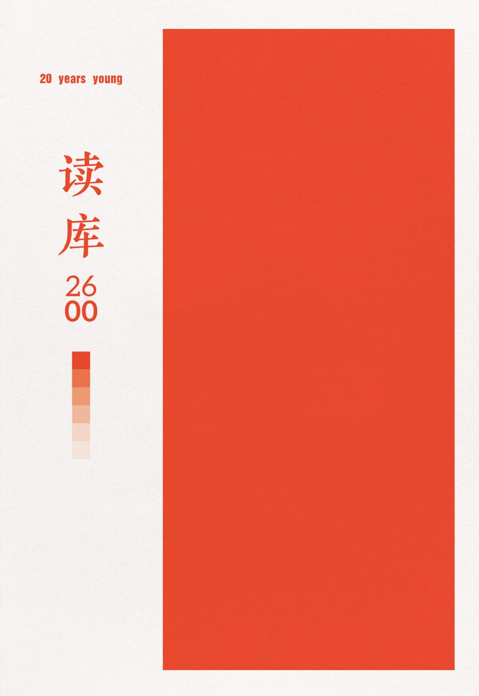

细心的读者可以发现，前两个月的生活月刊，我都是拖到次月的最后才写：七月底写六月、八月底写七月。此刻，八月最后一个周日下午，我刚游完泳，坐在咖啡馆等小李打麻将。终于，我决定在八月底写八月本月的生活月刊。

## 书影音

《[读库 2600](https://book.douban.com/subject/38494172/)》。恢复阅读后读完的第一本。每年的「00」号，是《读库》的非正式出版物，涵盖过去一年读库的对谈和编辑笔记等等。今年的有所不同，因为读库迎来二十周年，主编老六放进去的是去年年底开始的「二十城记」随笔，在二十多个城市和读者对谈的纪实。后面跟着的是几位作者在读库写作的缘起，再之后仍然是编辑笔记。这类文章我最爱看，关于书本身的文章。就像在看最近很火的视频播客。

《[我的恐怖妻子](https://movie.douban.com/subject/26741568/)》。剧情越来越疯，没想到这样的剧，结局还是大团圆。

《[欢迎来龙餐馆](https://movie.douban.com/subject/35811064/)》。后来同事们说这部电影很血腥。

《[无间道](https://movie.douban.com/subject/1307914/)》和《[律政俏佳人](https://movie.douban.com/subject/1304854/)》，搬家之后，有宽敞的屋子和大沙发。晚上，适合看电影。

CNN 纪录片《[温莎：皇家王朝](https://movie.douban.com/subject/35359695/)》，哔哩哔哩上随便找到的。小李之前对王室很感兴趣，我们也一起看了几季《王冠》和《唐顿庄园》。看完觉得，王室都成这样了，英国人是怎么忍受的。

## 安吉

小李工作到七月底，对工作这件事彻底祛魅，即便是到了周末也不开心。周六就会开始号丧：怎么周一又要上班啊。于是八月的第一个周末，我们决定去散心，去安吉漂流。

说是漂流，但是我们去的仙龙峡那个一点都不刺激，基本上就是一些人造的坡，除了冲坡的时候比较爽快，其他时候就是拿桨划，然后跟别的船的人打水仗。漂流完之后，又在手机上刷到了好多惊险的漂流，很多都是连人带船翻在水里，然后景区工作人员「包活」捞人的。不敢坐那种。

那天晚上，我们去「云上草原」仙侠镇溜达，从缆车上山后，看到了最美的晚霞。我曾以为云上草原就是很粗制滥造的那种景点，但是这次发现，这个仙侠镇修得还挺美，合理利用地势。

晚上在酒店，车被刮蹭了，肇事的是酒店的工作人员，他带女朋友一起下班，倒车的时候把我的车剐蹭掉漆。我还从没处理过这种事情，于是决定报警。十几分钟后，警察骑摩托车上来，骂骂咧咧，说你们这酒店怎么在这么高的山上。你怎么开的车，旁边这么空。这大晚上，我他妈的都不想出这个警。

## 深圳

彩虹最近休暑假，但还有一些商演。

八月初去深圳，参加《和平精英》的年度晚会。够丰富的：拍了好多短片、采访，都穿着游戏里特种兵的衣服。那衣服已经够难受的了，但是在现场，我们只能算是最朴素的，到处都是穿着夸张 cos 服的演员，方圆五米生人勿近，不然就会把衣服碰坏。

惊险的是回程。台风「白海豚」影响，回程的时候航班取消、和朋友一起买的备选高铁也取消。夜里取消之后，回上海的航班已经买不到，只能买凌晨六点从深圳飞往无锡的航班。那天晚上，室友三点多从外面疯玩回来，洗澡收拾就到了四点多，我也该出门了。

那天还算幸运，小李让我买尽早的航班，我成为了队伍里第一个到家的。他们买九点多航班回虹桥的，在候机了一个多小时后，才被宣布取消。最后各显神通，有的飞到常州回来，有的飞到合肥再转高铁。后来大家说，每次去深圳都是盛夏，每次都遇到这种事情。

月底，参加鲁迅文学奖颁奖典礼，唱团里为此新写的歌《下一页续写》，非常好听。三天中，在北外滩来福士吃了个够。

## 搬家

八月的周末，虽说不排练了，但周末尤其忙碌。一件大事，就是搬家。

七月找好的房子，本来说「一点一点搬」，结果发现不切实际，还是找了个周末一下子搬完。虽说之前的房子小，但书架、书桌什么的都是我自己添置的，搬起来要的空间还很大。搬家前一周我正好居家办公，闲的时候我就打包一点。周末，一车拉走。

新房子真大。住了几天后，觉得大了就是好，地方宽松，心里也宽松。我心急想施展布置想法，本来想把沙发和次卧的床都给扔了，小李力劝让我冷静。他提出把书架和书桌都放在客厅作为办公角，这点子一下让我自惭形秽。

搬家后的一周，邀请朋友们来玩。不满一岁的小孩和眼睛圆圆的小狗对视而笑。我学了打麻将，晚上一起吃了辣火锅。

## 明天早上，还吃包子

八月的最后一个周日晚上，我和小李睡不着。他大概是忧虑明天又要去上班，这份工作让初入职场的他焦虑不已。夜深了，我们两个睡不着，思绪却又被夜色迷糊住。

我突然饿了，我跟他说，之前在腾讯上班，也有一段苦闷的时间。公司食堂有早餐，我很爱吃油条加胡辣汤。如果师傅刚好新炸出来一锅油条，我就更开心。每天我都吃得饱饱的，每晚我好像就期待着这顿早餐，而变得期待明天。

我说，我是想到明天早上要吃肉包子，是我们两周前买的，连着吃了两周的。
