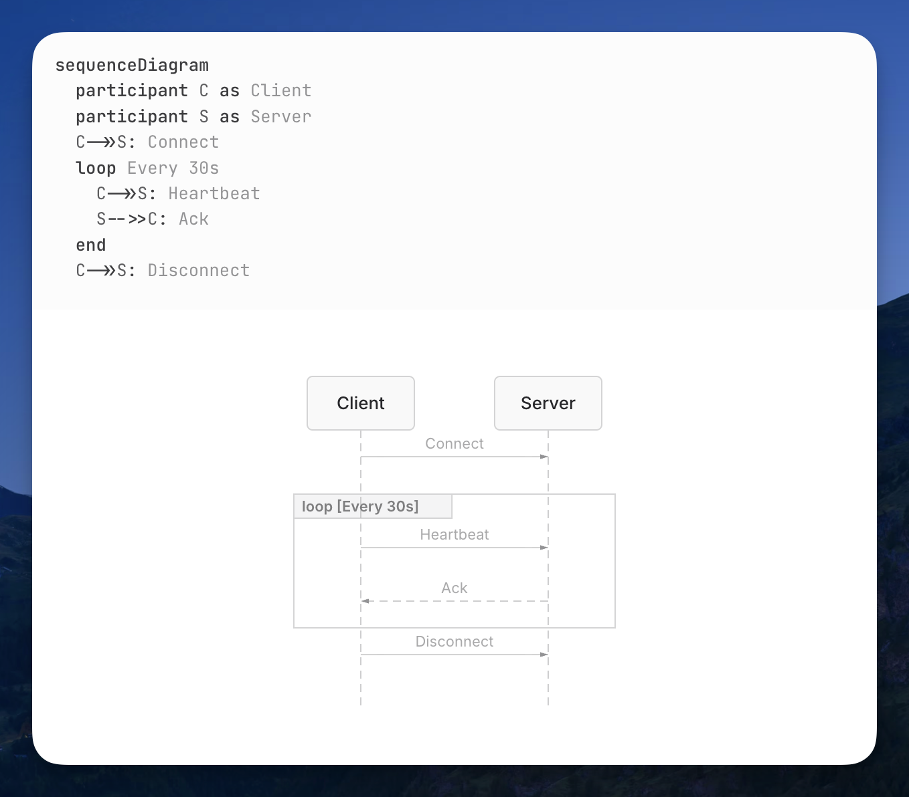
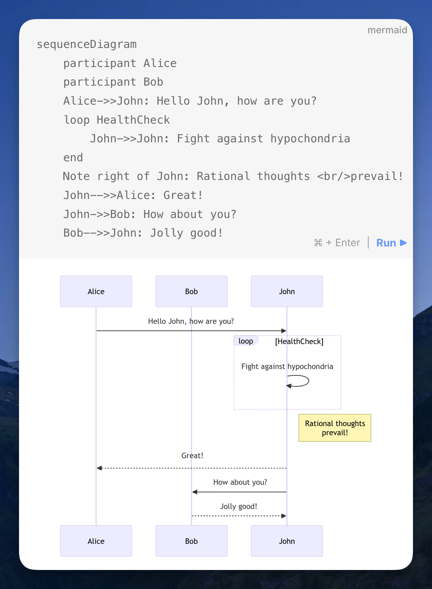

[Beautiful Mermaid](https://agents.craft.do/mermaid) ([via](https://x.com/balintorosz/status/2016564307765424285)). [Mermaid](https://mermaid.js.org/) is the de facto tool for describing diagrams in plain text and embedding them in Markdown. GitHub supports it, for example[^1]. But I've never liked the default theme — that's why I still haven't adopted it.

Today I found out the [Craft](https://craft.do/) team felt the same way, and they released a new rendering engine for Mermaid diagrams. It outputs both SVG and ASCII art, and the default theme looks great.

I haven't looked into it deeply yet, but it looks promising at a glance. I hope it becomes a catalyst for better-looking diagrams — either by maturing into a drop-in replacement that the ecosystem adopts, or by pushing the Mermaid team to ship a better default theme.

[^1]: GitHub blog post: [Include diagrams in your Markdown files with Mermaid](https://github.blog/developer-skills/github/include-diagrams-markdown-files-mermaid/); GitHub documentation: [Creating diagrams](https://docs.github.com/get-started/writing-on-github/working-with-advanced-formatting/creating-diagrams#creating-mermaid-diagrams)
