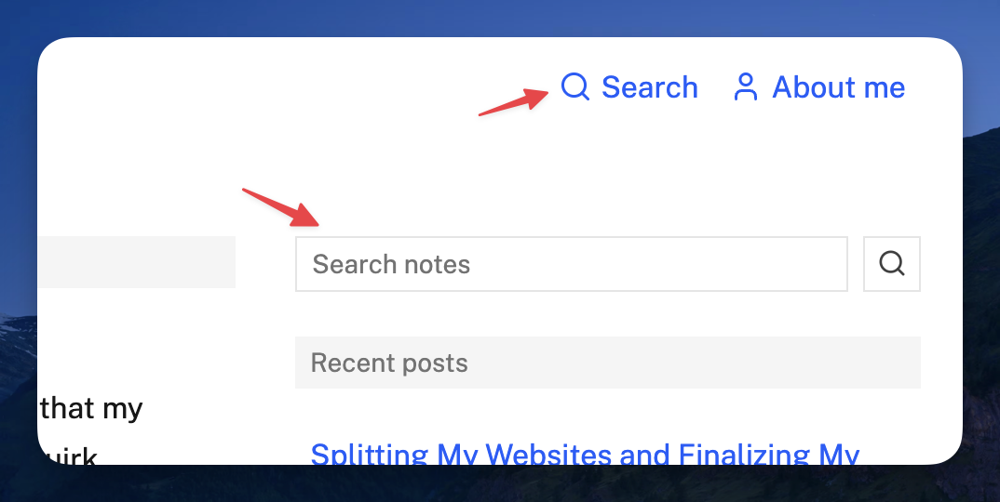

I just added a search page for notes on both https://tech.zlliang.me and https://days.zlliang.me. There is now a search button in the header, plus a small search form in the sidebar on larger screens and on the home page on mobile. The search indexes note titles and bodies, and for post notes it also includes the full content of the related post. The implementation uses [MiniSearch](https://github.com/lucaong/minisearch).

While doing this, I also reworked note pagination across both sites. Instead of URLs like `/notes/2`, note archive pages now use query parameters such as `/notes?page=2`, `/notes/types/link?page=2`, and `/notes/tags/astro?page=2`. I wanted the pagination model to be simpler and closer to common blog conventions, especially after reading Google's [documentation on pagination](https://developers.google.com/search/docs/specialty/ecommerce/pagination-and-incremental-page-loading).

The commit is [zlliang/zlliang@b1dc071](https://github.com/zlliang/zlliang/commit/b1dc0710ba89e899dd903b57261133267882fa20), which also closed [issue #72](https://github.com/zlliang/zlliang/issues/72).
