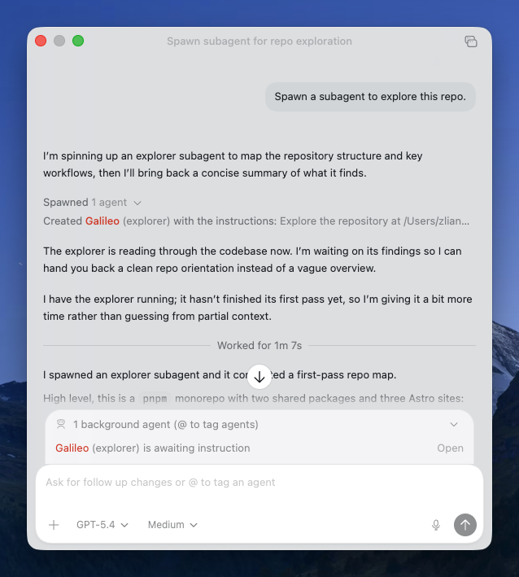

[Use subagents and custom agents in Codex](https://developers.openai.com/codex/subagents) ([via](https://x.com/OpenAIDevs/status/2033636701848174967)). Subagents are now generally available in Codex, after previously being introduced as an experimental feature called "multi-agents".

In short, you can ask Codex to spawn subagents that run in parallel with one another and with the main agent. They use their own context windows and report back to the main agent when they are done. Subagents can have their own models and instructions. There are built-in agents like `explorer`, and you can define your own ones with TOML configuration files under `.codex/agents`.

One fun detail is that Codex picks a random nickname for each subagent. My first try gave me an `explorer` subagent called "Galileo".

I first learned about subagents through [Amp](https://ampcode.com/), which ships several curated custom agents like [Oracle](https://ampcode.com/manual#oracle) and [Librarian](https://ampcode.com/manual#librarian). What I like about Amp's approach is that it presents subagents as recommended workflows, not just as a feature to try on your own. By pairing carefully designed agents with specific models and tools, it also shows how subagents fit into everyday work. That has been a consistent strength of Amp: it tends to package what it sees as the current best practice, and that is also where I first started to understand the idea of subagents.

Here are other comments on this Codex release:

- Simon Willison's [post](https://simonwillison.net/2026/Mar/16/codex-subagents/)
- Vaibhav (VB) Srivastav's article: [_You Should Be Using Subagents in Codex!_](https://x.com/reach_vb/status/2033636057690800452)

Now that major coding agents like [Claude Code](https://code.claude.com/docs/en/sub-agents), [OpenCode](https://opencode.ai/docs/agents/), and [Cursor](https://cursor.com/docs/subagents) all support subagents in broadly similar ways, will subagents become a standard, like [skills](https://agentskills.io)?
