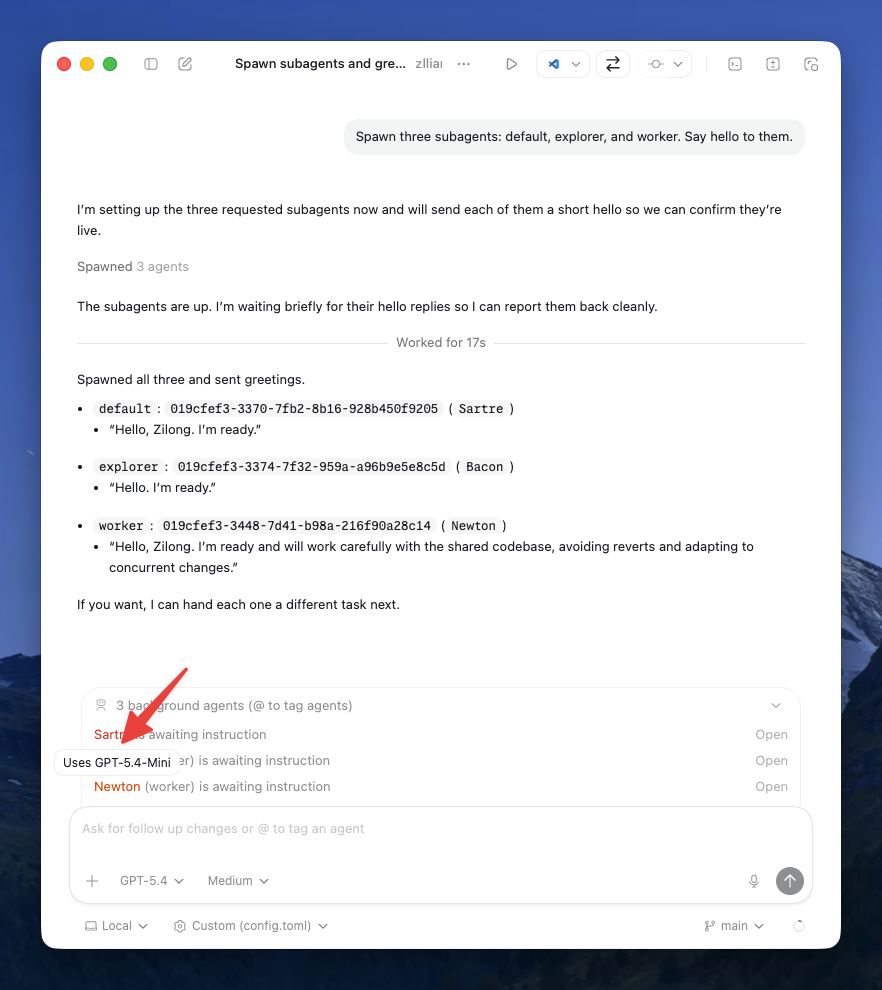

[Introducing GPT-5.4 mini and nano](https://openai.com/index/introducing-gpt-5-4-mini-and-nano/) ([via](https://x.com/OpenAIDevs/status/2033953815834333608)). OpenAI finally refreshed its smaller and cheaper models. The previous mini/nano release was [GPT-5](https://openai.com/index/introducing-gpt-5-for-developers/) in August 2025, while [GPT-5.1-Codex-Mini](https://developers.openai.com/api/docs/models/gpt-5.1-codex-mini) in November 2025 was a more coding-specific branch.

It feels like OpenAI is gradually tidying up its model lineup. At least in the GPT-5.4 family, there is no separate "Codex"-suffixed specialized model, and the mini and nano variants seem to be catching up too.

I checked the Codex app this morning and saw that its built-in subagents are already using GPT-5.4 Mini.

