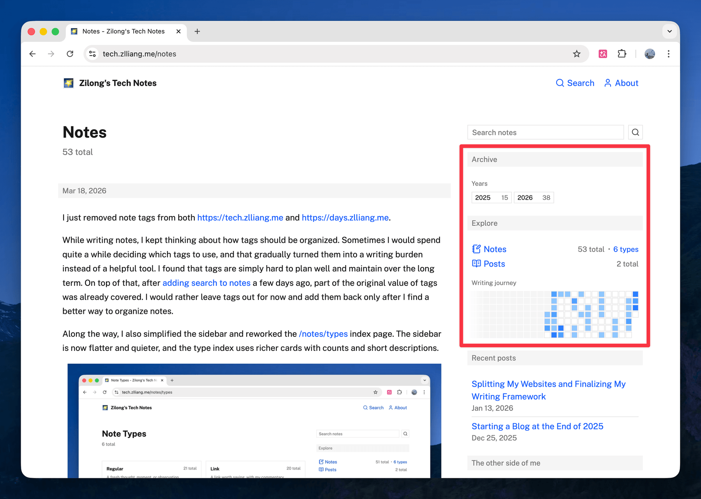
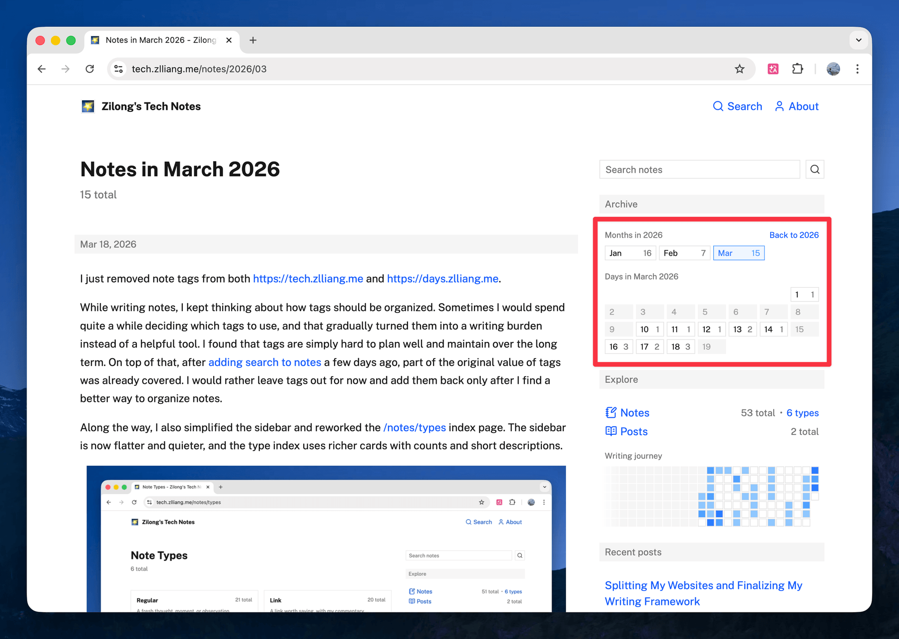

I just finished a fairly big notes-navigation refresh for both https://tech.zlliang.me and https://days.zlliang.me. Archive pages by year, month, and day are now fully in place, and the sidebar now has a "Writing journey" heatmap.

This makes the notes feel much easier to browse as a body of work instead of a flat reverse-chronological list. For example, visit [/notes/2026](/notes/2026) for notes in 2026, [/notes/2026/03](/notes/2026/03) for notes in March 2026, and [/notes/2026/03/19](/notes/2026/03/19) for notes on Mar 19, 2026. Each cell in the heatmap takes you to the archive page for that specific day.

The work happened in two commits: [zlliang/zlliang@7611949](https://github.com/zlliang/zlliang/commit/7611949a1ce61904fb7457ed00dbc4724150c9f8) and [zlliang/zlliang@b2d7c29](https://github.com/zlliang/zlliang/commit/b2d7c29bd508e313ea74d54121877ee69da00a0e). Most of the implementation was done with help from the [Codex app](https://openai.com/codex) and [Amp](https://ampcode.com).
