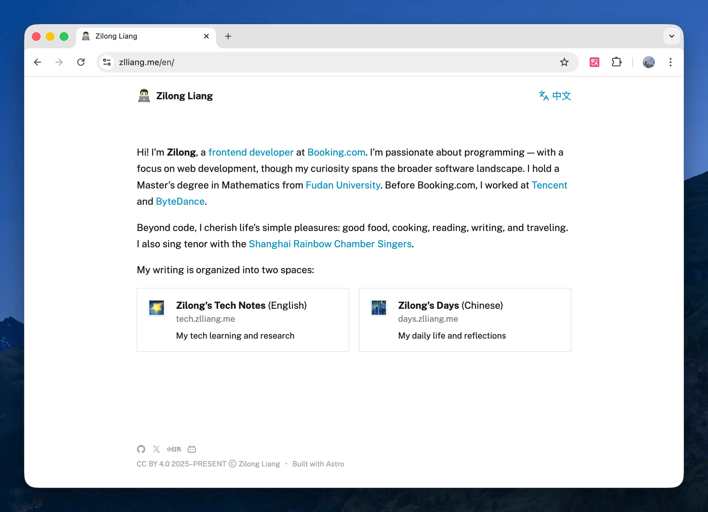
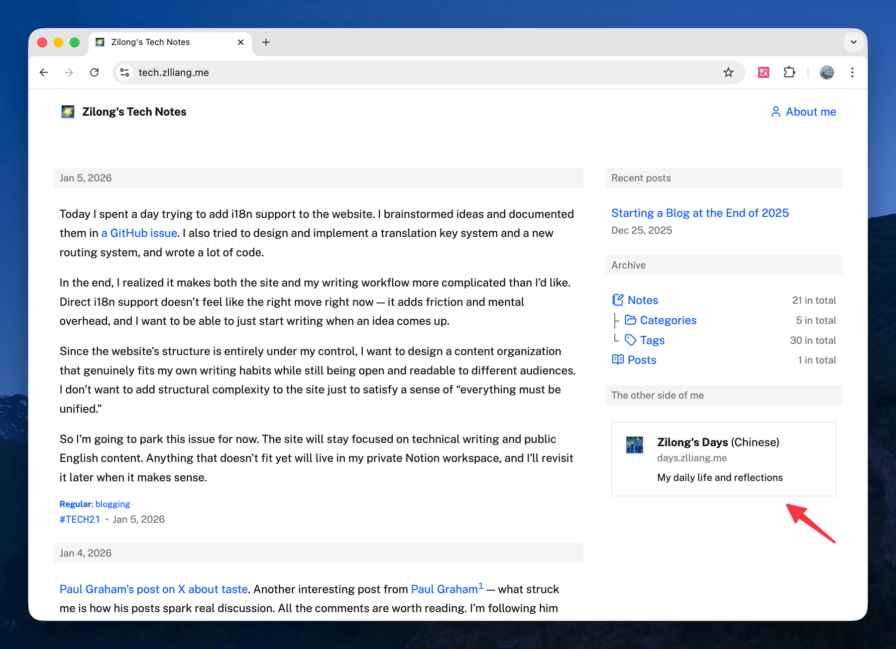
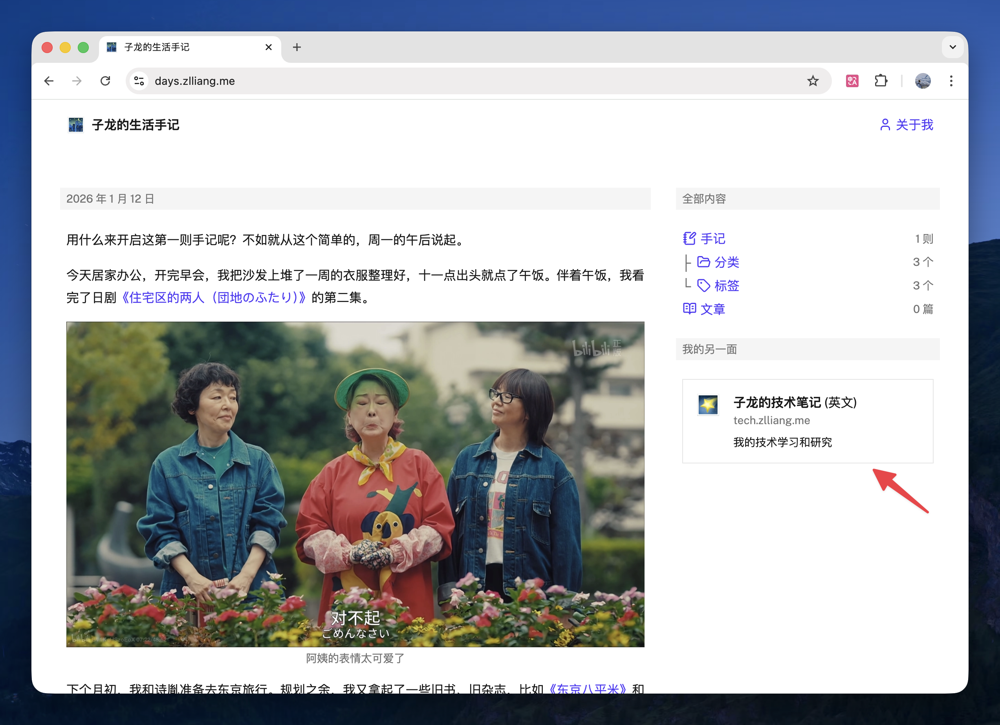

With starting my blog from the ground up at the end of 2025, and after writing for a few weeks, I was considering my writing framework for the next ten years.

In short, my personal websites are now organized into three parts:

| Website | URL | Description |
|---------|-----|-------------|
| Personal landing page | [https://zlliang.me](https://zlliang.me) | Brief introduction and navigation |
| Zilong's Tech Notes | [https://tech.zlliang.me](https://tech.zlliang.me) | Tech learning and research (English) |
| Zilong's Days | [https://days.zlliang.me](https://days.zlliang.me) | Daily life and reflections (Chinese) |

## A week's journey

When this blog was started, I decided to write in English. My native language is Chinese, and I've never lived in an English-speaking country. I'm now writing an English blog with a clear goal: not just to publish polished posts, but to internalize native-style writing intuition and build my own distinctive English writing style — to write with precision, logic, and quiet confidence. Also, English is the common language of the tech industry. In my vision, I want to engage with the tech community, by sharing my tech learning, research, and my projects with the community all around the world. The post I wrote last month explained my motivation in detail: [_Starting a Blog at the End of 2025_](/posts/2025/12/25/starting-a-blog-at-the-end-of-2025).

But after writing a bit, the other side of me is yelling too, the "personal" me. I'm also desperate to write about my personal life, my feelings and reflections on my daily experiences in living, eating, music, and travel. The goal of writing is not only to share with readers, but also an approach to think clearly, and I believe writing about my life can help me rebuild my sensitivity to life and emotional expression, which I found I'm gradually losing these years.  Without this part, my writing can't be called completed. On these topics, obviously I want to use the language that I'm most comfortable with, Chinese.

It tooks me a week to find a solution. I considered mixing English and Chinese content in the same blog, and delivering them bilingually with AI translation assistance. In that way, I can unify all my writings in a single place. I brainstormed ideas and documented them in a [GitHub issue](https://github.com/zlliang/zlliang/issues/71), but eventually I was still not comfortable with that solution — it adds friction and mental overhead a lot. You can read more in my [previous note](/notes/2026/01/05/spent-a-day-on-i18n-support).

After all, I found that my writing can be considered from two perspectives:

1. The goals. I write tech topics in English to practice my English writing skills and share my tech learning and research with the world; I write personal topics in Chinese to share my personal reflections and help me myself rebuild my sensitivity to life and emotional expression.
2. The target audience. Readers will be confused if they see too many topics in a single blog. I want my websites to be my writing "products", which have clear boundaries and provide self-contained experiences.

Thinking that way, I deduced my solution, which is landed like you can notice now.

## Finalizing my writing framework

As a result, I splitted my writing into two spaces: https://tech.zlliang.me, and https://days.zlliang.me. There's also a personal landing page, https://zlliang.me, giving a brief introduction and navigating readers to the two spaces. In my expectation, every reader of mine (only me myself for now) will be able to find all my work on the personal landing page, and choose to follow either side of me.

I simply duplicated the original blog's codebase and changed the theme slightly to make "Zilong's Days" go live. Links to each other are also added.

Also, I updated the note number system for the two spaces. For example, `#tech123` for tech notes, instead of `#123` previously, and `#days123` for personal notes.

Last but not least, I formalized the writing workflows and regorganized AI coding agent instruction files thoroughly. All the work is tracked and documented in the [GitHub issue](https://github.com/zlliang/zlliang/issues/76).

Currently, the websites are three separate [Astro](https://astro.build/) projects reside in a monorepo, and the two writing spaces are sharing a similar structure. There are short-form notes that can be categorized and tagged, and long-form posts that deep dive into specific topics. I'll first write a bit more and see whether I should extract the shared logic, or whether different structures and patterns are needed for each space.

Finally, a bad news is, the splitting this time is a breaking change. The links to the existing notes and posts are not working anymore. But I'm confident it's worth it. Finalizing my writing framework in such an early phase is a good move, implying that less breaking changes are expected in the future.

## What's next

Now I'm ready to mark the 1.0 version of my writing framework. I can freely write anything in my career and life in the splitted spaces, and letting them grow in the next few years. The links to notes and posts in these two spaces will be always valid.

As a follow-up task, I may write a post on each website to introduce what I'll cover on that site and how I write, and pin them as living documents.

Again, it's time to write, write, and write.
